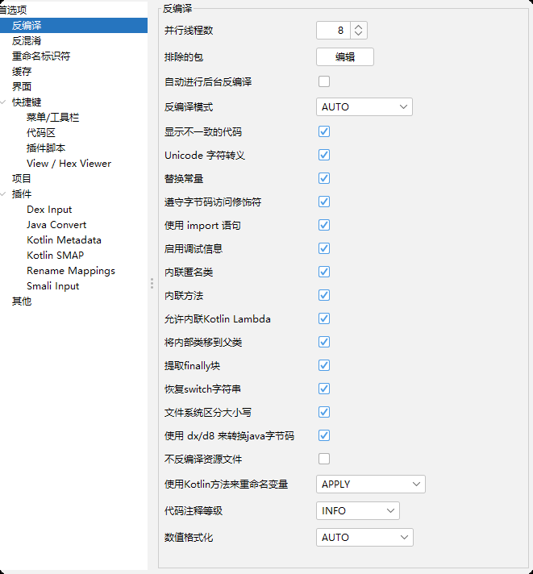
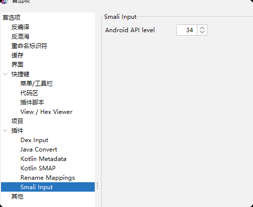
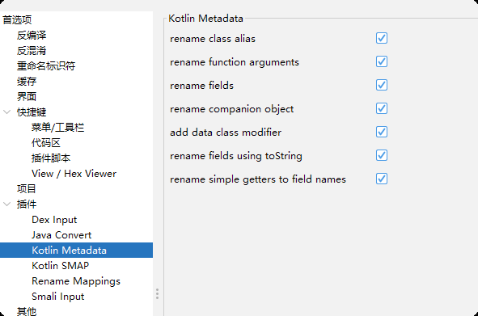
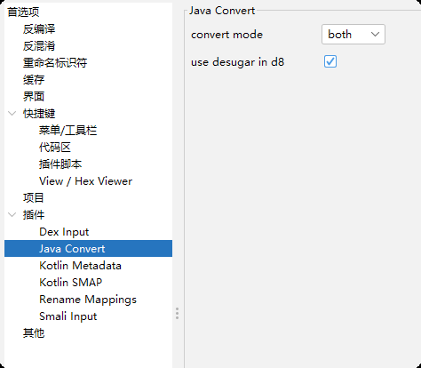
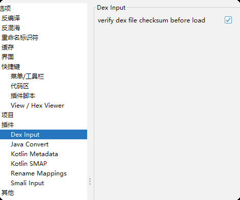

# 对一个apk进行codeql扫描

目标：我想要研究某个jar包是否存在指定的漏洞

大致步骤：

- 反编译apk包
- 使用codeql创建数据库
- 自定义ql语句进行扫描

## 反编译apk包

使用jadx-gui加载apk然后选择导出项目即可

## 创建数据库

如果出现缺少大量java文件，可能是jdk版本不一致，保持运行codeql的jdk版本、java_home以及运行jadx-gui的java版本一致，也可能是使用jadx-gui反编译为java源代码时存在编码或其他问题，根据以下配置尝试：

