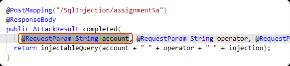

# 自定义ql


## 谓词

与函数有所区别，谓词用于描述构成 QL 程序的逻辑关系， 严格来说，谓词的计算结果为一组元组，如：

（1）一元组

```
predicate isCountry(string country) {
  country = "Germany"
  or
  country = "Belgium"
  or
  country = "France"
}
```

（2）二元组

```
predicate hasCapital(string country, string capital) {
  country = "Belgium" and capital = "Brussels"
  or
  country = "Germany" and capital = "Berlin"
  or
  country = "France" and capital = "Paris"
}
```

### 谓词定义

谓词大致可分为两种：

- 不带结果的谓词，如

  ```
  predicate isSmall(int i) {
    i in [1 .. 9]
  }
  ```

- 带结果的谓词

  ```
  int getSuccessor(int i) {
    result = i + 1 and
    i in [1 .. 9]
  }
  ```

  result是一个关键字，而且，result并不局限于在等式左边，如：

  ```
  Person getAChildOf(Person p) {
    p = getAParentOf(result)
  }
  ```

  result为p的子类。result也可以定义元组中单个值的结果，如：

  ```
  string getANeighbor(string country) {
    country = "France" and result = "Belgium"
    or
    country = "France" and result = "Germany"
    or
    country = "Germany" and result = "Austria"
    or
    country = "Germany" and result = "Belgium"
  }
  
  select getANeighbor("France")
  ```

  最后将会返回 Belgium和Germany


对于无结果的谓词可以这样使用：

```
import java // 根据目标语言调整
predicate isSmall(int i) {
  i in [1 .. 9]
}
from int i
where isSmall(i)
select i // 
```

最后会返回所有1-9的整数，而对于有结果的谓词在where会提示需要一个无结果的谓词

### 谓词递归

```
string getANeighbor(string country) {
  country = "France" and result = "Belgium"
  or
  country = "France" and result = "Germany"
  or
  country = "Germany" and result = "Austria"
  or
  country = "Germany" and result = "Belgium"
  or
  country = getANeighbor(result)
}
select getANeighbor("Austria")
```

最后得到结果为Germany


### 谓词种类

谓词还可以分为三种：

- 非成员谓词：独立定义，不属于任何类

- 特征谓词：在类的内部定义，类似构造函数，定义具体的成员，成员类型取决于extends的类型，此处是int类型

  ```
  class FavoriteNumbers extends int {
    FavoriteNumbers() {
      this = 1 or
      this = 4 or
      this = 9
    }
  }
  
  from FavoriteNumbers n
  select n
  ```

  返回1、4、9

- 成员谓词：在类的内部定义，定义了以下谓词：

  ```
  class FavoriteNumbers extends int {
    FavoriteNumbers() {
      this = 1 or
      this = 4 or
      this = 9
    }
    string getName() {   
      this = 1 and result = "one"
      or
      this = 4 and result = "four"
      or
      this = 9 and result = "nine"
    }
  }
  
  from FavoriteNumbers n
  select n.getName()
  ```

  最后返回one、four、nine，由此可以看出成员谓词更像是用于对类成员进行一定转换

注意，谓词中的元素不能是无限的，除非在外部使用该谓词时做了范围限制，且要使用bindingset做声明，比如：

```
bindingset[i]
int multiplyBy4(int i) {
  result = i * 4
}

from int i
where i in [1 .. 10]
select multiplyBy4(i)
```


## 查询

CodeQl包含两种查询：

- **警报查询** （problem）：突出显示代码中特定位置的问题的查询。
- **路径查询** （path-problem）：描述代码中源和接收器之间的信息流的查询。

这需要在编写好的ql文件的元数据中指定（这非常重要）：

```
/**
 * @name 原生sql注入
 * @description 使用jdbc进行sql语句的执行，由于构造sql时传入不可信数据导致问题存在.
 * @kind path-problem
 * @id java/sqli-jdbc
 * @problem.severity error
 * @security-severity 7.5
 * @precision high
 * @tags security
 */
```

一般的查询就是select或from+where+select，可以通过as关键字指定列名：

```
from int x, int y
where x = 3 and y in [0 .. 2]
select x, y, x * y as product
```

| **x** | **y** | **product** |
| :---: | :---: | :---------: |
|   3   |   0   |      0      |
|   3   |   1   |      3      |
|   3   |   2   |      6      |

通过desc或asc关键字按列排序：

```
from int x, int y
where x = 3 and y in [0 .. 2]
select x, y, x * y as product order by y asc
```

但除此之外，还有一个查询谓词

```
query int getProduct(int x, int y) {
  x = 3 and
  y in [0 .. 2] and
  result = x * y
}
```

最后返回一个

| x    | y    | result |
| ---- | ---- | ------ |
| 3    | 0    | 0      |
| 3    | 1    | 3      |
| 3    | 2    | 6      |

查询谓词同样可以在类中使用以定义成员：

```
query int getProduct(int x, int y) {
  x = 3 and
  y in [0 .. 2] and
  result = x * y
}

class MultipleOfThree extends int {
  MultipleOfThree() { this = getProduct(_, _) }
}

from MultipleOfThree m
select m
```

最后返回的实际上是getProduct的result


## 类型

QL中，每个变量必须有类型声明，这些类型分为原始类型和自定义类型。

- 原始类型包括float、boolean、int、string、date（日期）

- 自定义类型一般由以下部分组成

  - 成员谓词
  - 特征谓词（类似构造函数）
  - 字段

  如：

  ```
  class SmallInt extends int {
    SmallInt() { this = [1 .. 10] }
  }
  
  class DivisibleInt extends SmallInt {
    SmallInt divisor;   //字段
    DivisibleInt() { this % divisor = 0 }//特征谓词
  
    SmallInt getADivisor() { result = divisor }//成员谓词
  }
  from DivisibleInt i
  select i, i.getADivisor()
  ```

  继承使用extends

### 抽象类型


### 多重继承

```
class Two extends OneTwo, TwoThree {}
```

有关继承需要注意的是，当在同一文件内调用一个父类，其子类会自动被调用，如果子类存在问题，就会导致父类无法正常执行

### 拓展子类型

```
final class FinalOneTwoThree = OneTwoThree;
```

在继承该类型后，无法通过override覆写成员谓词

### 非拓展子类型

```
class Bar instanceof Foo {
  string toString() { result = super.fooMethod() }
}
```

通过instanceof声明为Foo的子类型，然后通过super调用父类的成员谓词


## 模块

模块的名称可以是任何标识符以大写或小写字母开头

### 显示定义模块

```
module Example {
  class OneTwoThree extends int {
    OneTwoThree() {
      this = 1 or this = 2 or this = 3
    }
  }
}
```

### 隐式定义模块

每个查询文件（扩展名 `.ql`）和库文件（扩展名 `.qll`）都隐式定义一个模块


### 导入模块

```
import <module_expression1> as <name>
import <module_expression2>
```

或者通过以下方式导入：

```
module Sets = QlBuiltins::InternSets<int, int, getAValue/1>;
```


### 内置模块QlBuiltins

- BigInt：任意范围证书
- InternSets：集合
- EquivalenceRelation：等价关系


## 签名

参数化模块使用签名作为其参数的类型系统。签名分为三类： **谓词签名** 、 **类型签名**和**模块签名** 。


## 公式

- 比较

  ```
  <expression> <operator> <expression>
  ```

  | 名字       | operator |
  | ---------- | -------- |
  | 大于       | `>`      |
  | 大于或等于 | `>=`     |
  | 小于       | `<`      |
  | 小于或等于 | `<=`     |

- 相等检查

  要使用 = 比较两个表达式，至少其中一个表达式必须具有类型。如果两个表达式都有一个类型，则它们的类型必须兼容 。

  要使用 ！= 比较两个表达式，两个表达式都必须具有类型。这些类型也必须兼容 。

- 类型检查

  ```
  <expression> instanceof <type>
  ```

- 范围检查

  ```
  <expression> in <range>
  ```

- 检查是否存在

  ```
  exists(<variable declarations> | <formula>)
  ```

  如果不存在则是not exists

- forall检查

  ```
  forall(<variable declarations> | <formula 1> | <formula 2>)
  ```

  如果 `< 公式  2>` 对 `< 公式  1>` 的所有值都成立，则它成立。

- 逻辑连接词

  - Negation ([not](https://codeql.github.com/docs/ql-language-reference/formulas/#negation))
  - Conditional formula ([if … then … else](https://codeql.github.com/docs/ql-language-reference/formulas/#conditional))
  - Conjunction ([and](https://codeql.github.com/docs/ql-language-reference/formulas/#conjunction))
  - Disjunction ([or](https://codeql.github.com/docs/ql-language-reference/formulas/#disjunction))
  - Implication ([implies](https://codeql.github.com/docs/ql-language-reference/formulas/#implication))

  


## codeql java

### 适用于java和Kotlin的库

标准 Java/Kotlin 库中最重要的类可以分为五大类：

1. 用于表示程序元素（例如类和方法）的类
2. 用于表示 AST 节点的类（例如语句和表达式）
3. 用于表示元数据（如注释和注释）的类
4. 用于计算指标的类（例如圈复杂度和耦合）
5. 用于导航程序调用图的类


#### 程序元素

这些类表示命名的程序元素：包 （`Package`）、编译单元 （`CompilationUnit`）、类型 （`Type`）、方法 （`Method`）、构造函数 （`Constructor`） 和变量 （`Variable`）

#### 类型

- `PrimitiveType` 表示一种原始类型 ，即 `boolean`、`byte`、`char`、`double`、`float`、`int`、`long`、`short` 之一;QL 还将 `void` 和 `<nulltype>`（` 空`文本的类型）分类为基元类型。
- `RefType` 表示引用 （即非基元） 类型;它又有几个子类：
- - `Class` 表示 Java 类。
  - `Interface` 表示 Java 接口。
  - `EnumType` 表示 Java ` 枚举`类型。
  - `Array` 表示 Java 数组类型。
- `TopLevelType` 表示在编译单元的顶层声明的引用类型。
- `NestedType` 是在另一个类型中声明的类型。

#### 泛型

略


#### 变量

`Field` 表示 Java 字段。

`LocalVariableDecl` 表示局部变量。

`Parameter` 表示方法或构造函数的参数。


#### AST

AST，抽象语法树，即语句（类 `Stmt`）和表达式（类 `Expr`）。

`Expr` 和 `Stmt` 都提供了用于探索程序的抽象语法树的成员谓词：

- `Expr.getAChildExpr` 返回给定表达式的子表达式。
- `Stmt.getAChild` 返回直接嵌套在给定语句中的语句或表达式。
- `Expr.getParent` 和 `Stmt.getParent` 返回 AST 节点的父节点。

语句通常不直接产生值，而表达式则会产生值


#### 元数据

主要是注释，比如查看所有构造函数的Annotation注释

```
import java

from Constructor c
select c.getAnAnnotation()
```

查找所有私有字段的Javadoc注释：

```
import java

from Field f, Javadoc jdoc
where f.isPrivate() and
    jdoc = f.getDoc().getJavadoc()
select jdoc
```


#### 度量

总共有六个这样的类：`MetricElement`、`MetricPackage`、`MetricRefType`、`MetricField`、`MetricCallable` 和 `MetricStmt`。每个相应的元素类都提供了一个成员谓词 `getMetrics`，该谓词可用于获取委托类的实例，然后可以在该实例上执行度量计算。

查找圈复杂度大于 40 的方法:

```
import java

from Method m, MetricCallable mc
where mc = m.getMetrics() and
    mc.getCyclomaticComplexity() > 40
select m
```


#### 调用图

可以使用谓词 `Call.getCallee` 来找出特定调用表达式引用的方法或构造函数，比如：

```
import java

from Call c, Method m
where m = c.getCallee() and
    m.hasName("println")
select c
```

查询从未调用的方法和构造函数：

```
import java

from Callable c
where not exists(c.getAReference())
select c
```


### 数据流

数据流存在以下概念：

- source：输入节点
- sink：输出节点
- sanitizer：净化函数（全局数据流）

只有当source和sink同时存在，并且从source到sink的链路是通的，数据流才存在

#### 本地数据流

本地数据流是单个方法或可调用范围内的数据流。

首先导入：

```
import semmle.code.java.dataflow.DataFlow
```

`DataFlow` 模块定义了 `Node` 类，表示数据可以流经的任何元素。` 节点`分为表达式节点 （`ExprNode`） 和参数节点 （`ParameterNode`）。通过成员谓词 `asExpr` 和 `asParameter` 可以获取当前节点的表达式和参数

#### 全局数据流

通过实现特征 `DataFlow：：ConfigSig` 并应用模块 `DataFlow：：Global<ConfigSig>` 来使用全局数据流库

```
import java
import semmle.code.java.dataflow.DataFlow

module MyFlowConfiguration implements DataFlow::ConfigSig {
  predicate isSource(DataFlow::Node source) {
    ...
  }

  predicate isSink(DataFlow::Node sink) {
    ...
  }
}

module MyFlow = DataFlow::Global<MyFlowConfiguration>;
```

使用：

```
from DataFlow::Node source, DataFlow::Node sink
where MyFlow::flow(source, sink)
select source, "Data flow to $@.", sink, sink.toString()
```

全局数据流和全局污点跟踪的区别在于，全局数据流关注数据的明确流动路径，且中途没有发生修改，但污点跟踪不是，因此全局污点跟踪一般会得到更多的数据

#### 污点跟踪

本地污点跟踪通过包含非值保留流步骤来扩展本地数据流。

首先导入：

```
import semmle.code.java.dataflow.TaintTracking
```

使用：

```
TaintTracking::localTaint(DataFlow::parameterNode(p), DataFlow::exprNode(call.getArgument(0)))
```

类似数据流，但实际上污点跟踪会追踪所有影响`call.getArgument(0)`的入参

#### 流源

类 `RemoteFlowSource`（在 `semmle.code.java.dataflow.FlowSources` 中定义）表示可能由远程用户控制的数据流源

```
import java
import semmle.code.java.dataflow.FlowSources

module MyFlowConfiguration implements DataFlow::ConfigSig {
  predicate isSource(DataFlow::Node source) {
    source instanceof RemoteFlowSource
  }

  ...
}

module MyTaintFlow = TaintTracking::Global<MyFlowConfiguration>;
```


### 常用函数

- 直接获取函数的返回类型

  ```
  m.getDeclaringType()
  ```

  m为Method类型

- 对返回类型进行类型判断

  ```
  m.getDeclaringType().hasQualifiedName("java.sql", "Statement")
  ```

  检查返回类型是不是`java.sql.Statement`

- 获取注解所在函数或类

  ```
  annotation.getParent()
  ```

  筛选所在为类：

  ```
  from Controller c, Class clazz
  where c.getParent()=clazz
  select c, c.getParent()
  ```

  筛选所在为函数：

  ```
  from MappingAnnotation a, Method m
  where m =a.getParent()
  select m
  ```

- 获取函数所在类

  ```
  from Method method
  method.getDeclaringType()
  ```

- 获取函数名

  ```
  from Method method
  select method.getName()
  ```

  对函数名做限制：

  ```
  from Method method
  where method.hasName("readObject")
  select method, method.getName()
  ```

  获取函数的第一个参数

  ```
  from Method method
  where method.hasName("readObject")
  select method, method.getName(), method.getParameter(0)
  ```

  获取函数的第一个参数的参数名和参数类型

  ```
  from Method method
  where method.hasName("readObject")
  select method, method.getName(), method.getParameter(0),
  method.getParameter(0).getName(), method.getParameter(0).getType()
  ```

  需要注意的是，Expr在获取类型时，（参数类型+参数名）由于也被视为一个Expr，那么获取类型时其实等价于`getParameter(0).getType()`

  对参数类型和函数包名进行限制

  ```
  from Method method
  where method.hasName("readObject") and method.getParameterType(0).hasName("ObjectInputStream")
  and not method.getQualifiedName() in ["java.awt.geom.Path2D.readObject"]
  select method, method.getQualifiedName()
  ```

- 获取e

- 限制构造函数类型

  ```
  school.getDeclaringType().hasQualifiedName("com.example.demo.entity", "School")
  ```

  school为Constructor类型

- 限制为调用了fileReader函数

  ```
  call.getCallee() = fileReader
  ```

  fileReader是Constructor类型，call是Call类型

- 限制参数是公共参数

  ```
   DataFlow::localFlow(DataFlow::parameterNode(p), DataFlow::exprNode(call.getArgument(0)))
  ```

  调用的函数的第一个参数来自公共参数p，p为Parameter类型


### 常用类

- Method：所有函数定义的位置
- MethodCall：所有函数被调用的位置
- Parameter：所有函数的入参位置
- Field：所有字段定义的位置
- FieldAccess：所有使用字段的位置
- Callable：所有调用定义的位置 
- Call：所有使用调用的位置

#### 枚举所有字符串字段并筛选字段值

```
from Field field, StringLiteral lit
where field.getInitializer() = lit 
and lit.getValue() = "x-token"
select field, field.getName(), lit.getValue()
```


#### FieldAccess


### Method和MethodCall的区别

Method定位的是方法本身，而MethodCall定位的是方法在哪个地方被调用，因此如果需要定位方法在什么地方被使用了，最合适的方法是使用MethodCall，这在编写sink时非常有用

在编写sink时，如果要比对param:

```
this.asParameter() = method.getParameter(0)
```

this为DataFlow::Node类型，method为Method类型

如果要比对expr：

```
this.asExpr() = call.getArgument(0)
```

this为DataFlow::Node类型，call为MethodCall类型

### ApiSourceNode

```
import java
import semmle.code.java.dataflow.FlowSources

from ApiSourceNode node
select node
```

会枚举所有Api的入口，哪怕某个入参实际没有被使用



枚举入参的信息：

```
import java
import semmle.code.java.dataflow.FlowSources

from ApiSourceNode node
select node.asParameter(),  node.asParameter().getType(), node.asParameter().getName()
```

包括asParameter、参数的类型以及参数名

#### 枚举Node对应的Method

```
import java
import semmle.code.java.dataflow.FlowSources

from ApiSourceNode node, Method method
where method = node.getEnclosingCallable()
select method
```


#### 枚举属于Controller且属于node的部分

```
import java
import semmle.code.java.dataflow.FlowSources


private class Mapping extends Annotation{
    //出现额外mapping注解在此补充，类似注解只能出现在方法上面
    Mapping(){
        this.getType().getQualifiedName() in 
        ["org.springframework.web.bind.annotation.PostMapping",
            "org.springframework.web.bind.annotation.RequestMapping",
            "org.springframework.web.bind.annotation.GetMapping",
            "org.springframework.web.bind.annotation.PutMapping",
            "org.springframework.web.bind.annotation.DeleteMapping",
            "org.springframework.web.bind.annotation.PatchMapping"]
    }
}

from ApiSourceNode node, Method m
where m = node.getEnclosingCallable() and
  exists(Mapping mapping | m = mapping.getParent())
select m
```

#### 枚举属于node但不属于Controller的部分

以下代码实际起不到筛选作用：

```
import java
import semmle.code.java.dataflow.FlowSources


private class Mapping extends Annotation{
    //出现额外mapping注解在此补充，类似注解只能出现在方法上面
    Mapping(){
        this.getType().getQualifiedName() in 
        ["org.springframework.web.bind.annotation.PostMapping",
            "org.springframework.web.bind.annotation.RequestMapping",
            "org.springframework.web.bind.annotation.GetMapping",
            "org.springframework.web.bind.annotation.PutMapping",
            "org.springframework.web.bind.annotation.DeleteMapping",
            "org.springframework.web.bind.annotation.PatchMapping"]
    }
}

from ApiSourceNode node, Method m
where m = node.getEnclosingCallable() and
  not exists(Mapping mapping | m = mapping.getParent())
select m
```


#### 枚举属于Controller中但不属于node的部分

```
import java
import semmle.code.java.dataflow.FlowSources


private class Mapping extends Annotation{
    //出现额外mapping注解在此补充，类似注解只能出现在方法上面
    Mapping(){
        this.getType().getQualifiedName() in 
        ["org.springframework.web.bind.annotation.PostMapping",
            "org.springframework.web.bind.annotation.RequestMapping",
            "org.springframework.web.bind.annotation.GetMapping",
            "org.springframework.web.bind.annotation.PutMapping",
            "org.springframework.web.bind.annotation.DeleteMapping",
            "org.springframework.web.bind.annotation.PatchMapping"]
    }
}

from Mapping mapping , Method m 
where m = mapping.getParent() and not exists(ApiSourceNode node | m = node.getEnclosingCallable())
select m
```


#### 不受信任的源

- 来自Controller url mapping的各类型入参

- 来自AOP切面查询的不可信输入，因为AOP可以通过JoinPoint获取目标方法的参数等信息，只要参数来自外部就是不可信输入，场景可能比较复杂，因为AOP不一定只通过包名和方法名来匹配，也有可能通过正则进行匹配，所以最好的方法是搜索AOP中的**`@Pointcut`**注解，这个注解定义要拦截处理的方法范围（todo：如果遇到类似场景可以写一些ql）

- 来自jdbc的输入

- 来自本地文件的输入（如`System.getProperty`， FileInputStream）

- 来自命令行的输入


### 优化ql

优化ql的目的是为了解决规则设置过于宽泛导致大量误报的问题

#### isSanitizer限制污点流

sanitizer（净化函数）是指在漏洞链条中，若存在一个方法阻断了污染数据的传递链，那么这个方法就是sanitizer，例如某处使用一个安全函数做了过滤，这个时候就可以使用isSanitizer来规避使用了安全函数的数据流（下列代码中的安全函数是xssEncode）

```
override predicate isSanitizer(DataFlow::Node node) { 
        exists(Call call|
            node.asExpr() = call and
            call.getCallee().hasName("xssEncode")
        ) 
        //认为在某个节点调用了xssEncode及污点数据被洗白
    }
```


#### isAdditionalTaintStep强制关联特定节点

CodeQL进行代码分析时，只会分析用户的代码，对于第三方包的方法调用被将认为是不可预测的，导致数据流被截断，因此就需要自己定义`isAdditionalTaintStep`

默认将所有函数调用都当成会传播污点的：

```
override predicate isAdditionalTaintStep(DataFlow::Node node1, DataFlow::Node node2) {
        exists(Call call |
            node2.asExpr()=call and 
            call.getAnArgument()=node1.asExpr()
        )
    }
```


#### 对项目进行模块划分

对项目进行模块划分，针对关键模块和安全敏感区域进行重点审计，减少整体分析范围。对于第三方库，可查看是否有针对性的 CodeQL 库或规则集，或者将其排除在扫描范围外，只关注项目的业务代码部分。对于测试目录也应当排除在扫描范围外


### 标准库

https://codeql.github.com/codeql-standard-libraries/java/


### 现有查询ql参考

https://codeql.github.com/codeql-query-help/java/


### 示例

#### 获取spring映射url

```
//梳理spring接口
import java
import semmle.code.java.Annotation

private class Controller extends Annotation{
    //出现额外Controller注解在此补充，类似注解只能出现在类上面
     Controller(){
        this.getType().getQualifiedName() in [
            "org.springframework.web.bind.annotation.RestController",
            "org.springframework.web.bind.annotation.Controller",
            "org.springframework.stereotype.Controller", 
            // "org.springframework.web.bind.annotation.RequestMapping" # 注意特殊场景：即定义在RequestMapping上而非Controller上
        ] 
     }

    
     string getPath(){
        if exists(this.getStringValue("value"))
        then result =this.getStringValue("value") 
        else (
            if exists(this.getStringValue("path"))
            then result = this.getStringValue("path")
            else result = ""
            )
     }
}

private class Mapping extends Annotation{
    //出现额外mapping注解在此补充，类似注解只能出现在方法上面
    Mapping(){
        this.getType().getQualifiedName() in 
        ["org.springframework.web.bind.annotation.PostMapping",
            "org.springframework.web.bind.annotation.RequestMapping",
            "org.springframework.web.bind.annotation.GetMapping",
            "org.springframework.web.bind.annotation.PutMapping",
            "org.springframework.web.bind.annotation.DeleteMapping",
            "org.springframework.web.bind.annotation.PatchMapping"]
    }

    //获取注解指定参数的值，这个值可能是字符串也可能是array，因此通过Expr返回
    //可以尝试获取value（path）、params、consumes、produces、method
    Expr getAnnotationValue(string name){
        result = this.getValue(name)
    }

}

private class MyClass extends Class{
    MyClass(){
        exists(Class clazz |  this = clazz)
    }

    string getController(){
        exists(Controller controller| this = controller.getParent() and result = controller.getPath())
    }


}

private class MyMethod extends Method{
    MyMethod(){
        exists(Method method |  this = method)
    }

    //由于映射的url可能存在多个，即可能为数组，因此返回Expr
    Expr getUrlMappingExpr(){
        exists(Mapping mapping| 
            mapping.getParent()=this
        and(
            if exists(mapping.getAnnotationValue("value"))
            then result = mapping.getAnnotationValue("value")
            else result = mapping.getAnnotationValue("path"))
        )
    }
}

from MyClass clazz, MyMethod method
where clazz = method.getDeclaringType()
select clazz, clazz.getController(), method, method.getUrlMappingExpr() 
```


#### 方法追踪

```
import java


from MethodCall m 
where m.getMethod().toString()="parse" or m.getMethod().toString()="parseObject"
select m.getCaller(),m.getParent(),m.getArgument(0)
```

这是一个最简单的定位fastjson解析对象位置的一个ql文件

| **#** | **[0]** |     **[1]**      | **[2]** |
| :---: | :-----: | :--------------: | :-----: |
|   1   |  main   |    parse(...)    |   js    |
|   2   |  main   | parseObject(...) | payload |

- 第一列：调用该方法的函数位置
- 第二列：被调用方法所处位置
- 第三列：方法的第一个入参

#### 本地数据流

```
import java
import semmle.code.java.dataflow.DataFlow

from Constructor school, Call call, Expr src
where
 school.getDeclaringType().hasQualifiedName("com.example.demo.entity", "School") and
  call.getCallee() = school and
  DataFlow::localFlow(DataFlow::exprNode(src), DataFlow::exprNode(call.getArgument(0)))
select src
```

明确要分析的是`com.example.demo.entity.School`类的构造函数，有关DataFlow部分的含义则是存在从源表达式（`src`）到构造函数第一个参数（`call.getArgument(0)`）的局部数据流。简化一下：

```
import java
import semmle.code.java.dataflow.DataFlow

from Call call, Expr src
where
  DataFlow::localFlow(DataFlow::exprNode(src), DataFlow::exprNode(call.getArgument(0)))
select src, call.getArgument(0)
```

如果代码是：

```
public static void main(String[] args) {
        String[] a = new String[]{"attachment1.pdf", "attachment1.exe", "attachment1.exe", "attachment2.exe", "attachment1.pdf"};
        FileValidateAndCalculate(a);

    }
```

则src（表达式）是`new String[]{"attachment1.pdf", "attachment1.exe", "attachment1.exe", "attachment2.exe", "attachment1.pdf"};`，`call.getArgument(0)`是`FileValidateAndCalculate(a)`中的a，**简而言之，该ql在追踪局部变量a**，但由于是在追踪所有被调用函数的第一个入参，因此需要做一些限制来简化结果。


#### fastjson（局部污点追踪）

```
import java
import semmle.code.java.dataflow.DataFlow
import semmle.code.java.dataflow.TaintTracking
import semmle.code.java.StringFormat

from MethodCall call, Expr src, Parameter p
where call.getMethod().toString() in ["parse", "parseObject" ] and
DataFlow::localFlow(DataFlow::exprNode(src), DataFlow::exprNode(call.getArgument(0))) 
and TaintTracking::localTaint(DataFlow::parameterNode(p), DataFlow::exprNode(call.getArgument(0)))
select p as input, call.getParent() as expr, call.getArgument(0) as sink
```

p是危险函数入参，expr是注入点所在表达式，`call.getArgument(0)为注入点`


#### 原生sql注入（全局污点追踪）

```
/**
 * @name 原生sql注入
 * @description 使用jdbc进行sql语句的执行，由于构造sql时传入不可信数据导致问题存在.
 * @kind path-problem
 * @id java/sqli-jdbc
 * @problem.severity error
 * @security-severity 9.2
 * @precision high
 * @tags security
 */

import java
import semmle.code.java.dataflow.TaintTracking
import semmle.code.java.security.PathSanitizer
private import semmle.code.java.dataflow.ExternalFlow
private import semmle.code.java.dataflow.FlowSources
private import semmle.code.java.security.Sanitizers

private class Mapping extends Annotation{
    //出现额外mapping注解在此补充，类似注解只能出现在方法上面
    Mapping(){
        this.getType().getQualifiedName() in 
        ["org.springframework.web.bind.annotation.PostMapping",
            "org.springframework.web.bind.annotation.RequestMapping",
            "org.springframework.web.bind.annotation.GetMapping",
            "org.springframework.web.bind.annotation.PutMapping",
            "org.springframework.web.bind.annotation.DeleteMapping",
            "org.springframework.web.bind.annotation.PatchMapping"]
    }
}

private class SqliSource extends DataFlow::Node{
  SqliSource()  {
    exists(Method m | m = this.getEnclosingCallable() and
  exists(Mapping mapping | m = mapping.getParent()))
  }
}

private class SqliSink extends DataFlow::Node {
    SqliSink(){
        exists(MethodCall call|(call.getMethod().getDeclaringType().hasQualifiedName("java.sql", "Statement") 
or call.getMethod().getDeclaringType().hasQualifiedName("java.sql", "Connection") ) and
        call.getMethod().toString()in["executeQuery", "executeUpdate","execute", "prepareStatement"]
        and this.asExpr() = call.getArgument(0))
    }

}

module SqlJdbcConfig implements DataFlow::ConfigSig {
  predicate isSource(DataFlow::Node source) { source instanceof SqliSource  }

  predicate isSink(DataFlow::Node sink) { sink instanceof SqliSink }

}


module SqlJdbcFlow = TaintTracking::Global<SqlJdbcConfig>;
// module SqlJdbcFlow = DataFlow::Global<SqlJdbcConfig>;
import SqlJdbcFlow::PathGraph

from SqlJdbcFlow::PathNode source, SqlJdbcFlow::PathNode sink
where SqlJdbcFlow::flowPath(source, sink)
select sink.getNode(), source, sink, "sql-injection"
```


## 参考

- https://codeql.github.com/docs/ql-language-reference/types/#defining-a-class

- https://geekdaxue.co/read/loulan-b47wt@rc30f7/kgidug

